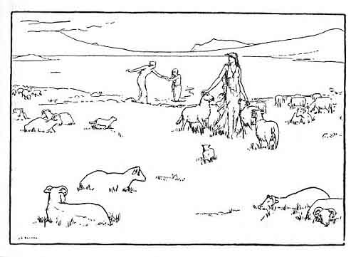
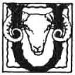

  
[Intangible Textual Heritage](../../../index)  [Legends and
Sagas](../../index)  [Celtic](../index)  [Index](index) 
[Previous](cft09)  [Next](cft11) 

------------------------------------------------------------------------

[Buy this Book at
Amazon.com](https://www.amazon.com/exec/obidos/ASIN/B0027A7X88/internetsacredte)

------------------------------------------------------------------------

  
*Celtic Fairy Tales*, by Joseph Jacobs, \[1892\], at Intangible Textual
Heritage

------------------------------------------------------------------------

p. 57

# The Shepherd of Myddvai

 

|                    |
|--------------------|
|  |

UP in the Black Mountains in Caermarthenshire lies the lake known as Lyn
y Van Vach. To the margin of this lake the shepherd of Myddvai once led
his lambs, and lay there whilst they sought pasture. Suddenly, from the
dark waters of the lake, he saw three maidens rise. Shaking the bright
drops from their hair and gliding to the shore, they wandered about
amongst his flock. They had more than mortal beauty, and he was filled
with Jove for her that came nearest to him. He offered her the

p. 58

bread he had with him, and she took it and tried it, but then sang to
him:

Hard-baked is thy bread,  
’Tis not easy to catch me,

and then ran off laughing to the lake.

Next day he took with him bread not so well done, and watched for the
maidens. When they came ashore he offered his bread as before, and the
maiden tasted it and sang:

Unbaked is thy bread,  
I will not have thee,

and again disappeared in the waves.

A third time did the shepherd of Myddvai try to attract the maiden, and
this time he offered her bread that he had found floating about near the
shore. This pleased her, and she promised to become his wife if he were
able to pick her out from among her sisters on the following day. When
the time came the shepherd knew his love by the strap of her sandal.
Then she told him she would be as good a wife to him as any earthly
maiden could be unless he should strike her three times without cause.
Of course he deemed that this could never be; and she, summoning from
the lake three cows, two oxen, and a bull, as her marriage portion, was
led homeward by him as his bride.

The years passed happily, and three children were born to the shepherd
and the lake-maiden. But one day here were going to a christening, and
she said to her husband it was far to walk, so he told her to go for the
horses.

p. 59

"I will," said she, "if you bring me my gloves which I've left in the
house."

But when he came back with the gloves, he found she had not gone for the
horses; so he tapped her lightly on the shoulder with the gloves, and
said, "Go, go."

"That's one," said she.

Another time they were at a wedding, when suddenly the lake-maiden fell
a-sobbing and a-weeping, amid the joy and mirth of all around her.

Her husband tapped her on the shoulder, and asked her, "Why do you
weep?"

"Because they are entering into trouble; and trouble is upon you; for
that is the second causeless blow you have given me. Be careful; the
third is the last."

The husband was careful never to strike her again. But one day at a
funeral she suddenly burst out into fits of laughter. Her husband
forgot, and touched her rather roughly on the shoulder, saying, "Is this
a time for laughter?"

"I laugh," she said, "because those that die go out of trouble, but your
trouble has come. The last blow has been struck; our marriage is at an
end, and so farewell."

And with that she rose up and left the house and went to their home.

Then she, looking round upon her home, called to the cattle she had
brought with her:

Brindle cow, white speckled,  
Spotted cow, bold freckled,  
Old white face, and gray Geringer,  
And the white bull from the king's coast,  
Grey ox, and black calf,  
All, all, follow me home,

p. 60

Now the black calf had just been slaughtered, and was hanging on the
hook; but it got off the hook alive and well and followed her; and the
oxen, though they were ploughing, trailed the plough with them and did
her bidding. So she fled to the lake again, they following her, and with
them plunged into the dark waters. And to this day is the furrow seen
which the plough left as it was dragged across the mountains to the
tarn.

Only once did she come again, when her sons were grown to manhood, and
then she gave them gifts of healing by which they won the name of
Meddygon Myddvai, the physicians of Myddvai.

------------------------------------------------------------------------

[Next: The Sprightly Tailor](cft11)
