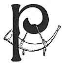
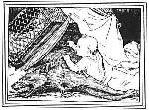

  
[Intangible Textual Heritage](../../../index)  [Legends and
Sagas](../../index)  [Celtic](../index)  [Index](index) 
[Previous](cft23)  [Next](cft25) 

------------------------------------------------------------------------

[Buy this Book at
Amazon.com](https://www.amazon.com/exec/obidos/ASIN/B0027A7X88/internetsacredte)

------------------------------------------------------------------------

  
*Celtic Fairy Tales*, by Joseph Jacobs, \[1892\], at Intangible Textual
Heritage

------------------------------------------------------------------------

p. 192

# Beth Gellert

|                    |
|--------------------|
|  |

PRINCE LLEWELYN had a favourite grey-hound named Gellert that had been
given to him by his father-in-law, King John. He was as gentle as a lamb
at home but a lion in the chase. One day Llewelyn went to the chase and
blew his horn in front of his castle. All his other dogs came to the
call but Gellert never answered it. so he blew a louder blast on his
horn and called Gellert by name, but still the greyhound did not come.
At last Prince Llewelyn could wait no longer and went off to the hunt
without Gellert. He had little sport that day because Gellert was not
there, the swiftest and boldest of his hounds.

He turned back in a rage to his castle, and as he came to the gate, who
should he see but Gellert come bounding out to meet him. But when the
hound came near him, the Prince was startled to see that his lips and
fangs were dripping with blood. Llewelyn started back and the grey-hound
crouched down at his feet as if surprised or afraid at the way his
master greeted him.

Now Prince Llewelyn had a little son a year old with whom Gellert used
to play, and a terrible thought crossed the Prince's mind that made him
rush towards the child's nursery. And the nearer he came the more blood
and disorder

p. 193

he found about the rooms. He rushed into it and found the child's cradle
overturned and daubed with blood.

Prince Liewelyn grew more and more terrified, and sought for his little
son everywhere. He could find him nowhere but only signs of some
terrible conflict in which much blood had been shed. At last he felt
sure the dog had destroyed his child, and shouting to Gellert, "Monster,
thou hast devoured my child," he drew out his sword and plunged it in
the greyhound's side, who fell with a deep yell and still gazing in his
master's eyes.

 

As Gellert raised his dying yell, a little child's cry answered it from
beneath the cradle, and there Llewelyn found his child unharmed and just
awakened from sleep. But just beside him lay the body of a great gaunt
wolf all torn to pieces and covered with blood. Too late, Llewelyn

p. 194

learned what had happened while he was away. Gellert had stayed behind
to guard the child and had fought and slain the wolf that had tried to
destroy Llewelyn's heir.

In vain was all Llewelyn's grief; he could not bring his faithful dog to
life again. So he buried him outside the castle walls within sight of
the great mountain of Snowdon, where every passer-by might see his
grave, and raised over it a great cairn of stones. And to this day the
place is called Beth Gellert, or the Grave of Gellert.

------------------------------------------------------------------------

[Next: The Tale of Ivan](cft25)
