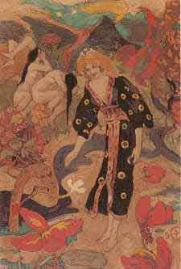

  
[Intangible Textual Heritage](../../../index)  [Legends and
Sagas](../../index)  [Celtic](../index) 

------------------------------------------------------------------------

[Buy this Book at
Amazon.com](https://www.amazon.com/exec/obidos/ASIN/B0027A7X88/internetsacredte)

------------------------------------------------------------------------

<table width="75%">
<colgroup>
<col style="width: 50%" />
<col style="width: 50%" />
</colgroup>
<tbody>
<tr class="odd">
<td width="50%" data-valign="TOP"></td>
<td width="50%" data-valign="CENTER"><h1 id="celtic-fairy-tales" data-align="CENTER">Celtic Fairy Tales</h1>
<h2 id="by-joseph-jacobs" data-align="CENTER">by Joseph Jacobs</h2>
<h5 id="illustrations-by-john-d.-batten" data-align="CENTER">Illustrations by John D. Batten</h5>
<h4 id="section" data-align="CENTER">[1892]</h4></td>
</tr>
</tbody>
</table>

------------------------------------------------------------------------

[Contents](#contents)    [Start Reading](cft00)    [Page
Index](pageidx)    [Text \[Zipped\]](cft.txt.gz)

------------------------------------------------------------------------

|                                                                                                                           |
|---------------------------------------------------------------------------------------------------------------------------|
|  |

This anthology of Celtic folklore tales by Joseph Jacobs is one of the
best of the crop. It includes some great tales such as "Munachar and
Manachar", the "Brewery of Eggshells", and "Fair, Brown and Trembling".
Jacobs also includes an extensive Notes and References section if you
want to follow up on each tale.

------------------------------------------------------------------------

 [Title Page](cft00)  
[Preface](cft01)  
[Contents](cft02)  
[Full Page Illustrations](cft03)  
[Connla and the Fairy Maiden](cft04)  
[Guleesh](cft05)  
[The Field of Boliauns](cft06)  
[The Horned Women](cft07)  
[Conall Yellowclaw](cft08)  
[Hudden and Dudden and Donald O'Neary](cft09)  
[The Shepherd of Myddvai](cft10)  
[The Sprightly Tailor](cft11)  
[The Story of Deirdre](cft12)  
[Munachar and Manachar](cft13)  
[Gold-Tree and Silver-Tree](cft14)  
[King O'Toole and his Goose](cft15)  
[The Wooing of Olwen](cft16)  
[Jack and his Comrades](cft17)  
[The Shee An Gannon and the Gruagach Gaire](cft18)  
[The Story-Teller at Fault](cft19)  
[The Sea-Maiden](cft20)  
[A Legend of Knockmany](cft21)  
[Fair, Brown and Trembling](cft22)  
[Jack and his Master](cft23)  
[Beth Gellert](cft24)  
[The Tale of Ivan](cft25)  
[Andrew Coffey](cft26)  
[The Battle of the Birds](cft27)  
[Brewery of Eggshells](cft28)  
[The Lad with the Goat-Skin](cft29)  
[Notes and References](cft30)  
