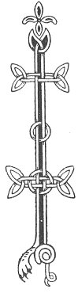

  
[Intangible Textual Heritage](../../../index) 
[Legends/Sagas](../../index)  [Celtic](../index)  [Carmina
Gadelica](../cg)  [Index](index)  [Previous](cg1005)  [Next](cg1007) 

------------------------------------------------------------------------

[Buy this Book at
Amazon.com](https://www.amazon.com/exec/obidos/ASIN/B0027P88YQ/internetsacredte)

------------------------------------------------------------------------

  
*Carmina Gadelica, Volume 1*, by Alexander Carmicheal, \[1900\], at
Intangible Textual Heritage

------------------------------------------------------------------------

 

<table data-border="0">
<colgroup>
<col style="width: 50%" />
<col style="width: 50%" />
</colgroup>
<tbody>
<tr class="odd">
<td data-valign="top" width="327">
p. 6
</td>
<td data-valign="top" width="327">
p. 7
</td>
</tr>
<tr class="even">
<td data-valign="top" width="327"><h3 id="ora-nam-buadh-3" data-align="center">ORA NAM BUADH [3]</h3></td>
<td data-valign="top" width="327"><h3 id="the-invocation-of-the-graces" data-align="center">THE INVOCATION OF THE GRACES</h3></td>
</tr>
</tbody>
</table>

DUNCAN MACLELLAN, crofter, Carnan, South Uist, heard this poem from
Catherine Macaulay in the early years of this century. When the crofters
along the east side of South Uist were removed, many of the more frail
and aged left behind became houseless and homeless, moving among and
existing upon the crofters left remaining along the west side of the
island.

Among these was Catherine Macaulay. Her people went to Cape Breton. She
came from Mol-a-deas, adjoining Corradale, where Prince Charlie lived
for several weeks when hiding in South Uist after Culloden. Catherine
Macaulay had seen the Prince several times, and had many reminiscences
of him and of his movements among the people of the district, who
entertained him to their best when much in need, and who shielded him to
their utmost when sorely harassed.

Catherine Macaulay was greatly gifted in speaking, and was marvellously
endowed with a memory for old tales and hymns, runes and incantations,
and for unwritten literature and traditions of many kinds.

She wandered about from house to house, and from townland to townland,
warmly welcomed and cordially received wherever she went, and remained
in each place longer or shorter according to the population and the
season, and p. 7 as the people could spare the
time to hear her. The description which Duncan Maclellan gave of
Catherine Macaulay, and of the people who crowded his father's house to
hear her night after night, and week after week, and of the discussions
that followed her recitations, were realistic and instructive. Being
then but a child he could not follow the meaning of this lore, but he
thought many times since that much of it must have been about the wild
beliefs and practices of his people of the long long ago, and perhaps
not so long ago either. Many of the poems and stories were long and
weird, and he could only remember fragments, which came up to him as he
lay awake, thinking of the present and the past. and of the contrast
between the two, even in his own time.

I heard versions of this poem in other islands and in districts of the
mainland, and in November 1888 John Gregorson Campbell, minister of
Tiree, sent me a fragment taken down from Margaret Macdonald, Tiree. The
poem must therefore have been widely known. in Tiree the poem was
addressed to boys and girls, in Uist to young men and maidens. Probably
it was composed to a maiden on her marriage. The phrase 'cala dhonn,'
brown swan, would indicate that the girl was young--not yet a white
swan.

<table data-border="0">
<colgroup>
<col style="width: 25%" />
<col style="width: 25%" />
<col style="width: 25%" />
<col style="width: 25%" />
</colgroup>
<tbody>
<tr class="odd">
<td data-valign="top">
 
</td>
<td data-valign="top">
p. 6
</td>
<td data-valign="top">
 
</td>
<td data-valign="top">
p. 7
</td>
</tr>
<tr class="even">
<td rowspan="5" data-valign="top">
 
</td>
<td data-valign="top">
IONNLAIME do bhasa 
Ann am frasa fiona, 
Ann an liu nan lasa, 
Ann an seachda siona, 
Ann an subh craobh, 
Ann am bainne meala, 
Is cuirime na naoi buaidhean glana caon, 
Ann do ghruaidhean caomha geala, 
         Buaidh cruth, 
         Buaidh guth, 
         Buaidh rath, 
         Buaidh math, 
         Buaidh chnoc, 
         Buaidh bhochd,
</td>
<td data-valign="top">
 
</td>
<td data-valign="top">
I BATHE thy palms 
In showers of wine, 
In the lustral fire, 
In the seven elements, 
In the juice of the rasps, 
In the milk of honey, 
And I place the nine pure choice graces 
In thy fair fond face, 
         The grace of form, 
         The grace of voice, 
         The grace of fortune, 
         The grace of goodness, 
         The grace of wisdom, 
         The grace of charity,
</td>
</tr>
<tr class="odd">
<td data-valign="top">
p. 8
</td>
<td data-valign="top">
 
</td>
<td data-valign="top">
p. 9
</td>
</tr>
<tr class="even">
<td data-valign="top">
         Buaidh na rogha finne, 
         Buaidh na fior eireachdais, 
         Buaidh an deagh labhraidh.

Is dubh am bail ud thall, 
Is dubh na daoine th’ann, 
Is tu an eala dhonn, 
Ta dol a steach ’n an ceann. 
Ta an cridhe fo do chonn, 
Ta an teanga fo do bhonn, 
’S a chaoidh cha chan iad bonn 
     Facail is oil leat.

Is dubhar thu ri teas, 
Is seasgar thu ri fuachd, 
Is suilean thu dha’n dall, 
Is crann dh’ an deoraidh thruagh, 
Is eilean thu air muir, 
Is cuisil thu air tir, 
Is fuaran thu am fasach, 
     Is slaint dha’n ti tha tinn.

Is tu gleus na Mnatha Sithe, 
Is tu beus na Bride bithe, 
Is tu creud na Moire mine, 
Is tu gniomh na mnatha Gréig, 
Is tu sgeimh na h-Eimir aluinn, 
Is tu mein na Dearshul agha, 
Is tu meanm na Meabha laidir, 
     Is tu taladh Binne-bheul.

Is tu sonas gach ni eibhinn, 
Is tu solus gath na greine,
</td>
<td data-valign="top">
 
</td>
<td data-valign="top">
         The grace of choice maidenliness, 
         The grace of whole-souled loveliness, 
         The grace of goodly speech.

Dark is yonder town, 
Dark are those therein, 
Thou art the brown swan, 
Going in among them. 
Their hearts are under thy control, 
Their tongues are beneath thy sole, 
Nor will they ever utter a word 
     To give thee offence.

A shade art thou in the heat, 
A shelter art thou in the cold, 
Eyes art thou to the blind, 
A staff art thou to the pilgrim, 
An island art thou at sea, 
A fortress art thou on land, 
A well art thou in the desert, 
     Health art thou to the ailing.

Thine is the skill of the Fairy Woman, 
Thine is the virtue of Bride the calm, 
Thine is the faith of Mary the mild, 
Thine is the tact of the woman of Greece, 
Thine is the beauty of Emir the lovely, 
Thine is the tenderness of Darthula delightful, 
Thine is the courage of Maebh the strong, 
     Thine is the charm of Binne-bheul.

Thou art the joy of all joyous things, 
Thou art the light of the beam of the sun,
</td>
</tr>
<tr class="odd">
<td data-valign="top">
p. 10
</td>
<td data-valign="top">
 
</td>
<td data-valign="top">
p. 11
</td>
</tr>
<tr class="even">
<td data-valign="top">
Is tu dorus flath na feile, 
Is tu corra reul an iuil, 
Is tu ceum feidh nan ardu, 
Is tu ceum steud nam blaru, 
Is tu seimh eal an t-snamhu, 
     Is tu ailleagan gach run.

Cruth aluinn an Domhnuich 
Ann do ghnuis ghlain, 
An cruth is ailinde 
Bha air talamh.

An trath is fearr ’s an latha duit, 
An la is fearr ’s an t-seachdain duit, 
An t-seachdain is fearr ’s a bhliadhna duit, 
A bhliadhn is fearr an domhan Mhic De duit.

Thainig Peadail ’s thainig Pol, 
Thainig Seumas ’s thainig Eoin, 
Thainig Muiril is Muir Oigh, 
Thainig Uiril uile chorr, 
Thainig Airil aill nan og, 
Thainig Gabriel fadh na h-Oigh, 
Thainig Raphail flath nan seod, 
’S thainig Micheal mil air sloigh, 
     Thainig ’s Iosa Criosda ciuin, 
     Thainig ’s Spiorad fior an iuil, 
     Thainig ’s Righ nan righ air stiuir, 
     A bhaireadh duit-se graidh is ruin, 
          A bhaireadh duit-se graidh is ruin.
</td>
<td data-valign="top">
 
</td>
<td data-valign="top">
Thou art the door of the chief of hospitality, 
Thou art the surpassing star of guidance, 
Thou art the step of the deer of the hill, 
Thou art the step of the steed of the plain, 
Thou art the grace of the swan of swimming, 
     Thou art the loveliness of all lovely desires.

The lovely likeness of the Lord 
Is in thy pure face, 
The loveliest likeness that 
Was upon earth.

The best hour of the day be thine, 
The best day of the week be thine, 
The best week of the year be thine, 
The best year in the Son of God's domain be thine.

Peter has come and Paul has come, 
James has come and John has come, 
Muriel and Mary Virgin have come, 
Uriel the all-beneficent has come, 
Ariel the beauteousness of the young has come, 
Gabriel the seer of the Virgin has come, 
Raphael the prince of the valiant has come, 
And Michael the chief of the hosts has come, 
     And Jesus Christ the mild has come, 
     And the Spirit of true guidance has come, 
     And the King of kings has come on the helm, 
     To bestow on thee their affection and their love, 
          To bestow on thee their affection and their love.
</td>
</tr>
</tbody>
</table>

 

 

------------------------------------------------------------------------

[Next: 4. A General Supplication. Achanaidh Choitcheann](cg1007)
