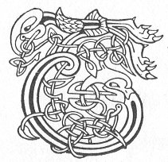

  
[Intangible Textual Heritage](../../../index) 
[Legends/Sagas](../../index)  [Celtic](../index)  [Carmina
Gadelica](../cg)  [Index](index)  [Previous](cg1014)  [Next](cg1016) 

------------------------------------------------------------------------

[Buy this Book at
Amazon.com](https://www.amazon.com/exec/obidos/ASIN/B0027P88YQ/internetsacredte)

------------------------------------------------------------------------

  
*Carmina Gadelica, Volume 1*, by Alexander Carmicheal, \[1900\], at
Intangible Textual Heritage

------------------------------------------------------------------------

 

<table data-border="0">
<colgroup>
<col style="width: 50%" />
<col style="width: 50%" />
</colgroup>
<tbody>
<tr class="odd">
<td data-valign="top" width="327">
p. 34
</td>
<td data-valign="top" width="327">
p. 35
</td>
</tr>
<tr class="even">
<td data-valign="top" width="327"><h3 id="achanaidh-grais-12" data-align="center">ACHANAIDH GRAIS [12]</h3></td>
<td data-valign="top" width="327"><h3 id="a-prayer-for-grace" data-align="center">A PRAYER FOR GRACE</h3></td>
</tr>
</tbody>
</table>

 

<table data-border="0">
<colgroup>
<col style="width: 25%" />
<col style="width: 25%" />
<col style="width: 25%" />
<col style="width: 25%" />
</colgroup>
<tbody>
<tr class="odd">
<td data-valign="top">
 
</td>
<td data-valign="top">
p. 34
</td>
<td data-valign="top">
 
</td>
<td data-valign="top">
p. 35
</td>
</tr>
<tr class="even">
<td data-valign="top">
 
</td>
<td data-valign="top">
TA mi lubadh mo ghlun 
An suil an Athar a chruthaich mi, 
An suil a Mhic a cheannaich mi, 
An suil a Spioraid a ghlanaich mi, 
     Le gradh agus run.

Doirt a nuas oirnn a flathas 
Trocair shuairce do mhathas; 
Fhir tha ’n uachdar na Cathair, 
     Dean-sa fathamas ruinn.

Tabhair duinn, a Shlan’ear Aigh, 
Eagal De, gaol De, agus gradh, 
Is toil De dheanamh air talamh gach re, 
Mar ni ainghlich is naoimhich air neamh; 
Gach la agus oidhche thoir duinn do sheimh, 
     Gach la agus oidhche thoir duinn do sheimh.
</td>
<td data-valign="top">
 
</td>
<td data-valign="top">
I AM bending my knee 
In the eye of the Father who created me, 
In the eye of the Son who died for me, 
In the eye of the Spirit who cleansed me, 
     In love and desire.

Pour down upon us from heaven 
The rich blessing of Thy forgiveness; 
Thou who art uppermost in the City, 
     Be Thou patient with us.

Grant to us, Thou Saviour of Glory, 
The fear of God, the love of God, and His affection, 
And the will of God to do on earth at all times 
As angels and saints do in heaven; 
Each day and night give us Thy peace. 
     Each day and night give us Thy peace.
</td>
</tr>
</tbody>
</table>

 

 

------------------------------------------------------------------------

[Next: 13. Prayer For Protection. Achanaidh Comhnadh](cg1016)
