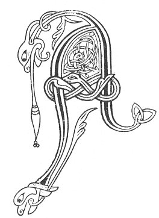

  
[Intangible Textual Heritage](../../../index) 
[Legends/Sagas](../../index)  [Celtic](../index)  [Carmina
Gadelica](../cg)  [Index](index)  [Previous](cg1020)  [Next](cg1022) 

------------------------------------------------------------------------

[Buy this Book at
Amazon.com](https://www.amazon.com/exec/obidos/ASIN/B0027P88YQ/internetsacredte)

------------------------------------------------------------------------

  
*Carmina Gadelica, Volume 1*, by Alexander Carmicheal, \[1900\], at
Intangible Textual Heritage

------------------------------------------------------------------------

<table data-border="0">
<colgroup>
<col style="width: 50%" />
<col style="width: 50%" />
</colgroup>
<tbody>
<tr class="odd">
<td data-valign="top" width="327">
p. 48
</td>
<td data-valign="top" width="327">
p. 49
</td>
</tr>
<tr class="even">
<td data-valign="top" width="327"><h3 id="an-t-aingheal-diona-18" data-align="center">AN T-AINGHEAL DIONA [18]</h3></td>
<td data-valign="top" width="327"><h3 id="the-guardian-angel" data-align="center">THE GUARDIAN ANGEL</h3></td>
</tr>
</tbody>
</table>

 

 

<table data-border="0">
<colgroup>
<col style="width: 25%" />
<col style="width: 25%" />
<col style="width: 25%" />
<col style="width: 25%" />
</colgroup>
<tbody>
<tr class="odd">
<td data-valign="top">
 
</td>
<td data-valign="top">
p. 48
</td>
<td data-valign="top">
 
</td>
<td data-valign="top">
p. 49
</td>
</tr>
<tr class="even">
<td data-valign="top">
 
</td>
<td data-valign="top">
AINGHIL Dhe a fhuair mo churam 
Bho Athair cumh na trocaireachd, 
Ciobaireachd caon cro nan naomh 
Dheanamh dha mo thaobh a nochd;

Fuad uam gach buar is cunnart 
Cuart mi air cuan na dobhachd, 
Anns a chunglait, chaimleit, chumhan, 
Cum mo churach fein an comhnuidh.

Bi ’na do lasair leith romham, 
Bi ’na do reuil iuil tharam, 
Bi ’na do ro reidh fotham, 
Is ’na do chiobair caomh mo dheoghann, 
An diugh, an nochd agus gu suthann.

Tha mi sgith is mi air m’ aineol, 
Treoraich mi do thir nan aingheal; 
Liom is tim a bhi dol dachaidh 
Do chuirt Chriosd, do shith nam flathas.
</td>
<td data-valign="top">
 
</td>
<td data-valign="top">
THOU angel of God who hast charge of me 
From the dear Father of mercifulness, 
The shepherding kind of the fold of the saints 
To make round about me this night;

Drive from me every temptation and danger, 
Surround me on the sea of unrighteousness, 
And in the narrows, crooks, and straits, 
Keep thou my coracle, keep it always.

Be thou a bright flame before me, 
Be thou a guiding star above me, 
Be thou a smooth path below me, 
And be a kindly shepherd behind me, 
To-day, to-night, and for ever.

I am tired and I a stranger, 
Lead thou me to the land of angels; 
For me it is time to go home 
To the court of Christ, to the peace of heaven.
</td>
</tr>
</tbody>
</table>

 

 

------------------------------------------------------------------------

[Next: 19. Desires. Ruin](cg1022)
