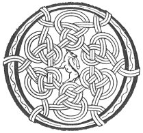

  
[Intangible Textual Heritage](../../../index) 
[Legends/Sagas](../../index)  [Celtic](../index)  [Carmina
Gadelica](../cg)  [Index](index)  [Previous](cg1030)  [Next](cg1032) 

------------------------------------------------------------------------

[Buy this Book at
Amazon.com](https://www.amazon.com/exec/obidos/ASIN/B0027P88YQ/internetsacredte)

------------------------------------------------------------------------

  
*Carmina Gadelica, Volume 1*, by Alexander Carmicheal, \[1900\], at
Intangible Textual Heritage

------------------------------------------------------------------------

 

<table data-border="0">
<colgroup>
<col style="width: 50%" />
<col style="width: 50%" />
</colgroup>
<tbody>
<tr class="odd">
<td data-valign="top" width="327">
p. 70
</td>
<td data-valign="top" width="327">
p. 71
</td>
</tr>
<tr class="even">
<td data-valign="top" width="327"><h3 id="an-achanaidh-anama-28" data-align="center">AN ACHANAIDH ANAMA [28]</h3></td>
<td data-valign="top" width="327"><h3 id="the-soul-plaint" data-align="center">THE SOUL PLAINT</h3></td>
</tr>
</tbody>
</table>

 

<table data-border="0">
<colgroup>
<col style="width: 25%" />
<col style="width: 25%" />
<col style="width: 25%" />
<col style="width: 25%" />
</colgroup>
<tbody>
<tr class="odd">
<td data-valign="top">
 
</td>
<td data-valign="top">
p. 70
</td>
<td data-valign="top">
 
</td>
<td data-valign="top">
p. 71
</td>
</tr>
<tr class="even">
<td data-valign="top">
 
</td>
<td data-valign="top">
O IOS, a nochd, 
Aghair nam bochd, 
Cholann gun lochd, 
Dh’ fhuilinn gu gort, 
Fo bhinn nan olc, 
’S a cheusadh.

Saor mi bho olc, 
Saor mi bho lochd, 
Caomhain mo chorp, 
Naomhaich mi nochd, 
O Ios, a nochd, 
’S na treig mi.

Bairig domh neart, 
Aghair nam feart, 
Stiuir mi ’na d’ cheart, 
Stiuir mi ’na d’ neart, 
O Ios, ’na d’ neart 
Gleidh mi.
</td>
<td data-valign="top">
 
</td>
<td data-valign="top">
O JESU! to-night, 
Thou Shepherd of the poor, 
Thou sinless person 
Who didst suffer full sore, 
By ban of the wicked, 
And wast crucified.

Save me from evil, 
Save me from harm, 
Save Thou my body, 
Sanctify me to-night, 
O Jesu! to-night, 
Nor leave me.

Endow me with strength, 
Thou Herdsman of might. 
Guide me aright, 
Guide me in Thy strength, 
O Jesu! in Thy strength 
Preserve me.
</td>
</tr>
</tbody>
</table>

 

 

------------------------------------------------------------------------

[Next: 29. Sleeping Prayer. Urnuigh Chadail](cg1032)
