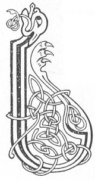

  
[Intangible Textual Heritage](../../../index) 
[Legends/Sagas](../../index)  [Celtic](../index)  [Carmina
Gadelica](../cg)  [Index](index)  [Previous](cg1036)  [Next](cg1038) 

------------------------------------------------------------------------

[Buy this Book at
Amazon.com](https://www.amazon.com/exec/obidos/ASIN/B0027P88YQ/internetsacredte)

------------------------------------------------------------------------

  
*Carmina Gadelica, Volume 1*, by Alexander Carmicheal, \[1900\], at
Intangible Textual Heritage

------------------------------------------------------------------------

<table data-border="0">
<colgroup>
<col style="width: 50%" />
<col style="width: 50%" />
</colgroup>
<tbody>
<tr class="odd">
<td data-valign="top" width="327">
p. 82
</td>
<td data-valign="top" width="327">
p. 83
</td>
</tr>
<tr class="even">
<td data-valign="top" width="327"><h3 id="beannachadh-leapa-34" data-align="center">BEANNACHADH LEAPA [34]</h3></td>
<td data-valign="top" width="327"><h3 id="bed-blessing" data-align="center">BED BLESSING</h3></td>
</tr>
</tbody>
</table>

 

<table data-border="0">
<colgroup>
<col style="width: 25%" />
<col style="width: 25%" />
<col style="width: 25%" />
<col style="width: 25%" />
</colgroup>
<tbody>
<tr class="odd">
<td data-valign="top">
 
</td>
<td data-valign="top">
p. 82
</td>
<td data-valign="top">
 
</td>
<td data-valign="top">
p. 83
</td>
</tr>
<tr class="even">
<td data-valign="top">
 
</td>
<td data-valign="top">
LAIGHIM sios an nochd mar is coir 
An cluanas Chriosda Mac Oigh nan cleachd, 
An cluanas Athair aigh na gloir, 
An cluanas Spioraid foir nam feart.

Laighim sios an nochd le Dia, 
Is laighidh Dia an nochd a sios liom, 
Cha laigh mi sios an nochd le olc, ’s cha dean 
Ole no fhiamh laighe liom.

Laighim sios an nochd le Spiorad Naomh, 
Is laighidh Spiorad Naomh an nochd a sios liom, 
Laighim sios le Teoiridh mo chaoimh, 
Is laighidh Teoiridh mo chaoimh a sios liom.
</td>
<td data-valign="top">
 
</td>
<td data-valign="top">
I AM lying down to-night as beseems 
In the fellowship of Christ, son of the Virgin of ringlets. 
In the fellowship of the gracious Father of glory, 
In the fellowship of the Spirit of powerful aid.

I am lying down to-night with God, 
And God to-night will lie down with me, 
I will not lie down to-night with sin, nor shall 
Sin nor sin's shadow lie down with me.

I am lying down to-night with the Holy Spirit, 
And the Holy Spirit this night will lie down with me, 
I will lie down this night with the Three of my love, 
And the Three of my love will lie down with me.
</td>
</tr>
</tbody>
</table>

 

------------------------------------------------------------------------

[Next: 35 The Sleep Prayer. An Urnuigh Chadail](cg1038)
