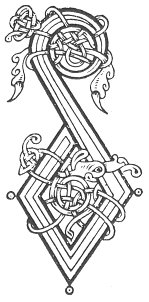

  
[Intangible Textual Heritage](../../../index) 
[Legends/Sagas](../../index)  [Celtic](../index)  [Carmina
Gadelica](../cg)  [Index](index)  [Previous](cg1040)  [Next](cg1042) 

------------------------------------------------------------------------

[Buy this Book at
Amazon.com](https://www.amazon.com/exec/obidos/ASIN/B0027P88YQ/internetsacredte)

------------------------------------------------------------------------

  
*Carmina Gadelica, Volume 1*, by Alexander Carmicheal, \[1900\], at
Intangible Textual Heritage

------------------------------------------------------------------------

<table data-border="0">
<colgroup>
<col style="width: 50%" />
<col style="width: 50%" />
</colgroup>
<tbody>
<tr class="odd">
<td data-valign="top" width="327">
p. 90
</td>
<td data-valign="top" width="327">
p. 91
</td>
</tr>
<tr class="even">
<td data-valign="top" width="327"><h3 id="a-choich-anama-38" data-align="center">A CHOICH ANAMA [38]</h3></td>
<td data-valign="top" width="327"><h3 id="the-soul-shrine" data-align="center">THE SOUL SHRINE</h3></td>
</tr>
</tbody>
</table>

THE Soul Shrine is sung by the people as they retire
to rest. They say that the angels of heaven guard them in sleep and
shield them from harm. Should any untoward event p.
91 occur to themselves or to their flocks, they avow that the
cause was the deadness of their hearts, the coldness of their faith, and
the fewness of their prayers.

 

<table data-border="0">
<colgroup>
<col style="width: 25%" />
<col style="width: 25%" />
<col style="width: 25%" />
<col style="width: 25%" />
</colgroup>
<tbody>
<tr class="odd">
<td data-valign="top">
 
</td>
<td data-valign="top">
p. 90
</td>
<td data-valign="top">
 
</td>
<td data-valign="top">
p. 91
</td>
</tr>
<tr class="even">
<td data-valign="top">
 
</td>
<td data-valign="top">
DHE tabhair aithne da t’ ainghle beannaichte, 
     Caim a chumail air an staing-sa nochd, 
Comachadh crabhaidh, tabhaidh, teannachaidh, 
     Chumas a choich anama-sa bho lochd.

Teasruig a Dhe an t-ardrach seo a nochd, 
     Iad fein ’s an cuid ’s an cliu, 
Tar iad o eug, o ghabhadh, o lochd, 
     ’S o thoradh na farmaid ’s na mi-ruin.

Tabhair duinn, a Dhe na fois, 
     Taingealachd an cois ar call, 
Bhi coimhlionadh do lagh a bhos, 
     ’S to fein a mhealtuinn thall.
</td>
<td data-valign="top">
 
</td>
<td data-valign="top">
GOD, give charge to Thy blessed angels, 
     To keep guard around this stead to-night, 
A band sacred, strong, and steadfast, 
     That will shield this soul-shrine from harm.

Safeguard Thou, God, this household to-night, 
     Themselves and their means and their fame, 
Deliver them from death, from distress, from harm, 
     From the fruits of envy and of enmity.

Give Thou to us, O God of peace, 
     Thankfulness despite our loss, 
To obey Thy statutes here below, 
     And to enjoy Thyself above.
</td>
</tr>
</tbody>
</table>

 

------------------------------------------------------------------------

[Next: 39. Soul-Shrine. Coich-Anama](cg1042)
