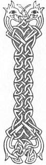

  
[Intangible Textual Heritage](../../../index) 
[Legends/Sagas](../../index)  [Celtic](../index)  [Carmina
Gadelica](../cg)  [Index](index)  [Previous](cg1051)  [Next](cg1053) 

------------------------------------------------------------------------

[Buy this Book at
Amazon.com](https://www.amazon.com/exec/obidos/ASIN/B0027P88YQ/internetsacredte)

------------------------------------------------------------------------

  
*Carmina Gadelica, Volume 1*, by Alexander Carmicheal, \[1900\], at
Intangible Textual Heritage

------------------------------------------------------------------------

 

<table data-border="0">
<colgroup>
<col style="width: 50%" />
<col style="width: 50%" />
</colgroup>
<tbody>
<tr class="odd">
<td data-valign="top" width="327">
p. 112
</td>
<td data-valign="top" width="327">
p. 113
</td>
</tr>
<tr class="even">
<td data-valign="top" width="327"><h3 id="an-cath-nach-tainig-49" data-align="center">AN CATH NACH TAINIG [49]</h3></td>
<td data-valign="top" width="327"><h3 id="the-battle-to-come" data-align="center">THE BATTLE TO COME</h3></td>
</tr>
</tbody>
</table>

 

<table data-border="0">
<colgroup>
<col style="width: 25%" />
<col style="width: 25%" />
<col style="width: 25%" />
<col style="width: 25%" />
</colgroup>
<tbody>
<tr class="odd">
<td data-valign="top">
 
</td>
<td data-valign="top">
p. 112
</td>
<td data-valign="top">
 
</td>
<td data-valign="top">
p. 113
</td>
</tr>
<tr class="even">
<td data-valign="top">
 
</td>
<td data-valign="top">
IOSA Mhic Mhoire eighim air th’ ainm, 
Is air ainm Eoin ostail ghradhaich, 
Is air ainm gach naoimh ’s an domhan dearg, 
Mo thearmad ’s a chath nach tainig, 
     Mo thearmad ’s a chath nach tainig.

Duair theid am beul a dhunadh, 
Duair theid an t-suil a dhruideadh, 
Duair sguireas an anail da struladh, 
Duair sguireas an cridhe da bhuille, 
     Sguireas an cridhe de bhuille.

Duair theid am Breitheamh dh’ an chathair, 
Is a theid an tagradh a shuidheach, 
Iosa Mhic Mhoire cobhair air m’ anam, 
A Mhicheil mhin gobh ri mo shiubhal. 
     Iosa Mhic Mhoire cobhair air m’ anam! 
     A Mhicheil mhin gobh ri mo shiubhal!
</td>
<td data-valign="top">
 
</td>
<td data-valign="top">
JESUS, Thou Son of Mary, I call on Thy name, 
And on the name of John the apostle beloved, 
And on the names of all the saints in the red domain, 
To shield me in the battle to come, 
     To shield me in the battle to come.

When the mouth shall be closed, 
When the eye shall be shut, 
When the breath shall cease to rattle, 
When the heart shall cease to throb, 
     When the heart shall cease to throb.

When the Judge shall take the throne, 
And when the cause is fully pleaded, 
O Jesu, Son of Mary, shield Thou my soul, 
O Michael fair, acknowledge my departure. 
     O Jesu, Son of Mary, shield Thou my soul! 
     O Michael fair, receive my departure!
</td>
</tr>
</tbody>
</table>

 

------------------------------------------------------------------------

[Next: 50. The Baptism Blessing. Am Beannachadh Baistidh](cg1053)
