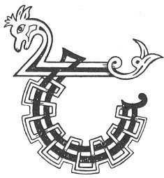

  
[Intangible Textual Heritage](../../../index) 
[Legends/Sagas](../../index)  [Celtic](../index)  [Carmina
Gadelica](../cg)  [Index](index)  [Previous](cg1052)  [Next](cg1054) 

------------------------------------------------------------------------

[Buy this Book at
Amazon.com](https://www.amazon.com/exec/obidos/ASIN/B0027P88YQ/internetsacredte)

------------------------------------------------------------------------

  
*Carmina Gadelica, Volume 1*, by Alexander Carmicheal, \[1900\], at
Intangible Textual Heritage

------------------------------------------------------------------------

 

<table data-border="0">
<colgroup>
<col style="width: 50%" />
<col style="width: 50%" />
</colgroup>
<tbody>
<tr class="odd">
<td data-valign="top" width="327">
p. 114
</td>
<td data-valign="top" width="327">
p. 115
</td>
</tr>
<tr class="even">
<td data-valign="top" width="327"><h3 id="am-beannachadh-baistidh-50" data-align="center">AM BEANNACHADH BAISTIDH [50]</h3></td>
<td data-valign="top" width="327"><h3 id="the-baptism-blessing" data-align="center">THE BAPTISM BLESSING</h3></td>
</tr>
</tbody>
</table>

 

IT is known that a form of baptism prevailed among
the Celts previous to the introduction of Christianity, as forms of
baptism prevail among pagan people now. Whenever possible the Celtic
Church christianized existing ceremonies and days of special observance,
grafting the new on the old, as at a later day Augustine did in southern
Britain. Immediately after its birth the nurse or other person present
drops three drops of water on the forehead of the child. The first drop
is in the name of the Father, representing wisdom; the second drop is in
the name of the Son, representing peace; the third drop is in the name
of the Spirit, representing purity. If the child be a male p. 115 the name 'Maol-domhnuich,' if a female the
name 'Griadach,' is applied to it temporarily. 'Maol-domhnuich' means
tonsured of the Lord, and 'Griadach' is rendered Gertrude. When the
child is ecclesiastically baptized--generally at the end of eight
days--the temporary is superseded by the permanent name. This lay
baptism is recognised by the Presbyterian, the Anglican; the Latin, and
the Greek Churches. If the child were not thus baptized it would need to
be carefully guarded lest the fairies should spirit it away before the
ecclesiastical baptism took place, when their power over it ceased. The
lay baptism also ensured that in the event of death the child should be
buried in consecrated ground.

 

<table data-border="0">
<colgroup>
<col style="width: 25%" />
<col style="width: 25%" />
<col style="width: 25%" />
<col style="width: 25%" />
</colgroup>
<tbody>
<tr class="odd">
<td data-valign="top">
 
</td>
<td data-valign="top">
p. 114
</td>
<td data-valign="top">
 
</td>
<td data-valign="top">
p. 115
</td>
</tr>
<tr class="even">
<td data-valign="top">
 
</td>
<td data-valign="top">
THI, tha comhnadh nan ard, 
Tiur do bheannachd ’na thrath, 
Cuimhnich-s’ leanabh mo chri, 
An Ainm Athar na sith; 
Trath chuireas sagart an Righ 
Air uisge na brigh, 
Builich da beannachd nan Tri 
     Ta lionadh nan ard. 
   Beannachd nan Tri 
     Ta lionadh nan ard.

Crath nuas air do ghras, 
Tabh dha feart agus fas, 
Tabh dha trein agus treoir, 
Tabh dha seilbh agus coir, 
Rian agus ciall gun gho, 
Gliocas aingeal r’a lo, 
Chum’s gun seas e gun sgeo 
     ’Na d’ lathair. 
   Gun seas e gun sgeo 
     ’Na d’ lathair.
</td>
<td data-valign="top">
 
</td>
<td data-valign="top">
THOU Being who inhabitest the heights 
Imprint Thy blessing betimes, 
Remember Thou the child of my body, 
In Name of the Father of peace; 
When the priest of the King 
On him puts the water of meaning, 
Grant him the blessing of the Three 
     Who fill the heights. 
   The blessing of the Three 
     Who fill the heights.

Sprinkle down upon him Thy grace, 
Give Thou to him virtue and growth, 
Give Thou to him strength and guidance, 
Give Thou to him flocks and possessions, 
Sense and reason void of guile, 
Angel wisdom in his day, 
That he may stand without reproach 
     In Thy presence. 
   He may stand without reproach 
     In Thy presence.
</td>
</tr>
</tbody>
</table>

 

------------------------------------------------------------------------

[Next: 51. The Soul Leading. An Treoraich Anama](cg1054)
