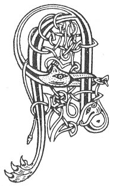

  
[Intangible Textual Heritage](../../../index) 
[Legends/Sagas](../../index)  [Celtic](../index)  [Carmina
Gadelica](../cg)  [Index](index)  [Previous](cg1053)  [Next](cg1055) 

------------------------------------------------------------------------

[Buy this Book at
Amazon.com](https://www.amazon.com/exec/obidos/ASIN/B0027P88YQ/internetsacredte)

------------------------------------------------------------------------

  
*Carmina Gadelica, Volume 1*, by Alexander Carmicheal, \[1900\], at
Intangible Textual Heritage

------------------------------------------------------------------------

<table data-border="0">
<colgroup>
<col style="width: 50%" />
<col style="width: 50%" />
</colgroup>
<tbody>
<tr class="odd">
<td data-valign="top" width="327">
p. 116
</td>
<td data-valign="top" width="327">
p. 117
</td>
</tr>
<tr class="even">
<td data-valign="top" width="327"><h3 id="an-treoraich-anama-51" data-align="center">AN TREORAICH ANAMA [51]</h3></td>
<td data-valign="top" width="327"><h3 id="the-soul-leading" data-align="center">THE SOUL LEADING</h3></td>
</tr>
</tbody>
</table>

DEATH blessings vary in words but not in spirit. These death blessings
are known by various names, as: 'Beannachadh Bais,' Death Blessing,
'Treoraich Anama,' Soul Leading, 'Fois Anama,' Soul Peace, and other
names familiar to the people.

The soul peace is intoned, not necessarily by a cleric, over the dying,
and the man or the woman who says it is called 'anam-chara,'
soul-friend. He or she is held in special affection by the friends of
the dying person ever after. The soul peace is slowly sung--all present
earnestly joining the soul-friend in beseeching the Three Persons of the
Godhead and all the saints of heaven to receive the departing soul of
earth. During the prayer the soul-friend, makes the sign of the cross
with the right thumb over the lips of the dying.

The scene is touching and striking in the extreme, and the man or woman
is not to be envied who could witness unmoved the distress of these
lovable people of the West taking leave of those who are near and dear
to them in their pilgrimage, as they say, of crossing 'abhuinn dubh a
bhais'--the black river of death; 'cuan mor na duibhre'--the great ocean
of darkness; and 'beanntaibh na bith-bhuantachd'--the mountains of
eternity. The scene may be in a lowly cot begrimed with smoke and p. 117 black with age, but the heart is not less
warm, the tear is not less bitter, and the parting is not less
distressful, than in the court of the noble or in the palace of royalty.

'Nowhere beats the Heart so kindly  
As beneath the tart plaid.'--AYTON.

According to the old people:--

'Duair a bheir an duine suas an ospag chithear an t-anam air cleas meall
soluis ag eirigh a suas anns na neoil. Theirear an uair sin:--

Tha ’n t-anam truagh a nis fo sgaoil  
An taobh a muigh dh’ an chaim;  
A Chriosd chaoimh nam beannachd saor  
Cuartaich mo ghaol ’na aim.'

When a person gives up the ghost the soul is seen ascending like a
bright ball of light into the clouds. Then it is said:--

The poor soul is now set free  
Outside the soul-shrine;  
O kindly Christ of the free blessings.  
Encompass Thou my love in time.

 

<table data-border="0">
<colgroup>
<col style="width: 25%" />
<col style="width: 25%" />
<col style="width: 25%" />
<col style="width: 25%" />
</colgroup>
<tbody>
<tr class="odd">
<td data-valign="top">
 
</td>
<td data-valign="top">
p. 116
</td>
<td data-valign="top">
 
</td>
<td data-valign="top">
p. 117
</td>
</tr>
<tr class="even">
<td data-valign="top">
 
</td>
<td data-valign="top">
AN t-anam-s' air do laimh, a Chriosda, 
A nigh na Cathrach Neomh. 
                                   Amen. 
Bho is tus, a Chriosd, a cheannaich an t-anam-s’, 
Biodh a-shith air do theannal fein. 
                                   Amen. 
Is biodh Micheal mil, and righ nan aingeal, 
A reiteach an rathaid romh ’n anam-s', a Dhe. 
                                   Amen. 
O Micheal mil an sith riut, anaim, 
Is a reiteach dhuit rathaid gu flathas Mhic De. 
                                   Amen.
</td>
<td data-valign="top">
 
</td>
<td data-valign="top">
BE this soul on Thine arm, O Christ, 
Thou King of the City of Heaven.. 
                                   Amen. 
Since Thou, O Christ, it was who bought'st this soul, 
Be its peace on Thine own keeping. 
                                   Amen. 
And may the strong Michael, high king of the angels, 
Be preparing the path before this soul, O God. 
                                   Amen. 
Oh! the strong Michael in peace with thee, soul, 
And preparing for thee the way to the kingdom of the Son of God. 
                                   Amen.
</td>
</tr>
</tbody>
</table>

 

------------------------------------------------------------------------

[Next: 52. The Death Blessing. Am Beannachadh Bais](cg1055)
