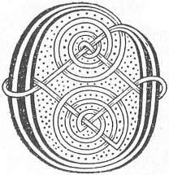

  
[Intangible Textual Heritage](../../../index) 
[Legends/Sagas](../../index)  [Celtic](../index)  [Carmina
Gadelica](../cg)  [Index](index)  [Previous](cg1055)  [Next](cg1057) 

------------------------------------------------------------------------

[Buy this Book at
Amazon.com](https://www.amazon.com/exec/obidos/ASIN/B0027P88YQ/internetsacredte)

------------------------------------------------------------------------

  
*Carmina Gadelica, Volume 1*, by Alexander Carmicheal, \[1900\], at
Intangible Textual Heritage

------------------------------------------------------------------------

<table data-border="0">
<colgroup>
<col style="width: 50%" />
<col style="width: 50%" />
</colgroup>
<tbody>
<tr class="odd">
<td data-valign="top" width="327">
p. 120
</td>
<td data-valign="top" width="327">
p. 121
</td>
</tr>
<tr class="even">
<td data-valign="top" width="327"><h3 id="fois-anama-53" data-align="center">FOIS ANAMA [53]</h3></td>
<td data-valign="top" width="327"><h3 id="soul-peace" data-align="center">SOUL PEACE</h3></td>
</tr>
</tbody>
</table>

 

<table data-border="0">
<colgroup>
<col style="width: 25%" />
<col style="width: 25%" />
<col style="width: 25%" />
<col style="width: 25%" />
</colgroup>
<tbody>
<tr class="odd">
<td data-valign="top">
 
</td>
<td data-valign="top">
p. 120
</td>
<td data-valign="top">
 
</td>
<td data-valign="top">
p. 121
</td>
</tr>
<tr class="even">
<td data-valign="top">
 
</td>
<td data-valign="top">
O ’S tus a Chriosd a cheannaich an t-anam-- 
Ri linn dioladh na beatha, 
Ri linn bruchdadh na falluis, 
Ri linn iobar na creadha, 
Ri linn dortadh na fala, 
Ri linn cothrom na meidhe, 
Ri linn sgathadh na h-anal, 
Ri linn tabhar na breithe, 
Biodh a shith air do theannal fein; 
Iosa Criosda Mhic Moire mine, 
Biodh a shith air do theannal fein, 
     O Ios! air do theannal fein.

Is bitheadh Micheal geal caomh, 
Ard righ nan aingeal naomh, 
An cinnseal an anama ghaoil, 
Ga dhion dh’an Triu barra-chaon, 
     O! dh’an Triu barra-chaon.
</td>
<td data-valign="top">
 
</td>
<td data-valign="top">
SINCE Thou Christ it was who didst buy the soul--- 
At the time of yielding the life, 
At the time of pouring the sweat, 
At the time of offering the clay, 
At the time of shedding the blood, 
At the time of balancing the beam, 
At the time of severing the breath, 
At the time of delivering the judgment, 
Be its peace upon Thine own ingathering; 
Jesus Christ Son of gentle Mary, 
Be its peace upon Thine own ingathering, 
     O Jesus! upon Thine own ingathering.

And may Michael white kindly, 
High king of the holy angels, 
Take possession of the beloved soul, 
And shield it home to the Three of surpassing love, 
     Oh! to the Three of surpassing love.
</td>
</tr>
</tbody>
</table>

 

------------------------------------------------------------------------

[Next: 54. The New Moon. A Ghealach Ur](cg1057)
