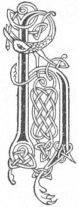

  
[Intangible Textual Heritage](../../../index) 
[Legends/Sagas](../../index)  [Celtic](../index)  [Carmina
Gadelica](../cg)  [Index](index)  [Previous](cg1059)  [Next](cg1061) 

------------------------------------------------------------------------

[Buy this Book at
Amazon.com](https://www.amazon.com/exec/obidos/ASIN/B0027P88YQ/internetsacredte)

------------------------------------------------------------------------

  
*Carmina Gadelica, Volume 1*, by Alexander Carmicheal, \[1900\], at
Intangible Textual Heritage

------------------------------------------------------------------------

 

<table data-border="0">
<colgroup>
<col style="width: 50%" />
<col style="width: 50%" />
</colgroup>
<tbody>
<tr class="odd">
<td data-valign="top" width="327">
p. 132
</td>
<td data-valign="top" width="327">
p. 133
</td>
</tr>
<tr class="even">
<td data-valign="top" width="327"><h3 id="duan-nollaig-56" data-align="center">DUAN NOLLAIG [56]</h3></td>
<td data-valign="top" width="327"><h3 id="christmas-carol" data-align="center">CHRISTMAS CAROL</h3></td>
</tr>
</tbody>
</table>

 

<table data-border="0">
<colgroup>
<col style="width: 25%" />
<col style="width: 25%" />
<col style="width: 25%" />
<col style="width: 25%" />
</colgroup>
<tbody>
<tr class="odd">
<td data-valign="top">
 
</td>
<td data-valign="top">
p. 132
</td>
<td data-valign="top">
 
</td>
<td data-valign="top">
p. 133
</td>
</tr>
<tr class="even">
<td data-valign="top">
 
</td>
<td data-valign="top">
HOIRE! hoire! beannaicht e! beannaicht e! 
Hoire! hoire! beannaicht e! beannaicht e! 
Hoire! hoire! beannaicht e’n Righ dh’ am bi sinn a’ seinn, 
        Ho! ro! biodh aoibh!

Nochd oidhche Nollaige moire, 
Rugadh Mac na Moir Oighe, 
Rainig a bhonnaibh an lar, 
Mac nam buadh a nuas o’n ard, 
Dhealraich neamh is cruinne dha, 
        Ho! ro! biodh aoibh!

Seimh saoghal dha, sona neamh dha, 
Feuch rainig a bhonn an lar, 
Fodhail Righ dha, failt Uain dha, 
Righ nam buadh, Uan nan agh, 
Shoillsich cluan agus cuanta dha, 
        Ho! ro! biodh aoibh!

Shoillsich frith dha, shoillsich fonn dha, 
Nuall nan tonn le fonn nan tragh, 
Ag innse dhuinne gun d’ rugadh Criosda 
Mac Righ nan righ a tir na slaint; 
Shoillsich grian nam beannaibh ard dha, 
        Ho! ro! biodh aoibh!

Shoillsich ce dha is cruinne comhla, 
Dh’ fhosgail De an Domhnaich Dorus; 
A Mhic Mhuir Oighe greas ga’m chomhnadh, 
A Chriosd an dochais, a Chomhla ’n t-sonais, 
Oradh Ghreine shleibh is mhonaidh, 
        Ho! ro! biodh aoibh!
</td>
<td data-valign="top">
 
</td>
<td data-valign="top">
HAIL King! hail King! blessed is He! blessed is He! 
Hail King! hail King! blessed is He! blessed is He! 
Hail King! hail King! blessed is He, the King of whom we sing, 
        All hail! let there be joy!

This night is the eve of the great Nativity, 
Born is the Son of Mary the Virgin, 
The soles of His feet have reached the earth, 
The Son of glory down from on high, 
Heaven and earth glowed to Him, 
        All hail! let there be joy!

The peace of earth to Him, the joy of heaven to Him, 
Behold His feet have reached the world; 
The homage of a King be His, the welcome of a Lamb be His, 
King all victorious, Lamb all glorious, 
Earth and ocean illumed to Him, 
        All hail! let there be joy!

The mountains glowed to Him, the plains glowed to Him, 
The voice of the waves with the song of the strand, 
Announcing to us that Christ is born, 
Son of the King of kings from the land of salvation; 
Shone the sun on the mountains high to Him, 
All hail! let there be joy!

Shone to Him the earth and sphere together, 
God the Lord has opened a Door; 
Son of Mary Virgin, hasten Thou to help me, 
Thou Christ of hope, Thou Door of joy, 
Golden Sun of hill and mountain, 
        All hail! let there be joy!
</td>
</tr>
</tbody>
</table>

 

------------------------------------------------------------------------

[Next: 57. Christmas Chant. Duan Nollaig](cg1061)
