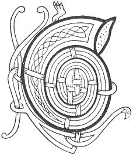

  
[Intangible Textual Heritage](../../../index) 
[Legends/Sagas](../../index)  [Celtic](../index)  [Carmina
Gadelica](../cg)  [Index](index)  [Previous](cg1066)  [Next](cg1068) 

------------------------------------------------------------------------

[Buy this Book at
Amazon.com](https://www.amazon.com/exec/obidos/ASIN/B0027P88YQ/internetsacredte)

------------------------------------------------------------------------

  
*Carmina Gadelica, Volume 1*, by Alexander Carmicheal, \[1900\], at
Intangible Textual Heritage

------------------------------------------------------------------------

<table data-border="0">
<colgroup>
<col style="width: 50%" />
<col style="width: 50%" />
</colgroup>
<tbody>
<tr class="odd">
<td data-valign="top" width="327">
p. 148
</td>
<td data-valign="top" width="327">
p. 149
</td>
</tr>
<tr class="even">
<td data-valign="top" width="327"><h3 id="calluinn-a-bhuilg-63" data-align="center">CALLUINN A BHUILG [63]</h3></td>
<td data-valign="top" width="327"><h3 id="hogmanay-of-the-sack" data-align="center">HOGMANAY OF THE SACK</h3></td>
</tr>
</tbody>
</table>

CALLUINEN HO!--This rune is still repeated in the Isles. Rarely,
however, do two persons recite it alike. This renders it difficult to
decide the right form of the words.

The walls of the old houses in the West are very thick--from five to
eight feet. There are no gables, the walls being of uniform height
throughout. The roof of the house being raised from the inner edge of
the wall, a broad terrace is left on the outside. Two or three stones
project from the wall at the door, forming steps. On these the inmates
ascend for purposes of thatching and securing the roof in time of storm.
p. 149

The 'gillean Callaig' carollers or Hogmanay lads perambulate the
townland at night. One man is enveloped in the hard hide of a bull with
the horns and hoofs still attached. When the men come to a house they
ascend the wall and run round sunwise, the man in the hide shaking the
horns and hoofs, and the other men striking the hard hide with sticks.
The appearance of the man in the hide is gruesome, while the din made is
terrific. Having descended and recited their runes at the door, the
Hogmanay men are admitted and treated to the best in the house. The
performance seems to be symbolic, but of what it is not easy to say,
unless of laying an evil spirit. That the rite is heathen and ancient is
evident.

 

<table data-border="0">
<colgroup>
<col style="width: 25%" />
<col style="width: 25%" />
<col style="width: 25%" />
<col style="width: 25%" />
</colgroup>
<tbody>
<tr class="odd">
<td data-valign="top">
 
</td>
<td data-valign="top">
p. 148
</td>
<td data-valign="top">
 
</td>
<td data-valign="top">
p. 149
</td>
</tr>
<tr class="even">
<td data-valign="top">
 
</td>
<td data-valign="top">
CALLIUINN a bhuilg, 
Calluinn a bhuilg, 
     Buail am boicionn, 
     Buail am boicionn. 
Calluinn a bhuilg, 
Calluinn a bhuilg, 
     Buail an craicionn, 
     Buail an craicionn. 
Calluinn a bhuilg, 
Calluinn a bhuilg, 
     Sios e! suas e! 
     Buail am boicionn. 
Calluinn a bhuilg, 
Calluinn a bhuilg, 
     Sios e! suas e! 
     Buail an craicionn. 
Calluinn a bhuilg, 
Calluinn a bhuilg.
</td>
<td data-valign="top">
 
</td>
<td data-valign="top">
HOGMANAY of the sack, 
Hogmanay of the sack, 
     Strike the hide, 
     Strike the hide. 
Hogmanay of the sack, 
Hogmanay of the sack, 
     Beat the skin, 
     Beat the skin. 
Hogmanay of the sack, 
Hogmanay of the sack, 
     Down with it! up with it! 
     Strike the hide. 
Hogmanay of the sack, 
Hogmanay of the sack, 
     Down with it! up with it! 
     Beat the skin. 
Hogmanay of the sack, 
Hogmanay of the sack.
</td>
</tr>
</tbody>
</table>

 

------------------------------------------------------------------------

[Next: 64. Hogmanay Carol. Cairioll Callaig](cg1068)
