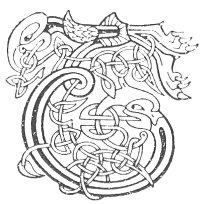

  
[Intangible Textual Heritage](../../../index) 
[Legends/Sagas](../../index)  [Celtic](../index)  [Carmina
Gadelica](../cg)  [Index](index)  [Previous](cg1069)  [Next](cg1071) 

------------------------------------------------------------------------

[Buy this Book at
Amazon.com](https://www.amazon.com/exec/obidos/ASIN/B0027P88YQ/internetsacredte)

------------------------------------------------------------------------

  
*Carmina Gadelica, Volume 1*, by Alexander Carmicheal, \[1900\], at
Intangible Textual Heritage

------------------------------------------------------------------------

 

<table data-border="0">
<colgroup>
<col style="width: 50%" />
<col style="width: 50%" />
</colgroup>
<tbody>
<tr class="odd">
<td data-valign="top" width="327">
p. 156
</td>
<td data-valign="top" width="327">
p. 157
</td>
</tr>
<tr class="even">
<td data-valign="top" width="327"><h3 id="oidhche-challaig-66" data-align="center">OIDHCHE CHALLAIG [66]</h3></td>
<td data-valign="top" width="327"><h3 id="hogmanay" data-align="center">HOGMANAY</h3></td>
</tr>
</tbody>
</table>

 

<table data-border="0">
<colgroup>
<col style="width: 25%" />
<col style="width: 25%" />
<col style="width: 25%" />
<col style="width: 25%" />
</colgroup>
<tbody>
<tr class="odd">
<td data-valign="top">
 
</td>
<td data-valign="top">
p. 156
</td>
<td data-valign="top">
 
</td>
<td data-valign="top">
p. 157
</td>
</tr>
<tr class="even">
<td rowspan="5" data-valign="top">
 
</td>
<td data-valign="top">
THAINE sinne chon an doruis, 
Feuch am feairrde sinn an turas, 
Dh’ innis a mhnathan coir a bhaile, 
Gur e maireach La Cullaig.
</td>
<td data-valign="top">
 
</td>
<td data-valign="top">
WE are come to the door, 
To see if we be the better of our visit, 
To tell the generous women of the townland 
That to-morrow is Calendae Day.
</td>
</tr>
<tr class="odd">
<td colspan="3" data-valign="top">
After being entertained the guisers go sunwise p. 157 round the fire singing--
</td>
</tr>
<tr class="even">
<td data-valign="top">
Gum beannaicheadh Dia an t-ardrach, 
Eadar chlach, is chuaille, is chrann, 
Eadar bhithe, bhliochd, is aodach, 
Slainte dhaoin bhi daonnan ann,
</td>
<td data-valign="top">
 
</td>
<td data-valign="top">
May God bless the dwelling, 
Each stone, and beam, and stave, 
All food, and drink, and clothing, 
May health of men he always there.
</td>
</tr>
<tr class="odd">
<td colspan="3" data-valign="top">Should the guisers be inhospitably treated, they file round the fire withershins and walk out, and raise a cairn in or near the door, called 'carnan mollachd,' cairn of malison, 'carnan cronachd,' scaith cairn. p. 157

They tramp loudly, shaking the dust of the place off their feet, and intoning with a deep voice the following and other maledictions:--
</td>
</tr>
<tr class="even">
<td data-valign="top">
Mallachd Dhe is Challaig oirbh, 
’S cronachd chlaimhein chiuchaich, 
Fioinn, fithich agus fiolair, 
’S cronachd sionnaich liugaich.

Cronachd chon is chat oirbh, 
Thorc is bhroc is bhrugha, 
Mhaghain mais ’s mhadaidh-alla, 
’S cronachd thaghain tutaidh.
</td>
<td data-valign="top">
 
</td>
<td data-valign="top">
The malison of God and of Hogmanay be on you, 
And the scath of the plaintive buzzard, 
Of the hen-harrier, of the raven, of the eagle, 
And the scath of the sneaking fox.

The scath of the dog and of the cat be on you, 
Of the boar, of the badger, and of the 'brugha,' 
Of the hipped bear and of the wild wolf, 
And the scath of the foul foumart.
</td>
</tr>
</tbody>
</table>

 

------------------------------------------------------------------------

[Next: 67. The Blessing Of The New Year. Beannachadh Bliadhna
Uir](cg1071)
