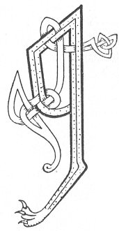

  
[Intangible Textual Heritage](../../../index) 
[Legends/Sagas](../../index)  [Celtic](../index)  [Carmina
Gadelica](../cg)  [Index](index)  [Previous](cg1076)  [Next](cg1078) 

------------------------------------------------------------------------

[Buy this Book at
Amazon.com](https://www.amazon.com/exec/obidos/ASIN/B0027P88YQ/internetsacredte)

------------------------------------------------------------------------

  
*Carmina Gadelica, Volume 1*, by Alexander Carmicheal, \[1900\], at
Intangible Textual Heritage

------------------------------------------------------------------------

 

<table data-border="0">
<colgroup>
<col style="width: 50%" />
<col style="width: 50%" />
</colgroup>
<tbody>
<tr class="odd">
<td data-valign="top" width="327">
p. 178
</td>
<td data-valign="top" width="327">
p. 179
</td>
</tr>
<tr class="even">
<td data-valign="top" width="327"><h3 id="manus-mo-ruin-72" data-align="center">MANUS MO RUIN [72]</h3></td>
<td data-valign="top" width="327"><h3 id="magnus-of-my-love" data-align="center">MAGNUS OF MY LOVE</h3></td>
</tr>
</tbody>
</table>

 

MAGNUS was descended from Malcolm Canmore, King of the Scots. Earl
Magnus and his half-brother Earl Hakon ruled the Northern Isles, and
while they were in agreement with one another there was peace and plenty
within those isles. But dissensions arose. Magnus was eminently
handsome, beneficent, and beloved. Hakon was lacking in these qualities,
and he became morose and jealous of his brother.

The two brothers met at the Thingstead in Lent, Hakon being there for
offensive, and Magnus for defensive, purposes. Wisdom prevailed,
however, and war was averted. To confirm the peace Hakon invited Magnus
to meet him in Pasch week in the church of Egilsey, the brothers
agreeing to limit their retinue to two warships each. Magnus observed
the agreement and came with two ships, but Hakon brought eight, with
their full complement of armed men.

His people wished to defend Magnus, but he refused to allow the spilling
of blood, or the perilling of souls. Magnus submitted to his brother
three proposals. First, that he should go to his relative, the King of
the Scots, and never return; second, that he should go to Rome or to
Jerusalem and never return; or third, that he would submit to be maimed,
gouged, or slain. Hakon spurned all the proposals save the last, and
Magnus was put to death on the 14th of April, 1115, to the great grief
of his people. p. 179

The place where Magnus was slain had been a rough, sterile moor of heath
and moss, but immediately Magnus was put to death the moor became a
smiling grassy plain, and there issued a heavenly light and a sweet
odour from the holy ground.

Those who were in peril prayed to Magnus and were rescued, and those who
were sick came to his grave and were healed. Pilgrims flocked to his
tomb to keep vigil at his shrine, and be cured of their leprosy of body
or of soul,

St Magnus had three burials--the first in the island of Egilsey where he
was slain, and the second at the intercession of his mother, Thora, in
Christ Church in the island of Birsa. During imminent peril at sea Earl
Rognovald prayed to Magnus for deliverance, and vowed that he would
build a minster to his memory more beautiful than any church in those
lands. The prayer was heard, and Rognovald built and endowed, to the
memory of the holy Magnus, the cathedral church of Kirkwall. Thither the
relics of the saint were brought and interred, and the cathedral became
the resort of pilgrims who sought the aid of St Magnus.

At the battle of Anglesea, between Magnus Barefoot, his brother Ireland,
his cousin Haco, and the Earls of Chester and Shrewsbury, Magnus recited
the Psalter during the conflict. The victory of his northern kinsmen was
attributed to the holy Magnus.

 

<table data-border="0">
<colgroup>
<col style="width: 25%" />
<col style="width: 25%" />
<col style="width: 25%" />
<col style="width: 25%" />
</colgroup>
<tbody>
<tr class="odd">
<td data-valign="top">
 
</td>
<td data-valign="top">
p. 178
</td>
<td data-valign="top">
 
</td>
<td data-valign="top">
p. 179
</td>
</tr>
<tr class="even">
<td data-valign="top">
 
</td>
<td data-valign="top">
A MHANUIS mo ruin, 
Is to dheanadh dhuinn iul, 
A chuirp chubhraidh nan dul, 
     Cuimhnich oirnn.

Cuimhnich a naoimh nam buadh, 
A chomraig ’s a chomhn an sluagh, 
Cobhair oirnne ’n ar truaigh, 
     ’S na treig sinn.

Tog ar seilbh mach ri leirg, 
Casg coin ghioirr is coin dheirg, 
Cum uainn fuath, fath, feirg, 
     Agus foirne.
</td>
<td data-valign="top">
 
</td>
<td data-valign="top">
O MAGNUS of my love, 
Thou it is who would’st us guide, 
Thou fragrant body of grace, 
     Remember us.

Remember us, thou Saint of power, 
Who didst encompass and protect the people, 
Succour thou us in our distress, 
     Nor forsake us.

Lift our flocks to the hills, 
Quell the wolf and the fox, 
Ward from us spectre, giant, fury, 
     And oppression.
</td>
</tr>
<tr class="odd">
<td data-valign="top">
 
</td>
<td data-valign="top">
p. 180
</td>
<td data-valign="top">
 
</td>
<td data-valign="top">
p. 181
</td>
</tr>
<tr class="even">
<td data-valign="top">
 
</td>
<td data-valign="top">
Cuartaich tan agus buar, 
Cuartaich caor agus uan; 
Cum uap an fhamh-bhual, 
     ’S an luch-fheoir.

Crath an druchd o’n speur air crodh, 
Thoir fas air feur, deis, agus snodh, 
Dubhrach, lus-feidh, ceis, meacan-dogh, 
     Agus neoinean.

O Mhanuis nan glonn, 
Air bharca nan sonn, 
Air bharra nan tonn, 
Air sala no fonn, 
     Comhn agus gleidh sinn.
</td>
<td data-valign="top">
 
</td>
<td data-valign="top">
Surround cows and herds, 
Surround sheep and lambs; 
Keep from them the water-vole, 
     And the field-vole.

Sprinkle dew from the sky upon kine, 
Give growth to grass, and corn, and sap to plants, 
Water-cress, deer's-grass, 'ceis,' burdock, 
     And daisy.

O Magnus of fame, 
On the barque of the heroes, 
On the crests of the waves, 
On the sea, on the land, 
     Aid and preserve us.
</td>
</tr>
</tbody>
</table>

 

------------------------------------------------------------------------

[Next: 73. The Beltane Blessing. Am Beannachadh Bealltain](cg1078)
