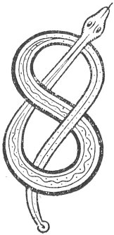

  
[Intangible Textual Heritage](../../../index) 
[Legends/Sagas](../../index)  [Celtic](../index)  [Carmina
Gadelica](../cg)  [Index](index)  [Previous](cg1094)  [Next](cg1096) 

------------------------------------------------------------------------

[Buy this Book at
Amazon.com](https://www.amazon.com/exec/obidos/ASIN/B0027P88YQ/internetsacredte)

------------------------------------------------------------------------

  
*Carmina Gadelica, Volume 1*, by Alexander Carmicheal, \[1900\], at
Intangible Textual Heritage

------------------------------------------------------------------------

 

<table data-border="0">
<colgroup>
<col style="width: 50%" />
<col style="width: 50%" />
</colgroup>
<tbody>
<tr class="odd">
<td data-valign="top" width="327">
p. 240
</td>
<td data-valign="top" width="327">
p. 241
</td>
</tr>
<tr class="even">
<td data-valign="top" width="327"><h3 id="beannachadh-smalaidh-87" data-align="center">BEANNACHADH SMALAIDH [87]</h3></td>
<td data-valign="top" width="327"><h3 id="smooring-blessing" data-align="center">SMOORING BLESSING</h3></td>
</tr>
</tbody>
</table>

 

<table data-border="0">
<colgroup>
<col style="width: 25%" />
<col style="width: 25%" />
<col style="width: 25%" />
<col style="width: 25%" />
</colgroup>
<tbody>
<tr class="odd">
<td data-valign="top">
 
</td>
<td data-valign="top">
p. 240
</td>
<td data-valign="top">
 
</td>
<td data-valign="top">
p. 241
</td>
</tr>
<tr class="even">
<td data-valign="top">
 
</td>
<td data-valign="top">
SMALAIDH mis an tula 
Mar a smaladh Muire; 
Comraig Bhride ’s Mhuire, 
Air an tula ’s air an lar, 
     ’S air an fhardaich uile.

Co siud air liana mach? 
Muire ghrian-gheal ’s a Mac, 
Bial Dia dh’ iarradh, aingheal Dia labhradh; 
Ainghle geallaidh faire an teallaidh, 
     Gu’n tig latha geal gu beallaidh.
</td>
<td data-valign="top">
 
</td>
<td data-valign="top">
I WILL smoor the hearth 
As Mary would smoor; 
The encompassment of Bride and of Mary, 
On the fire and on the floor, 
     And on the household all.

Who is on the lawn without? 
Fairest Mary and her Son, 
The mouth of God ordained, the angel of God spoke; 
Angels of promise watching the hearth, 
     Till white day comes to the fire.
</td>
</tr>
</tbody>
</table>

 

 

------------------------------------------------------------------------

[Next: 88. The Consecration of the Seed. An Coisrigeadh Sioil](cg1096)
