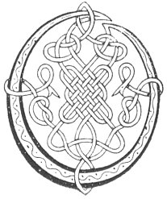

  
[Intangible Textual Heritage](../../../index) 
[Legends/Sagas](../../index)  [Celtic](../index)  [Carmina
Gadelica](../cg)  [Index](index)  [Previous](cg1105)  [Next](cg1107) 

------------------------------------------------------------------------

[Buy this Book at
Amazon.com](https://www.amazon.com/exec/obidos/ASIN/B0027P88YQ/internetsacredte)

------------------------------------------------------------------------

  
*Carmina Gadelica, Volume 1*, by Alexander Carmicheal, \[1900\], at
Intangible Textual Heritage

------------------------------------------------------------------------

 

<table data-border="0">
<colgroup>
<col style="width: 50%" />
<col style="width: 50%" />
</colgroup>
<tbody>
<tr class="odd">
<td data-valign="top" width="327">
p. 266
</td>
<td data-valign="top" width="327">
p. 267
</td>
</tr>
<tr class="even">
<td data-valign="top" width="327"><h3 id="ho-m-aghan-97" data-align="center">HO M’ AGHAN! [97]</h3></td>
<td data-valign="top" width="327"><h3 id="ho-my-heifer" data-align="center">HO, MY HEIFER!</h3></td>
</tr>
</tbody>
</table>

 

<table data-border="0">
<colgroup>
<col style="width: 25%" />
<col style="width: 25%" />
<col style="width: 25%" />
<col style="width: 25%" />
</colgroup>
<tbody>
<tr class="odd">
<td data-valign="top">
 
</td>
<td data-valign="top">
p. 266
</td>
<td data-valign="top">
 
</td>
<td data-valign="top">
p. 267
</td>
</tr>
<tr class="even">
<td data-valign="top">
 
</td>
<td data-valign="top">
OIDHCHE sin bha ’m Buachaill a muigh 
Cha deacha buarach air boin, 
Cha deacha geum a beul laoigh, 
Caoineadh Buachaill a chruidh, 
     Caoineadh Buachaill a chruidh.

     Ho m’ aghan! ho m’ aghan! 
     Ho m’ aghan! m’ aghan gaoil 
     Chridheag chridh, choir, ghradhaich, 
     Air sgath an Ard Righ gabh ri d’ laogh.

Oidhche sin bha ’m Buachaill air chall, 
Fhuaradh anns an Teampull e. 
Righ na gile thighinn a nall! 
Righ na greine nuas a neamh! 
     Righ na greine nuas a neamh!
</td>
<td data-valign="top">
 
</td>
<td data-valign="top">
THE night the Herdsman was out 
No shackle went on a cow, 
Lowing ceased not from the mouth of calf 
Wailing the Herdsman of the flock, 
     Wailing the herdsman of the flock.

     Ho my heifer! ho my heifer! 
     Ho my heifer! my heifer beloved! 
     My heartling heart, kind, fond, 
     For the sake of the High King take to thy calf.

The night the Herdsman was missing, 
In the Temple He was found. 
The King of the moon to come hither! 
The King of the sun down from heaven! 
     King of the sun down from heaven!
</td>
</tr>
</tbody>
</table>

 

------------------------------------------------------------------------

[Next: 98. Give Thy Milk. Thoir Am Bainne](cg1107)
