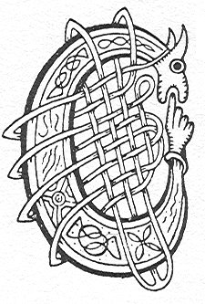

  
[Intangible Textual Heritage](../../../index) 
[Legends/Sagas](../../index)  [Celtic](../index)  [Carmina
Gadelica](../cg)  [Index](index)  [Previous](cg1109)  [Next](cg1111) 

------------------------------------------------------------------------

[Buy this Book at
Amazon.com](https://www.amazon.com/exec/obidos/ASIN/B0027P88YQ/internetsacredte)

------------------------------------------------------------------------

  
*Carmina Gadelica, Volume 1*, by Alexander Carmicheal, \[1900\], at
Intangible Textual Heritage

------------------------------------------------------------------------

<table data-border="0">
<colgroup>
<col style="width: 50%" />
<col style="width: 50%" />
</colgroup>
<tbody>
<tr class="odd">
<td data-valign="top" width="327">
p. 274
</td>
<td data-valign="top" width="327">
p. 275
</td>
</tr>
<tr class="even">
<td data-valign="top" width="327"><h3 id="beannachadh-buachailleachd-101" data-align="center">BEANNACHADH BUACHAILLEACHD [101]</h3></td>
<td data-valign="top" width="327"><h3 id="herding-blessing" data-align="center">HERDING BLESSING</h3></td>
</tr>
</tbody>
</table>

 

<table data-border="0">
<colgroup>
<col style="width: 25%" />
<col style="width: 25%" />
<col style="width: 25%" />
<col style="width: 25%" />
</colgroup>
<tbody>
<tr class="odd">
<td data-valign="top">
 
</td>
<td data-valign="top">
p. 274
</td>
<td data-valign="top">
 
</td>
<td data-valign="top">
p. 275
</td>
</tr>
<tr class="even">
<td data-valign="top">
 
</td>
<td data-valign="top">
CUIRIDH mi an Di seo romham, 
Mar a dh’ orduich Righ an domhan, 
Bride ’g an gleidheadh, ’g an coimhead, ’s ’g an comhnadh, 
Air bheann, air ghleann, air chomhnard, 
     Bride ’g an gleidheadh, ’g an coimhead, ’s ’g an comhnadh, 
     Air bheann, air ghleann, air chomhnard.

Eirich, a Bhride mhin-gheal, 
Glac do lion, do chir, agus t’ fholt, 
Bho rinn thu daibh eolas amhra, 
’G an cumail bho chall is bho lochd, 
     Bho rinn thu daibh colas amhra, 
     ’G an cumail bho chall is bho lochd.

Bho chreag, bho chathan, bho allt, 
Bho chadha cam, bho mhille sluic, 
Bho shaighde reang nam ban seanga sith, 
Bho chridhe mhi-ruin, bho shuil an uilc, 
     Bho shaighde reang nam ban seanga sith, 
     Bho chridhe mhi-ruin, bho shuil an uilc.

Mhoire Mhathair, cuallaich an t-al gu leir, 
Bhride nam basa mine, dion domh mo spreidh, 
Chaluim chaoimh, a naoimh nan ioma buadh, 
Comraig dhomh crodh an ail, bairig dhomh buar, 
     Chaluim chaoimh, a naoimh nan ioma buadh, 
     Comraig dhomh crodh an ail, bairig dhomh buar.
</td>
<td data-valign="top">
 
</td>
<td data-valign="top">
I WILL place this flock before me, 
As was ordained of the King of the world, 
Bride to keep them, to watch them, to tend them. 
On ben, on glen, on plain, 
     Bride to keep them, to watch them, to tend them, 
     On ben, on glen, on plain.

Arise, thou Bride the gentle, the fair, 
Take thou thy lint, thy comb, and thy hair, 
Since thou to them madest the noble charm, 
To keep them from straying, to save them from harm, 
     Since thou to them madest the noble charm, 
     To keep them from straying, to save them from harm.

From rocks, from drifts, from streams, 
From crooked passes, from destructive pits, 
From the straight arrows of the slender ban-shee, 
From the heart of envy, from the eye of evil, 
     From the straight arrows of the slender ban-shee, 
     From the heart of envy, from the eye of evil.

Mary Mother, tend thou the offspring all, 
Bride of the fair palms, guard thou my flocks, 
Kindly Columba, thou saint of many powers, 
Encompass thou the breeding cows, bestow on me herds, 
     Kindly Columba, thou saint of many powers, 
     Encompass thou the breeding cows, bestow on me herds.
</td>
</tr>
</tbody>
</table>

 

 

------------------------------------------------------------------------

[Next: 102. Herding Blessing. Beannachadh Buachailleachd](cg1111)
