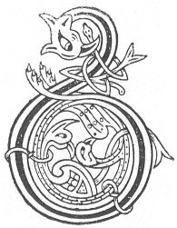

  
[Intangible Textual Heritage](../../../index) 
[Legends/Sagas](../../index)  [Celtic](../index)  [Carmina
Gadelica](../cg)  [Index](index)  [Previous](cg1111)  [Next](cg1113) 

------------------------------------------------------------------------

[Buy this Book at
Amazon.com](https://www.amazon.com/exec/obidos/ASIN/B0027P88YQ/internetsacredte)

------------------------------------------------------------------------

  
*Carmina Gadelica, Volume 1*, by Alexander Carmicheal, \[1900\], at
Intangible Textual Heritage

------------------------------------------------------------------------

 

<table data-border="0">
<colgroup>
<col style="width: 50%" />
<col style="width: 50%" />
</colgroup>
<tbody>
<tr class="odd">
<td data-valign="top" width="327">
p. 278
</td>
<td data-valign="top" width="327">
p. 279
</td>
</tr>
<tr class="even">
<td data-valign="top" width="327"><h3 id="comraig-nam-ba-103" data-align="center">COMRAIG NAM BA [103]</h3></td>
<td data-valign="top" width="327"><h3 id="the-protection-of-the-cattle" data-align="center">THE PROTECTION OF THE CATTLE</h3></td>
</tr>
</tbody>
</table>

 

<table data-border="0">
<colgroup>
<col style="width: 25%" />
<col style="width: 25%" />
<col style="width: 25%" />
<col style="width: 25%" />
</colgroup>
<tbody>
<tr class="odd">
<td data-valign="top">
 
</td>
<td data-valign="top">
p. 278
</td>
<td data-valign="top">
 
</td>
<td data-valign="top">
p. 279
</td>
</tr>
<tr class="even">
<td data-valign="top">
 
</td>
<td data-valign="top">
BLARAGAN reidh, fada, farsuinn, 
Faileagan feile fo ’r casan, 
Cairdeas Mhic De dh’ ar toir dhachaidh 
Gu faiche nam fuaran, 
     Faiche nam fuaran.

Gum bu duinte duibh gach slochd, 
Gum bu sumhail duibh gach cnoc, 
Gum bu clumhaidh duibh gach nochd, 
Am fochar nam fuar-bheann, 
     Fochar ham fuar-bheann.

Comraig Pheadail agus Phoil, 
Comraig Sheumais agus Eoin, 
Comraig Bhride mhin ’s Mhuir Oigh, 
Dh’ ar comhlach ’s dh’ ar cuallach, 
O! comraig gach aon dh’ an chomhl 
Dh’ ar comhnadh ’s dh’ ar cuanadh.
</td>
<td data-valign="top">
 
</td>
<td data-valign="top">
PASTURES smooth, long, and spreading, 
Grassy meads aneath your feet, 
The friendship of God the Son to bring you home 
To the field of the fountains, 
     Field of the fountains.

Closed be every pit to you, 
Smoothed be every knoll to you, 
Cosy every exposure to you, 
Beside the cold mountains, 
     Beside the cold mountains.

The care of Peter and of Paul, 
The care of James and of John, 
The care of Bride fair and of Mary Virgin, 
To meet you and to tend you, 
     Oh! the care of all the band 
     To protect you and to strengthen you.
</td>
</tr>
</tbody>
</table>

 

------------------------------------------------------------------------

[Next: 104. Guarding The Flocks. Gleidheadh Treuid](cg1113)
