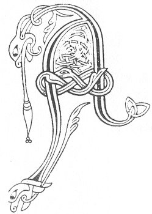

  
[Intangible Textual Heritage](../../../index) 
[Legends/Sagas](../../index)  [Celtic](../index)  [Carmina
Gadelica](../cg)  [Index](index)  [Previous](cg1113)  [Next](cg1115) 

------------------------------------------------------------------------

[Buy this Book at
Amazon.com](https://www.amazon.com/exec/obidos/ASIN/B0027P88YQ/internetsacredte)

------------------------------------------------------------------------

  
*Carmina Gadelica, Volume 1*, by Alexander Carmicheal, \[1900\], at
Intangible Textual Heritage

------------------------------------------------------------------------

 

<table data-border="0">
<colgroup>
<col style="width: 50%" />
<col style="width: 50%" />
</colgroup>
<tbody>
<tr class="odd">
<td data-valign="top" width="327">
p. 282
</td>
<td data-valign="top" width="327">
p. 283
</td>
</tr>
<tr class="even">
<td data-valign="top" width="327"><h3 id="cronan-cuallaich-105" data-align="center">CRONAN CUALLAICH [105]</h3></td>
<td data-valign="top" width="327"><h3 id="a-herding-croon" data-align="center">A HERDING CROON</h3></td>
</tr>
</tbody>
</table>

 

<table data-border="0">
<colgroup>
<col style="width: 25%" />
<col style="width: 25%" />
<col style="width: 25%" />
<col style="width: 25%" />
</colgroup>
<tbody>
<tr class="odd">
<td data-valign="top">
 
</td>
<td data-valign="top">
p. 282
</td>
<td data-valign="top">
 
</td>
<td data-valign="top">
p. 283
</td>
</tr>
<tr class="even">
<td data-valign="top">
 
</td>
<td data-valign="top">
AN crodh an diugh a dol imirig, 
        Hill-i-ruin is o h-ug o, 
        Ho ro la ill o, 
        Hill-i-ruin is o h-ug o, 
Dol a dh’ itheadh feur na cille, 
        Hill-i-ruin is o h-ug o, 
Am buachaille fein ann ’g an iomain, 
        Ho ro la ill o, 
        Hill-i-ruin is o h-ug o, 
’G an cuallach, ’g an cuart, ’g an tilleadh, 
        Hill-i-ruin is o h-ug o, 
Bride bhith-gheal bhi ’g am blighinn, 
        Hill-i-ruin is o h-ug o, 
Muire mhin-gheal bhi ’g an glidheadh, 
        Hill-i-ruin is o h-ug o, 
’S Iosa Criosda air chinn an slighe, 
  Iosa Criosda air chinn an slighe. 
        Hill-i-ruin is o h-ug o.
</td>
<td data-valign="top">
 
</td>
<td data-valign="top">
THE cattle are to-day going a-flitting, 
        Hill-i-rūin is o h-ug o, 
        Ho ro la ill o, 
        Hill-i-rūin is o h-ūg o, 
Going to eat the grass of the burial-place, 
        Hill-i-rūin is o h-ūg o, 
Their own herdsman there to tend them, 
        Ho ro la ill o, 
        Hill-i-rūin is o h-ūg o, 
Tending them, fending them, turning them, 
        Hill-i-rūin is o h-ūg o, 
Be the gentle Bride milking them, 
        Hill-i-rūin is o h-ūg o, 
Be the lovely Mary keeping them, 
        Hill i-rūin is o h-ūg o, 
And Jesu Christ at the end of their journey, 
  Jesu Christ at the end of their journey. 
        Hill-i-rūin is o h-ūg o.
</td>
</tr>
</tbody>
</table>

 

------------------------------------------------------------------------

[Next: 106. Hatching Blessing. Beannachadh Guir](cg1115)
