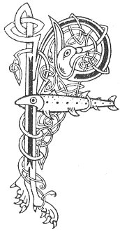

  
[Intangible Textual Heritage](../../../index) 
[Legends/Sagas](../../index)  [Celtic](../index)  [Carmina
Gadelica](../cg)  [Index](index)  [Previous](cg1116)  [Next](cg1118) 

------------------------------------------------------------------------

[Buy this Book at
Amazon.com](https://www.amazon.com/exec/obidos/ASIN/B0027P88YQ/internetsacredte)

------------------------------------------------------------------------

  
*Carmina Gadelica, Volume 1*, by Alexander Carmicheal, \[1900\], at
Intangible Textual Heritage

------------------------------------------------------------------------

 

<table data-border="0">
<colgroup>
<col style="width: 50%" />
<col style="width: 50%" />
</colgroup>
<tbody>
<tr class="odd">
<td data-valign="top" width="327">
p. 292
</td>
<td data-valign="top" width="327">
p. 293
</td>
</tr>
<tr class="even">
<td data-valign="top" width="327"><h3 id="am-beannachd-lombaidh-108" data-align="center">AM BEANNACHD LOMBAIDH [108]</h3></td>
<td data-valign="top" width="327"><h3 id="the-clipping-blessing" data-align="center">THE CLIPPING BLESSING</h3></td>
</tr>
</tbody>
</table>

 

WHEN a man has shorn a sheep and has set p.
293 it free, he waves his hand after it and says:--

 

<table data-border="0">
<colgroup>
<col style="width: 25%" />
<col style="width: 25%" />
<col style="width: 25%" />
<col style="width: 25%" />
</colgroup>
<tbody>
<tr class="odd">
<td data-valign="top">
 
</td>
<td data-valign="top">
p. 292
</td>
<td data-valign="top">
 
</td>
<td data-valign="top">
p. 293
</td>
</tr>
<tr class="even">
<td data-valign="top">
 
</td>
<td data-valign="top">
FALBH lom ’s thig molach, 
Beir am boirionn Bealltain, 
Bride mhin a bhi dha d’ chonaill, 
Moire gheal dha t’ aurais, 
     Moire gheal dha t’ aurais.

Micheal mil a bhi dha d’ dhion 
Bho ’n mhi-chu is bho ’n an-chu, 
Bho ’n mhac-tir ’s bho ’n mhadhan stig, 
’S bho ianaibh ineach call-ghob, 
     Bho ianaibh ineach cam-ghob.
</td>
<td data-valign="top">
 
</td>
<td data-valign="top">
Go shorn and come woolly, 
Bear the Beltane female lamb, 
Be the lovely Bride thee endowing, 
And the fair Mary thee sustaining, 
     The fair Mary sustaining thee.

Michael the chief be shielding thee 
From the evil dog and from the fox, 
From the wolf and from the sly bear, 
And from the taloned birds of destructive bills, 
     From the taloned birds of hooked bills.
</td>
</tr>
</tbody>
</table>

 

------------------------------------------------------------------------

[Next: 109. The Chant of the Warping. Duan Deilbh](cg1118)
