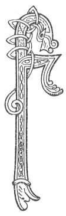

  
[Intangible Textual Heritage](../../../index) 
[Legends/Sagas](../../index)  [Celtic](../index)  [Carmina
Gadelica](../cg)  [Index](index)  [Previous](cg1118)  [Next](cg1120) 

------------------------------------------------------------------------

[Buy this Book at
Amazon.com](https://www.amazon.com/exec/obidos/ASIN/B0027P88YQ/internetsacredte)

------------------------------------------------------------------------

  
*Carmina Gadelica, Volume 1*, by Alexander Carmicheal, \[1900\], at
Intangible Textual Heritage

------------------------------------------------------------------------

 

<table data-border="0">
<colgroup>
<col style="width: 50%" />
<col style="width: 50%" />
</colgroup>
<tbody>
<tr class="odd">
<td data-valign="top" width="327">
p. 300
</td>
<td data-valign="top" width="327">
p. 301
</td>
</tr>
<tr class="even">
<td data-valign="top" width="327"><h3 id="beannachd-beairte-110" data-align="center">BEANNACHD BEAIRTE [110]</h3></td>
<td data-valign="top" width="327"><h3 id="loom-blessing" data-align="center">LOOM BLESSING</h3></td>
</tr>
</tbody>
</table>

 

<table data-border="0">
<colgroup>
<col style="width: 25%" />
<col style="width: 25%" />
<col style="width: 25%" />
<col style="width: 25%" />
</colgroup>
<tbody>
<tr class="odd">
<td data-valign="top">
 
</td>
<td data-valign="top">
p. 300
</td>
<td data-valign="top">
 
</td>
<td data-valign="top">
p. 301
</td>
</tr>
<tr class="even">
<td data-valign="top">
 
</td>
<td data-valign="top">
FUIDHEAGAN no corr do shnath 
Cha do chum ’s cha chum mo lamh.

Gach dath a ta ’s a bhogha-fhrois 
Chaidh troimh mo mheoirean fo na chrois,

Geal is dubh, dearg is madar, 
Uaine, ciar-ghlas, agus sgarlaid,

Gorm, is grisionn ’s dath na caorach, 
’S caoibean cha robh dhith air aodach.

Guidhim Bride bith na faolachd, 
Guidhim Muire min na gaolachd, 
Guidhim Iosa Criosd na daonnachd, 
Gun mi fein dhol eug a ’n aonais, 
     Gun mi fein dhol eug a ’n aonais.
</td>
<td data-valign="top">
 
</td>
<td data-valign="top">
THRUMS nor odds of thread 
My hand never kept, nor shall keep,

Every colour in the bow of the shower 
Has gone through my fingers beneath the cross,

White and black, red and madder, 
Green, dark grey, and scarlet,

Blue, and roan, and colour of the sheep, 
And never a particle of cloth was wanting.

I beseech calm Bride the generous, 
I beseech mild Mary the loving, 
I beseech Christ Jesu the humane, 
That I may not die without them, 
     That I may not die without them.
</td>
</tr>
</tbody>
</table>

 

------------------------------------------------------------------------

[Next: 111 Setting the Iomairt. Suidheachadh Na H-Iomairt](cg1120)
