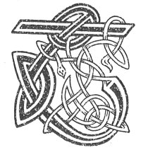

  
[Intangible Textual Heritage](../../../index) 
[Legends/Sagas](../../index)  [Celtic](../index)  [Carmina
Gadelica](../cg)  [Index](index)  [Previous](cg1128)  [Next](cg1130) 

------------------------------------------------------------------------

[Buy this Book at
Amazon.com](https://www.amazon.com/exec/obidos/ASIN/B0027P88YQ/internetsacredte)

------------------------------------------------------------------------

  
*Carmina Gadelica, Volume 1*, by Alexander Carmicheal, \[1900\], at
Intangible Textual Heritage

------------------------------------------------------------------------

 

<table data-border="0">
<colgroup>
<col style="width: 50%" />
<col style="width: 50%" />
</colgroup>
<tbody>
<tr class="odd">
<td data-valign="top" width="327">
p. 324
</td>
<td data-valign="top" width="327">
p. 325
</td>
</tr>
<tr class="even">
<td data-valign="top" width="327"><h3 id="beannachadh-cuain" data-align="center">BEANNACHADH CUAIN</h3></td>
<td data-valign="top" width="327"><h3 id="the-ocean-blessing" data-align="center">THE OCEAN BLESSING</h3></td>
</tr>
</tbody>
</table>

 

<table data-border="0">
<colgroup>
<col style="width: 25%" />
<col style="width: 25%" />
<col style="width: 25%" />
<col style="width: 25%" />
</colgroup>
<tbody>
<tr class="odd">
<td data-valign="top">
 
</td>
<td data-valign="top">
p. 324
</td>
<td data-valign="top">
 
</td>
<td data-valign="top">
p. 325
</td>
</tr>
<tr class="even">
<td data-valign="top">
 
</td>
<td data-valign="top">
THI tha chomhnadh nan ard, 
Tiuirich duinn do bheannachd aigh, 
Iomchair leinn air bharr an t-sal, 
Iomchair sinn gu cala tamh, 
Beannaich ar sgioba agus bat, 
Beannaich gach acair agus ramh, 
Gach stadh is tarruinn agus rac, 
Ar siuil-mhora ri crainn ard 
Cum a Righ nan dul ’n an ait 
Run ’s gu ’n till sinn dachaidh slan; 
Suidhidh mi fain air an stiuir, 
Is e Mac De a bheir domh iuil, 
Mar a thug e Chalum ciuin, 
’N am dha stadh a chur ri siuil.

Mhuire, Bhride, Mhicheil, Phail, 
Pheadair, Ghabriel, Eoin a ghraidh, 
Doirtibh oirnn an driuchd o’n aird, 
Bheireadh oirnn ’s a chreideamh fas, 
Daingnibh sinn ’s a Charraig Ail, 
Anns gach reachd a dhealbhas gradh, 
Run ’s gu ’n ruig sinn tir an aigh, 
Am hi sith is seirc is baigh 
Air an nochdadh duinn tre ghras; 
Chaoidh chan fhaigh a chnoimh ’n ar dail, 
Bithidh sinn tearuint ann gu brath, 
Cha bhi sinn an geimhlibh bais, 
Ge do tha sinn do shiol Adh.
</td>
<td data-valign="top">
 
</td>
<td data-valign="top">
O THOU who pervadest the heights, 
Imprint on us Thy gracious blessing, 
Carry us over the surface of the sea, 
Carry us safely to a haven of peace, 
Bless our boatmen and our boat, 
Bless our anchors and our oars, 
Each stay and halyard and traveller, 
Our mainsails to our tall masts 
Keep, O King of the elements, in their place 
That we may return home in peace; 
I myself will sit down at the helm, 
It is God's own Son who will give me guidance, 
As He gave to Columba the mild 
What time he set stay to sails.

Mary, Bride, Michael, Paul, 
Peter, Gabriel, John of love, 
Pour ye down from above the dew 
That would make our faith to grow, 
Establish ye us in the Rock of rocks, 
In every law that love exhibits, 
That we may reach the land of glory, 
Where peace and love and mercy reign, 
All vouchsafed to us through grace; 
Never shall the canker worm get near us, 
We shall there be safe for ever, 
We shall not be in the bonds of death 
Though we are of the seed of Adam.
</td>
</tr>
<tr class="odd">
<td data-valign="top">
 
</td>
<td data-valign="top">
p. 326
</td>
<td data-valign="top">
 
</td>
<td data-valign="top">
p. 327
</td>
</tr>
<tr class="even">
<td data-valign="top">
 
</td>
<td data-valign="top">
La Fheill Michell, La Fheill Mairt, 
La Fheill Andrais, bann na baigh, 
La Fheill Bride, la mo luaidh, 
Tilg an nimhir sios an chuan, 
Feuch an dean e slugadh suas; 
La Fheill Paruig, la nam buadh, 
Sorchair oirnn an stoirm o thuath, 
Casg a fraoch, maol a gruam, 
Diochd a gairge, marbh a fuachd.

La nan Tri Righrean shuas, 
Ciuinich dhuinne barr nan stuadh, 
La Bealltain thoir an driuchd, 
La Fheill Sheathain thoir an ciuin, 
La Fheill Moire mar nan char, 
Seachainn oirnn an stoirm o ’n iar, 
Gach la ’s oidhche, gach stoirm is fiamh, 
Bi thusa leinn, a Thriath nan triath, 
Bi fein duinn ad chairt-iuil, 
Biodh do lamh air failm ar stiuir, 
Do lamh fein, a Dhe nan dul, 
Moch is anamoch mar is iul, 
     Moch is anamoch mar is iul.
</td>
<td data-valign="top">
 
</td>
<td data-valign="top">
On the Feast Day of Michael, the Feast Day of Martin, 
The Feast Day of Andrew, band of mercy, 
The Feast Day of Bride, day of my choice, 
Cast ye the serpent into the ocean, 
So that the sea may swallow her up; 
On the Feast Day of Patrick, day of power, 
Reveal to us the storm from the north, 
Quell its wrath and blunt its fury, 
Lessen its fierceness, kill its cold.

On the Day of the Three Kings on high, 
Subdue to us the crest of the waves, 
On Beltane Day give us the dew, 
On John's Day the gentle wind, 
The Day of Mary the great of fame, 
Ward off us the storm from the west; 
Each day and night, storm and calm, 
Be Thou with us, O Chief of chiefs, 
Be Thou Thyself to us a compass-chart, 
Be Thine hand on the helm of our rudder, 
Thine own hand, Thou God of the elements, 
Early and late as is becoming, 
     Early and late as is becoming.
</td>
</tr>
</tbody>
</table>

 

 

------------------------------------------------------------------------

[Next: 119. Ocean Blessing. Beannachadh Cuain](cg1130)
