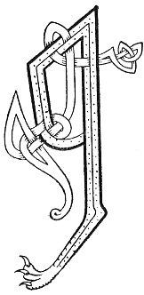

  
[Intangible Textual Heritage](../../../index) 
[Legends/Sagas](../../index)  [Celtic](../index)  [Carmina
Gadelica](../cg)  [Index](index)  [Previous](cg2004)  [Next](cg2006) 

------------------------------------------------------------------------

[Buy this Book at
Amazon.com](https://www.amazon.com/exec/obidos/ASIN/B0027P890O/internetsacredte)

------------------------------------------------------------------------

  
*Carmina Gadelica, Volume 2*, by Alexander Carmicheal, \[1900\], at
Intangible Textual Heritage

------------------------------------------------------------------------

 

<table data-border="0">
<colgroup>
<col style="width: 50%" />
<col style="width: 50%" />
</colgroup>
<tbody>
<tr class="odd">
<td data-valign="top" width="327">
p. 6
</td>
<td data-valign="top" width="327">
p. 7
</td>
</tr>
<tr class="even">
<td data-valign="top" width="327"><h3 id="eolas-na-ru-124" data-align="center">EOLAS NA RU [124]</h3></td>
<td data-valign="top" width="327"><h3 id="charm-for-rose" data-align="center">CHARM FOR ROSE</h3></td>
</tr>
</tbody>
</table>

 

<table data-border="0">
<colgroup>
<col style="width: 25%" />
<col style="width: 25%" />
<col style="width: 25%" />
<col style="width: 25%" />
</colgroup>
<tbody>
<tr class="odd">
<td data-valign="top">
 
</td>
<td data-valign="top">
p. 6
</td>
<td data-valign="top">
 
</td>
<td data-valign="top">
p. 7
</td>
</tr>
<tr class="even">
<td data-valign="top">
 
</td>
<td data-valign="top">
A RU eugail, aogail, atail, 
Fag uth na ba caisne, 
Fag uth na ba cait-cinn, 
Fag, fag a phait sin, 
     Agus tar pait eil ort.

A ru rag, rudaidh, 
Our an uth a mhairt, 
Fag an t-at ’s an t-utha, 
Teich gu grunn na claiche.

Cuirim ru ri clach, 
Cuirim clach ri lar, 
Cuirim bainne an uth, 
Cuirim sugh an ar.
</td>
<td data-valign="top">
 
</td>
<td data-valign="top">
THOU rose deathly, deadly, swollen, 
Leave the udder of the white-footed cow, 
Leave the udder of the spotted cow, 
Leave, leave that swelling, 
     And betake thyself to other swelling.

Thou rose thrawn, obstinate, 
Surly in the udder of the cow, 
Leave thou the swelling and the udder, 
Flee to the bottom of the stone.

I place the rose to the stone, 
I place the stone to the earth, 
I place milk in the udder, 
I place substance in the kidney.
</td>
</tr>
</tbody>
</table>

 

------------------------------------------------------------------------

[Next: 125. Charm For Swollen Breast. Eolas At Cioch](cg2006)
