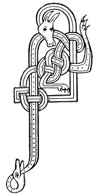

  
[Intangible Textual Heritage](../../../index) 
[Legends/Sagas](../../index)  [Celtic](../index)  [Carmina
Gadelica](../cg)  [Index](index)  [Previous](cg2007)  [Next](cg2009) 

------------------------------------------------------------------------

[Buy this Book at
Amazon.com](https://www.amazon.com/exec/obidos/ASIN/B0027P890O/internetsacredte)

------------------------------------------------------------------------

  
*Carmina Gadelica, Volume 2*, by Alexander Carmicheal, \[1900\], at
Intangible Textual Heritage

------------------------------------------------------------------------

 

<table data-border="0">
<colgroup>
<col style="width: 50%" />
<col style="width: 50%" />
</colgroup>
<tbody>
<tr class="odd">
<td data-valign="top" width="327">
p. 12
</td>
<td data-valign="top" width="327">
p. 13
</td>
</tr>
<tr class="even">
<td data-valign="top" width="327"><h3 id="eolas-na-budha-127" data-align="center">EOLAS NA BUDHA [127]</h3></td>
<td data-valign="top" width="327"><h3 id="charm-for-jaundice" data-align="center">CHARM FOR JAUNDICE</h3></td>
</tr>
</tbody>
</table>

 

THE following scene was described to me by Angus MacEachain, herdsman,
Staonabrig, South Uist, one of the chief actors in the episode.

The daughter of a farmer in the neighbourhood was ill with jaundice. The
doctor of the parish was attending her, but she was becoming worse
instead of better, and her end seemed near. Her distressed parents sent
for 'Aonas nan gisrean,' Angus of the exorcisms, and he came. The man
examined the girl and announced that she was possessed of the demon of
the jaundice, but that he would expel the demon and cure the girl. He
requested the mother to put on a big fire, the sisters to bring a tub of
clear cold water, and the father to bring the plough irons, evil spirits
being unable to withstand iron. All this was promptly done. The exorcist
placed the plough irons in the fire, displaying much solicitude that
they should be red-hot. The room was darkened and the eyes of the
patient were bandaged that the eyes of the body might be subjective to
the eyes of the mind. Directed by the exorcist, the mother and sisters
placed the back of the girl to the front of the bed, and laying it bare
left the room, the man securing the door after them. Making a clanging
noise with the plough irons as if to drive away the jaundice demon, the
man replaced the share in the fire and put the coulter in the water.
Then pretending to take the red-hot share out of the fire, he took up
the icy-cold coulter and placed it along the spine of the p. 13 patient, loudly commanding the demon to
depart. The girl screamed in evident agony, calling on the Mother of
Christ and on the Foster-mother of Christ, and on her own mother, to
come and rescue her from the brutal treatment of black Angus the father
of evil, the brother of demons, and to see how her blood was flowing in
streams and her flesh was burnt off her back, laying her backbone bare.
While loudly calling to the jaundice demon to depart, the expert
exorcist threw the red-hot share into the tub of water, adding to the
already abundant noise in the room. Against the remonstrances of the
father, who said that Angus knew what he was about, the mother and
sisters burst open the door, calling on Mary Mother to rescue the
maltreated girl, and on Calumcille to redress her wrongs.

'Whether the cure was due to her simple faith in the exorcist or to the
shock to her nervous system I do not know,' continued the narrator, 'but
in a few days the girl was up and about. She is grateful, but shy of me
ever since, probably remembering the hard things she said. She will
always believe that I exercised some occult power over the jaundice
demon. The case of this girl was as bad as any I have seen. She had been
an attractive, comely girl, with a winning expression and a clear
complexion, but she had become yellow-black instead of rosy-red.'

Angus MacEachain told of this and similar cases with much humour, but
without a smile on his lips, though his eyes sparkled, and his
countenance glowed with evident appreciation of the scenes.

 

<table data-border="0">
<colgroup>
<col style="width: 25%" />
<col style="width: 25%" />
<col style="width: 25%" />
<col style="width: 25%" />
</colgroup>
<tbody>
<tr class="odd">
<td data-valign="top">
 
</td>
<td data-valign="top">
p. 12
</td>
<td data-valign="top">
 
</td>
<td data-valign="top">
p. 13
</td>
</tr>
<tr class="even">
<td data-valign="top">
 
</td>
<td data-valign="top">
AIR bhuidhe, air dhuibhe, air arnach, 
Air a ghalar-dhearg, air a ghalar-shearg, 
Air a ghalar-tholl, air a ghalar-lom, 
Air a ghalar-dhonn, air a ghalar-bhonn, 
’S air Bach galar a dh’ f haodadh 
A bhi an aorabh ba 
No an sgath gamhna.
</td>
<td data-valign="top">
 
</td>
<td data-valign="top">
FOR the jaundice, for the spaul, for the bloody flux, 
For the red disease, for the withering disease, 
For the bot disease, for the skin disease, 
For the brown disease, for the foot disease, 
And for every disease that might be 
In the constitution of cow 
Or adhering to stirk.
</td>
</tr>
</tbody>
</table>

 

------------------------------------------------------------------------

[Next: 128. Charm For A Bursting Vein. Eolas Sgiucha Feithe](cg2009)
