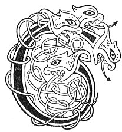

  
[Intangible Textual Heritage](../../../index) 
[Legends/Sagas](../../index)  [Celtic](../index)  [Carmina
Gadelica](../cg)  [Index](index)  [Previous](cg2015)  [Next](cg2017) 

------------------------------------------------------------------------

[Buy this Book at
Amazon.com](https://www.amazon.com/exec/obidos/ASIN/B0027P890O/internetsacredte)

------------------------------------------------------------------------

  
*Carmina Gadelica, Volume 2*, by Alexander Carmicheal, \[1900\], at
Intangible Textual Heritage

------------------------------------------------------------------------

<table data-border="0">
<colgroup>
<col style="width: 50%" />
<col style="width: 50%" />
</colgroup>
<tbody>
<tr class="odd">
<td data-valign="top" width="327">
p. 28
</td>
<td data-valign="top" width="327">
p. 29
</td>
</tr>
<tr class="even">
<td data-valign="top" width="327"><h3 id="sian-a-bheatha-bhuan" data-align="center">SIAN A BHEATHA BHUAN</h3></td>
<td data-valign="top" width="327"><h3 id="charm-of-the-lasting-life" data-align="center">CHARM OF THE LASTING LIFE</h3></td>
</tr>
</tbody>
</table>

 

<table data-border="0">
<colgroup>
<col style="width: 25%" />
<col style="width: 25%" />
<col style="width: 25%" />
<col style="width: 25%" />
</colgroup>
<tbody>
<tr class="odd">
<td data-valign="top">
 
</td>
<td data-valign="top">
p. 28
</td>
<td data-valign="top">
 
</td>
<td data-valign="top">
p. 29
</td>
</tr>
<tr class="even">
<td data-valign="top">
 
</td>
<td data-valign="top">
CUIRIM an seun air do chom, 
Agus air do shealbhachd, 
Seun Dhe nan dul 
Chum do thearmaid.

An seun a chuir Bride nan ni 
Mu mhuineal min Dhornghil, 
An seun a chuir Moire mu Mac, 
Eadar bonn agus broghaid, 
Eadar cioch agus glun, 
Eadar cul agus broth, 
Eadar braigh agus bonn, 
Eadar suil agus folt.

Cliar Mhicheil air do thaobh, 
Sgiath Mhicheil air do shlinnean, 
Ni bheil eadar neamh is lar 
Na bheir buaidh air Righ nan gras.

Cha reub lainn thu, 
Cha mhill muir thu, 
Cha teum mnaoi thu, 
Cha treann duin thu.

Brat Chriosda fein umad, 
Sgath Chriosda fein tharad, 
Bho mhullach do chinn 
Gu buinn do chas.
</td>
<td data-valign="top">
 
</td>
<td data-valign="top">
I PLACE the charm on thy body, 
And on thy prosperity, 
The charm of the God of life 
For thy protection.

The charm that Bride of the kine 
Put round the fair neck of Dornghil, 
The charm that Mary put about her Son, 
Between sole and throat, 
Between pap and knee, 
Between back and breast, 
Between chest and sole, 
Between eye and hair.

The host of Michael on thy side, 
The shield of Michael on thy shoulder, 
There is not between heaven and earth 
That can overcome the King of grace.

No spear shall rive thee, 
No sea shall drown thee, 
No woman shall wile thee, 
No man shall wound thee.

The mantle of Christ Himself about thee, 
The shadow of Christ Himself above thee, 
From the crown of thy head 
To the soles of thy feet.
</td>
</tr>
<tr class="odd">
<td data-valign="top">
 
</td>
<td data-valign="top">
p. 30
</td>
<td data-valign="top">
 
</td>
<td data-valign="top">
p. 31
</td>
</tr>
<tr class="even">
<td data-valign="top">
 
</td>
<td data-valign="top">
Ta seun De ort a nis, 
Cha teid gu brath ort ailis.

Theid thu mach an ainm do Righ, 
Thig thu steach an ainm do Phriomh, 
Is le Dia nan dul thu nis gu h-uilidh, 
Agus leis na Cumhachdan comhla.

Cuirim an seun seo moch Di-luain, 
An ceum cruaidh, druiseach, droigheach, 
Falbh a mach ’s an seun mu d’ chom, 
Is na biodh bonn eagail ort.

Diridh tu cirein nan stuc, 
Dionar tu a thaobh do chuil, 
Is tu an eala chiuin ’s a bhlar, 
Cumhnar tu am measg nan ar, 
Seasaidh tu troimh choig ceud, 
Is bidh t’eircirich an sas.

     Seun De umad! 
     Feun De tharad!
</td>
<td data-valign="top">
 
</td>
<td data-valign="top">
The charm of God is on thee now, 
Thou shalt never know disgrace.

Thou shalt go forth in name of thy King, 
Thou shalt come in in name of thy Chief, 
To the God of life thou now belongest wholly, 
And to all the Powers together.

I place this charm early on Monday, 
In passage hard, brambly, thorny, 
Go thou out and the charm about thy body, 
And be not the least fear upon thee.

Thou shalt ascend the crest of the hill, 
Protected thou shalt be behind thee, 
Thou art the calm swan in battle, 
Preserved thou shalt be amidst the slaughter, 
Stand thou canst against five hundred, 
And thine oppressors shall be seized.

     The charm of God about thee! 
     The arm of God above thee!
</td>
</tr>
</tbody>
</table>

 

------------------------------------------------------------------------

[Next: 135. The Charm of the Lasting Life. Sian A Bheatha Bhuan](cg2017)
