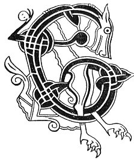

  
[Intangible Textual Heritage](../../../index) 
[Legends/Sagas](../../index)  [Celtic](../index)  [Carmina
Gadelica](../cg)  [Index](index)  [Previous](cg2020)  [Next](cg2022) 

------------------------------------------------------------------------

[Buy this Book at
Amazon.com](https://www.amazon.com/exec/obidos/ASIN/B0027P890O/internetsacredte)

------------------------------------------------------------------------

  
*Carmina Gadelica, Volume 2*, by Alexander Carmicheal, \[1900\], at
Intangible Textual Heritage

------------------------------------------------------------------------

<table data-border="0">
<colgroup>
<col style="width: 50%" />
<col style="width: 50%" />
</colgroup>
<tbody>
<tr class="odd">
<td data-valign="top" width="327">
p. 40
</td>
<td data-valign="top" width="327">
p. 41
</td>
</tr>
<tr class="even">
<td data-valign="top" width="327"><h3 id="eolas-gradhaidh-139" data-align="center">EOLAS GRADHAIDH [139]</h3></td>
<td data-valign="top" width="327"><h3 id="love-charm" data-align="center">LOVE CHARM</h3></td>
</tr>
</tbody>
</table>

 

<table data-border="0">
<colgroup>
<col style="width: 25%" />
<col style="width: 25%" />
<col style="width: 25%" />
<col style="width: 25%" />
</colgroup>
<tbody>
<tr class="odd">
<td data-valign="top">
 
</td>
<td data-valign="top">
p. 40
</td>
<td data-valign="top">
 
</td>
<td data-valign="top">
p. 41
</td>
</tr>
<tr class="even">
<td data-valign="top">
 
</td>
<td data-valign="top">
EOLAS gradhaidh dut, 
Uisge thraghadh thromh shop, 
Blaths an fhir [te] thig riut, 
     Le ghradh a tharsainn ort.

Eirich moch Di-domhnaich, 
Gu lic chomhnard chladaich 
Beir leat beannach pubaill, 
     Agus currachd sagairt.

Deannan beag a ghriosaich 
An iochdar do bhadain, 
Dolman corr a ghruaigean 
     Ann an sluasaid mhaide.

Tri cnamhan seann-duine, 
An deigh an creann a uaigh, 
Naoi goisne reann-roinnich, 
     An deigh an treann le tuaigh.

Loisg iad air teine crionaich 
Is dean gu leir diubh luath; 
Crath am brollach broth do leannain, 
     An aghaidh gath gaoth tuath.

Rach ruaig rath an alachd, 
Car nan coig cuart, 
’S bheirim brath is baran duit 
     Nach falbh am fear [bean] sin uat.
</td>
<td data-valign="top">
 
</td>
<td data-valign="top">
A LOVE charm for thee, 
Water drawn through a straw, 
The warmth of him [her] thou lovest, 
     With love to draw on thee.

Arise betimes on Lord's day, 
To the flat rock of the shore 
Take with thee the pointed canopy,   [butter-bur (?) 
     And the cap of a priest.           [fox-glove (?)

A small quantity of embers 
In the skirt of thy kirtle, 
A special handful of sea-weed 
     In a wooden shovel.

Three bones of an old man, 
Newly torn from the grave, 
Nine stalks of royal fern, 
     Newly trimmed with an axe.

Burn them on a fire of faggots 
And make them all into ashes; 
Sprinkle in the fleshy breast of thy lover, 
     Against the venom of the north wind.

Go round the 'rath' of procreation, 
The circuit of the five turns, 
And I will vow and warrant thee 
     That man [woman] shall never leave thee.
</td>
</tr>
</tbody>
</table>

 

------------------------------------------------------------------------

[Next: 140. Thwarting the Evil Eye. Cronachduinn Suil](cg2022)
