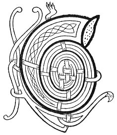

  
[Intangible Textual Heritage](../../../index) 
[Legends/Sagas](../../index)  [Celtic](../index)  [Carmina
Gadelica](../cg)  [Index](index)  [Previous](cg2021)  [Next](cg2023) 

------------------------------------------------------------------------

[Buy this Book at
Amazon.com](https://www.amazon.com/exec/obidos/ASIN/B0027P890O/internetsacredte)

------------------------------------------------------------------------

  
*Carmina Gadelica, Volume 2*, by Alexander Carmicheal, \[1900\], at
Intangible Textual Heritage

------------------------------------------------------------------------

 

<table data-border="0">
<colgroup>
<col style="width: 50%" />
<col style="width: 50%" />
</colgroup>
<tbody>
<tr class="odd">
<td data-valign="top" width="327">
p. 42
</td>
<td data-valign="top" width="327">
p. 43
</td>
</tr>
<tr class="even">
<td data-valign="top" width="327"><h3 id="cronachduinn-suil-140" data-align="center">CRONACHDUINN SUIL [140]</h3></td>
<td data-valign="top" width="327"><h3 id="thwarting-the-evil-eye" data-align="center">THWARTING THE EVIL EYE</h3></td>
</tr>
</tbody>
</table>

 

THE results of the evil eye appear in yawning and vomiting and in a
general disturbance of the system. The countenance assumes an appearance
grim, gruesome, and repulsive--'greann, greisne, grannda.'

This formula for removing the effects of the evil eye is handed down
from male to female, from female to male, and is efficacious only when
thus transmitted. Before pronouncing it over the particular case of
sickness, the operator proceeds to a stream, where the living and the
dead alike pass, and lifts water, in name of the Holy Trinity, into a
wooden ladle. In no case is the ladle of metal. On returning, a wife's
gold ring, a piece of gold, of silver, and of copper, are put in the
ladle. The sign of the holy cross is then made, and this rhyme is
repeated in a slow recitative manner--the name of the person or animal
under treatment being mentioned towards the end. In the case of an
animal a woollen thread, generally of the natural colour of the sheep,
is tied p. 43 round the tail. The consecrated
water is then given as a draught, and sprinkled over the head and
backbone. In the case of a cow the horns and the space between the horns
are carefully anointed.

The remnant of the water, no drop of which must have reached the ground
previously, is poured over a corner stone, threshold flag, or other
immovable stone or rock, which is said to split if the sickness be
severe. Experts profess to distinguish whether it be a man or a woman
who has laid the evil eye:--if a man, the copper adheres to the bottom
of the upturned ladle, significant of the 'iomadh car,' many turns in a
man's dark wily heart; if a woman, only the silver and gold adhere, the
heart of a woman being to that of man--not in this case, 'as moonlight
unto sunlight and as water unto wine'--but as gold and silver to copper
and brass. Old women in the Highlands say that if men's hearts were laid
bare they would be found to contain many more twists and turns and wiles
than those of women.

 

<table data-border="0">
<colgroup>
<col style="width: 25%" />
<col style="width: 25%" />
<col style="width: 25%" />
<col style="width: 25%" />
</colgroup>
<tbody>
<tr class="odd">
<td data-valign="top">
 
</td>
<td data-valign="top">
p. 42
</td>
<td data-valign="top">
 
</td>
<td data-valign="top">
p. 43
</td>
</tr>
<tr class="even">
<td data-valign="top">
 
</td>
<td data-valign="top">
             CO a thilleas cronachduinn suil? 
             Tillidh mise tha mi ’n duil, 
             Ann an ainm Righ nan dul. 
             Tri seachd gairmeachdain co ceart, 
             Labhair Criosd an dorusd na cathrach; 
                  Paidir Moire a h-aon, 
                  Paidir Righ a dha, 
                  Paidir Moire a tri, 
                  Paidir Righ a ceithir, 
                  Paidir Moire a coig, 
                  Paidir Righ a sia, 
                  Paidir Moire a seachd; 
             Tillidh seachd paidrichean Moire 
                  Cronachduinn suil, 
             Co dhiubh bhitheas e air duine no air bruid, 
                  Air mart no air earc; 
             Thusa bhi na d’ h-ioma shlainte nochd, 
                       [<em>An t-ainm</em>] 
An ainm an Athar, a Mhic, ’s an Spioraid Naoimh. Amen.
</td>
<td data-valign="top">
 
</td>
<td data-valign="top">
             WHO shall thwart the evil eye? 
             I shall thwart it, methinks, 
             In name of the King of life. 
             Three seven commands so potent, 
             Spake Christ in the door of the city; 
                  Pater Mary one, 
                               Pater King two, 
                  Pater Mary three, 
                  Pater King four, 
                  Pater Mary five, 
                  Pater King six, 
                  Pater Mary seven; 
             Seven pater Maries will thwart 
                  The evil eye, 
             Whether it be on man or on beast, 
                  On horse or on cow; 
             Be thou in thy full health this night, 
                           [<em>The name</em>] 
In name of the Father, the Son, and the Holy Spirit. Amen.
</td>
</tr>
</tbody>
</table>

 

------------------------------------------------------------------------

[Next: 141. Exorcism of the Eye. Eolas A Bheum Shula.](cg2023)
