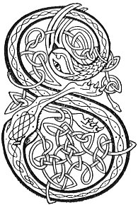

  
[Intangible Textual Heritage](../../../index) 
[Legends/Sagas](../../index)  [Celtic](../index)  [Carmina
Gadelica](../cg)  [Index](index)  [Previous](cg2022)  [Next](cg2024) 

------------------------------------------------------------------------

[Buy this Book at
Amazon.com](https://www.amazon.com/exec/obidos/ASIN/B0027P890O/internetsacredte)

------------------------------------------------------------------------

  
*Carmina Gadelica, Volume 2*, by Alexander Carmicheal, \[1900\], at
Intangible Textual Heritage

------------------------------------------------------------------------

 

<table data-border="0">
<colgroup>
<col style="width: 50%" />
<col style="width: 50%" />
</colgroup>
<tbody>
<tr class="odd">
<td data-valign="top" width="327">
p. 44
</td>
<td data-valign="top" width="327">
p. 45
</td>
</tr>
<tr class="even">
<td data-valign="top" width="327"><h3 id="eolas-a-bheum-shula-141" data-align="center">EOLAS A BHEUM SHULA [141]</h3></td>
<td data-valign="top" width="327"><h3 id="exorcism-of-the-eye" data-align="center">EXORCISM OF THE EYE</h3></td>
</tr>
</tbody>
</table>

 

<table data-border="0">
<colgroup>
<col style="width: 25%" />
<col style="width: 25%" />
<col style="width: 25%" />
<col style="width: 25%" />
</colgroup>
<tbody>
<tr class="odd">
<td data-valign="top">
 
</td>
<td data-valign="top">
p. 44
</td>
<td data-valign="top">
 
</td>
<td data-valign="top">
p. 45
</td>
</tr>
<tr class="even">
<td data-valign="top">
 
</td>
<td data-valign="top">
SALTRAIM air an t-suil, 
Mar a shaltrais lach air luin, 
Mar a shaltrais eal air burn, 
Mar a shaltrais each air uir, 
Mar a shaltrais earc air iuc, 
Mar a shaltrais feachd nan dul, 
     Mar a shaltrais feachd nan dul.

Ta neart gaoith agam air, 
Ta neart fraoich agam air, 
Ta neart teine agam air, 
Ta neart torruinn agam air, 
Ta neart dealain agam air, 
Ta neart gaillinn agam air, 
Ta neart gile agam air, 
Ta neart greine agam air, 
Ta neart nan reul agam air, 
Ta neart nan speur agam air, 
Ta neart nan neamh 
Is nan ce agam air, 
     Neart nan neamh 
     Is nan ce agam air.

Trian air na clacha glasa dheth, 
Trian air na beanna casa dheth, 
Trian air na h-easa brasa dheth,
</td>
<td data-valign="top">
 
</td>
<td data-valign="top">
I TRAMPLE upon the eye, 
As tramples the duck upon the lake, 
As tramples the swan upon the water, 
As tramples the horse upon the plain, 
As tramples the cow upon the 'iuc,' 
As tramples the host of the elements, 
     As tramples the host of the elements.

Power of wind I have over it, 
Power of wrath I have over it, 
Power of fire I have over it, 
Power of thunder I have over it, 
Power of lightning I have over it, 
Power of storms I have over it, 
Power of moon I have over it, 
Power of sun I have over it, 
Power of stars I have over it, 
Power of firmament I have over it, 
Power of the heavens 
And of the worlds I have over it, 
     Power of the heavens 
     And of the worlds I have over it.

A portion of it upon the grey stones,      [third 
A portion of it upon the steep hills, 
A portion of it upon the fast falls,
</td>
</tr>
<tr class="odd">
<td data-valign="top">
 
</td>
<td data-valign="top">
p. 46
</td>
<td data-valign="top">
 
</td>
<td data-valign="top">
p. 47
</td>
</tr>
<tr class="even">
<td data-valign="top">
 
</td>
<td data-valign="top">
Trian air na liana maiseach dheth, 
’S trian air a mhuir mhoir shalach, 
’S i fein asair is fearr gu ghiulan, 
     A mhuir mhor shalach, 
     Asair is fearr gu ghiulan.

An ainm Tri nan Dul, 
An ainm nan Tri Numh, 
An ainm nan uile Run, 
Agus nan Cursa comhla.
</td>
<td data-valign="top">
 
</td>
<td data-valign="top">
A portion of it upon the fair meads, 
And a portion upon the great salt sea, 
She herself is the best instrument to carry it, 
     The great salt sea, 
     The best instrument to carry it.

In name of the Three of Life, 
In name of the Sacred Three, 
In name of all the Secret Ones, 
And of the Powers together.
</td>
</tr>
</tbody>
</table>

 

------------------------------------------------------------------------

[Next: 142. Counteracting The Evil Eye. Cronachdain Suil](cg2024)
