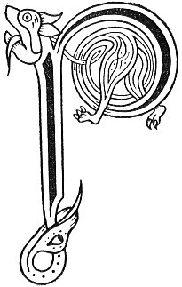

  
[Intangible Textual Heritage](../../../index) 
[Legends/Sagas](../../index)  [Celtic](../index)  [Carmina
Gadelica](../cg)  [Index](index)  [Previous](cg2027)  [Next](cg2029) 

------------------------------------------------------------------------

[Buy this Book at
Amazon.com](https://www.amazon.com/exec/obidos/ASIN/B0027P890O/internetsacredte)

------------------------------------------------------------------------

  
*Carmina Gadelica, Volume 2*, by Alexander Carmicheal, \[1900\], at
Intangible Textual Heritage

------------------------------------------------------------------------

<table data-border="0">
<colgroup>
<col style="width: 50%" />
<col style="width: 50%" />
</colgroup>
<tbody>
<tr class="odd">
<td data-valign="top" width="327">
p. 58
</td>
<td data-valign="top" width="327">
p. 59
</td>
</tr>
<tr class="even">
<td data-valign="top" width="327"><h3 id="eolas-146" data-align="center">EOLAS [146]</h3></td>
<td data-valign="top" width="327"><h3 id="charm" data-align="center">CHARM</h3></td>
</tr>
</tbody>
</table>

 

<table data-border="0">
<colgroup>
<col style="width: 25%" />
<col style="width: 25%" />
<col style="width: 25%" />
<col style="width: 25%" />
</colgroup>
<tbody>
<tr class="odd">
<td data-valign="top">
 
</td>
<td data-valign="top">
p. 58
</td>
<td data-valign="top">
 
</td>
<td data-valign="top">
p. 59
</td>
</tr>
<tr class="even">
<td data-valign="top">
 
</td>
<td data-valign="top">
      PEADAIR is Seumas is Eoin, 
      Triuir is binne beuis an gloir, 
      Dh’ eirich a dheanamh na h-eoir, 
      Romh mhor dhorus na Cathrach, 
            Ri glun deas De a Mhic.

      Air na feara fur-shuileach, 
      Air na bana bur-shuileach, 
      Air na siocharra seanga sith, 
            Air na saighde siubhlach sibheideach.

      Dithis a rinn dut dibhidh sul, 
      Fear agus bean le nimh agus tnu, 
      Triuir a chuirim an urra riu, 
            Athair, agus Mac, agus Spiorad Numh.

Ceithir ghalara fichead an aorabh duine ’s bruid, 
Dia d’ an sgrid, Dia d’ an sgroid, Dia d’ an sgruid, 
A t’ fhuil, a t’ fheoil a d’ chnamha cubhra caoin, 
O’n la’n duigh ’s gach la thig, gun tig la crich do shaoghail.
</td>
<td data-valign="top">
 
</td>
<td data-valign="top">
      PETER and James and John, 
      The three of sweetest virtues in glory, 
      Who arose to make the charm, 
      Before the great door of the City, 
            By the right knee of God the Son.

      Against the keen-eyed men, 
      Against the peering-eyed women, 
      Against the slim, slender, fairy-darts, 
            Against the swift arrows of furies.

      Two made to thee the withered eye, 
      Man and woman with venom and envy, 
      Three whom I will set against them, 
            Father, Son, and Spirit Holy.

Four and twenty diseases in the constitution of man and beast, 
God scrape them, God search them, God cleanse them, 
From out thy blood, from out thy flesh, from out thy fragrant bones, 
From this day and each day that comes, till thy day on earth be done.
</td>
</tr>
</tbody>
</table>

 

------------------------------------------------------------------------

[Next: 147. A Malediction. Mallachd](cg2029)
