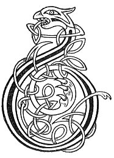

  
[Intangible Textual Heritage](../../../index) 
[Legends/Sagas](../../index)  [Celtic](../index)  [Carmina
Gadelica](../cg)  [Index](index)  [Previous](cg2034)  [Next](cg2036) 

------------------------------------------------------------------------

[Buy this Book at
Amazon.com](https://www.amazon.com/exec/obidos/ASIN/B0027P890O/internetsacredte)

------------------------------------------------------------------------

  
*Carmina Gadelica, Volume 2*, by Alexander Carmicheal, \[1900\], at
Intangible Textual Heritage

------------------------------------------------------------------------

 

<table data-border="0">
<colgroup>
<col style="width: 50%" />
<col style="width: 50%" />
</colgroup>
<tbody>
<tr class="odd">
<td data-valign="top" width="327">
p. 70
</td>
<td data-valign="top" width="327">
p. 71
</td>
</tr>
<tr class="even">
<td data-valign="top" width="327"><h3 id="eolas-a-chronachaidh-153" data-align="center">EOLAS A CHRONACHAIDH [153]</h3></td>
<td data-valign="top" width="327"><h3 id="spell-of-the-counteracting" data-align="center">SPELL OF THE COUNTERACTING</h3></td>
</tr>
</tbody>
</table>

 

<table data-border="0">
<colgroup>
<col style="width: 25%" />
<col style="width: 25%" />
<col style="width: 25%" />
<col style="width: 25%" />
</colgroup>
<tbody>
<tr class="odd">
<td data-valign="top">
 
</td>
<td data-valign="top">
p. 70
</td>
<td data-valign="top">
 
</td>
<td data-valign="top">
p. 71
</td>
</tr>
<tr class="even">
<td data-valign="top">
 
</td>
<td data-valign="top">
BUAINIDH mi a chathair aigh 
A bhuain Criosd le leth-laimh.

Thainig Ard Righ nan aingeal 
Le ghradh ’s le fhath os mo chionn.

Thainig Iosa Criosda steach 
Le bliochd, le blachd, le barr, 
Le laoigh bhoirionn, le ais.

Air suil bhig, air suil mhoir, 
Air uachdar cuid Chriosd.

An ainm Ti nan dul 
Cum rium do ghras, 
Crun Righ nan aingeal, 
Bainne chur an uth ’s an ar, 
Le laoigh bhoirionn, le al.

Gun robh agaibh fad nan seachd bliadhna 
Gun chall laogh, gun chall bainne, 
Gun chall maona no caomh charaid.
</td>
<td data-valign="top">
 
</td>
<td data-valign="top">
I WILL pluck the gracious yarrow 
That Christ plucked with His one hand.

The High King of the angels 
Came with His love and His countenance above me.

Jesus Christ came hitherward 
With milk, with substance, with produce, 
With female calves, with milk product.

On small eye, on large eye, 
Over Christ's property.

In name of the Being of life 
Supply me with Thy grace, 
The crown of the King of the angels 
To put milk in udder and gland, 
With female calves, with progeny.

May you have the length of seven years 
Without loss of calf, without loss of milk, 
Without loss of means or of dear friends.
</td>
</tr>
</tbody>
</table>

 

------------------------------------------------------------------------

[Next: 154. The Counting of the Stye. Cunntas An T-Sleamhnain](cg2036)
