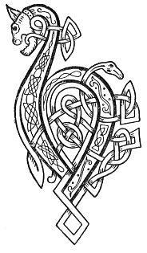

  
[Intangible Textual Heritage](../../../index) 
[Legends/Sagas](../../index)  [Celtic](../index)  [Carmina
Gadelica](../cg)  [Index](index)  [Previous](cg2038)  [Next](cg2040) 

------------------------------------------------------------------------

[Buy this Book at
Amazon.com](https://www.amazon.com/exec/obidos/ASIN/B0027P890O/internetsacredte)

------------------------------------------------------------------------

  
*Carmina Gadelica, Volume 2*, by Alexander Carmicheal, \[1900\], at
Intangible Textual Heritage

------------------------------------------------------------------------

 

<table data-border="0">
<colgroup>
<col style="width: 50%" />
<col style="width: 50%" />
</colgroup>
<tbody>
<tr class="odd">
<td data-valign="top" width="327">
p. 76
</td>
<td data-valign="top" width="327">
p. 77
</td>
</tr>
<tr class="even">
<td data-valign="top" width="327"><h3 id="an-dearg-chasachan-157" data-align="center">AN DEARG CHASACHAN [157]</h3></td>
<td data-valign="top" width="327"><h3 id="the-red-stalk" data-align="center">THE RED-STALK</h3></td>
</tr>
</tbody>
</table>

 

<table data-border="0">
<colgroup>
<col style="width: 25%" />
<col style="width: 25%" />
<col style="width: 25%" />
<col style="width: 25%" />
</colgroup>
<tbody>
<tr class="odd">
<td data-valign="top">
 
</td>
<td data-valign="top">
p. 76
</td>
<td data-valign="top">
 
</td>
<td data-valign="top">
p. 77
</td>
</tr>
<tr class="even">
<td data-valign="top">
 
</td>
<td data-valign="top">
BUAINIDH mi an dearg-chasachan aic, 
An lion a bhuain Bride mhin tromh glaic, 
Air buaidh shlainte, air buaidh chairdeas 
    Air buaidh thoileachais, 
Air buaidh droch run, air buaidh droch shul, 
    Air buaidh chronachais. 
Air buaidh droch bheud, air buaidh droch bheus, 
    Air buaidh ghonachais, 
Air buaidh droch sgeul, air buaidh droch bheul, 
    Air buaidh shonachais-- 
    Air buaidh shonachais.
</td>
<td data-valign="top">
 
</td>
<td data-valign="top">
PLUCK will I the little red-stalk of surety, 
The lint the lovely Bride drew through her palm, 
For success of health, for success of friendship, 
    For success of joyousness, 
For overcoming of evil mind, for overcoming of evil eye, 
    For overcoming of bewitchment, 
For overcoming of evil deed, for overcoming of evil conduct, 
    For overcoming of malediction, 
For overcoming of evil news, for overcoming of evil words, 
    For success of blissfulness-- 
    For success of blissfulness.
</td>
</tr>
</tbody>
</table>

 

------------------------------------------------------------------------

[Next: 158. The Tree-Entwining Ivy. An Eidheann-Mu-Chrann](cg2040)
