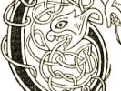
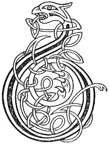

  
[Intangible Textual Heritage](../../../index) 
[Legends/Sagas](../../index)  [Celtic](../index)  [Carmina
Gadelica](../cg)  [Index](index)  [Previous](cg2044)  [Next](cg2046) 

------------------------------------------------------------------------

[Buy this Book at
Amazon.com](https://www.amazon.com/exec/obidos/ASIN/B0027P890O/internetsacredte)

------------------------------------------------------------------------

  
*Carmina Gadelica, Volume 2*, by Alexander Carmicheal, \[1900\], at
Intangible Textual Heritage

------------------------------------------------------------------------

 

<table data-border="0">
<colgroup>
<col style="width: 50%" />
<col style="width: 50%" />
</colgroup>
<tbody>
<tr class="odd">
<td data-valign="top" width="327">
p. 92
</td>
<td data-valign="top" width="327">
p. 93
</td>
</tr>
<tr class="even">
<td data-valign="top" width="327"><h3 id="an-earnaid-shith-162" data-align="center">AN EARNAID SHITH [162]</h3></td>
<td data-valign="top" width="327"><h3 id="the-fairy-wort" data-align="center">THE FAIRY WORT</h3></td>
</tr>
</tbody>
</table>

 

<table data-border="0">
<colgroup>
<col style="width: 25%" />
<col style="width: 25%" />
<col style="width: 25%" />
<col style="width: 25%" />
</colgroup>
<tbody>
<tr class="odd">
<td data-valign="top">
 
</td>
<td data-valign="top">
p. 92
</td>
<td data-valign="top">
 
</td>
<td data-valign="top">
p. 93
</td>
</tr>
<tr class="even">
<td data-valign="top">
 
</td>
<td data-valign="top">
BUAINIDH mi an earnaid, 
Le earlaid a bruth, 
Chur barrlait air gach ainreit, 
Fad ’s is earnaid i.

Earnaid shith, earnaid shith, 
Mo niarach an neach dh’ am bi, 
Ni bheil ni mu iadhadh grein, 
Nach bheil di-se le buaidh reidh.

Buainidh mi a chraobh urramach 
Bhuain Moire mhor, Mathair chobhair an t-sluaigh, 
Chur dhiom gach sgeula sguana, sgulanach, 
Dim-bith, dim-baigh, dim-buaidh, 
Fuailisg, guailisg, duailisg, doilisg, 
Gun teid mi dh’ an fhuar lic fo’n talamh.
</td>
<td data-valign="top">
 
</td>
<td data-valign="top">
PLUCK will I the fairy wort, 
With expectation from the fairy bower, 
To overcome every oppression, 
As long as it be fairy wort.

Fairy wort, fairy wort, 
I envy the one who has thee, 
There is nothing the sun encircles, 
But is to her a sure victory.

Pluck will I mine honoured plant 
Plucked by the great Mary, helpful Mother of the people, 
To cast off' me every tale of scandal and flippancy, 
Ill-life, ill-love, ill-luck, 
Hatred, falsity, fraud and vexation, 
Till I go in the cold grave beneath the sod.
</td>
</tr>
</tbody>
</table>

 

------------------------------------------------------------------------

[Next: 163. The Yarrow. Earr Thalmhainn](cg2046)
