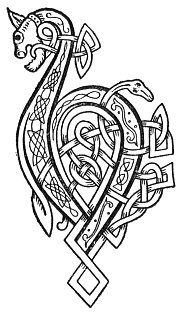

  
[Intangible Textual Heritage](../../../index) 
[Legends/Sagas](../../index)  [Celtic](../index)  [Carmina
Gadelica](../cg)  [Index](index)  [Previous](cg2045)  [Next](cg2047) 

------------------------------------------------------------------------

[Buy this Book at
Amazon.com](https://www.amazon.com/exec/obidos/ASIN/B0027P890O/internetsacredte)

------------------------------------------------------------------------

  
*Carmina Gadelica, Volume 2*, by Alexander Carmicheal, \[1900\], at
Intangible Textual Heritage

------------------------------------------------------------------------

 

<table data-border="0">
<colgroup>
<col style="width: 50%" />
<col style="width: 50%" />
</colgroup>
<tbody>
<tr class="odd">
<td data-valign="top" width="327">
p. 94
</td>
<td data-valign="top" width="327">
p. 95
</td>
</tr>
<tr class="even">
<td data-valign="top" width="327"><h3 id="earr-thalmhainn-163" data-align="center">EARR THALMHAINN [163]</h3></td>
<td data-valign="top" width="327"><h3 id="the-yarrow" data-align="center">THE YARROW</h3></td>
</tr>
</tbody>
</table>

 

<table data-border="0">
<colgroup>
<col style="width: 25%" />
<col style="width: 25%" />
<col style="width: 25%" />
<col style="width: 25%" />
</colgroup>
<tbody>
<tr class="odd">
<td data-valign="top">
 
</td>
<td data-valign="top">
p. 94
</td>
<td data-valign="top">
 
</td>
<td data-valign="top">
p. 95
</td>
</tr>
<tr class="even">
<td data-valign="top">
 
</td>
<td data-valign="top">
BUAINIDH mi an earr reidh, 
Gum bu cheinide mo chruth, 
Gum bu bhlathaide mo bheuil, 
Gum bu gheinide mo ghuth. 
Biodh mo ghuth mar ghath na grein, 
Biodh mo bheuil mar ein nan subh.

Gum bu h-eilean mi air muir, 
Gum bu tulach mi air tir, 
Gum bu reuil mi ri ra dorcha, 
Gum bu lorg mi dhuine cli, 
Leonaidh mi a h-uile duine, 
Cha leoin duine mi.
</td>
<td data-valign="top">
 
</td>
<td data-valign="top">
I WILL pluck the yarrow fair, 
That more benign shall be my face, 
That more warm shall be my lips, 
That more chaste shall be my speech, 
Be my speech the beams of the sun, 
Be my lips the sap of the strawberry.

May I be an isle in the sea, 
May I be a hill on the shore, 
May I be a star in waning of the moon, 
May I be a staff to the weak, 
Wound can I every man, 
Wound can no man me.
</td>
</tr>
</tbody>
</table>

 

------------------------------------------------------------------------

[Next: 164. The Yarrow. An Earr-Thalmhainn](cg2047)
