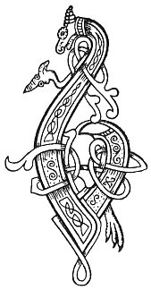

  
[Intangible Textual Heritage](../../../index) 
[Legends/Sagas](../../index)  [Celtic](../index)  [Carmina
Gadelica](../cg)  [Index](index)  [Previous](cg2047)  [Next](cg2049) 

------------------------------------------------------------------------

[Buy this Book at
Amazon.com](https://www.amazon.com/exec/obidos/ASIN/B0027P890O/internetsacredte)

------------------------------------------------------------------------

  
*Carmina Gadelica, Volume 2*, by Alexander Carmicheal, \[1900\], at
Intangible Textual Heritage

------------------------------------------------------------------------

 

<table data-border="0">
<colgroup>
<col style="width: 50%" />
<col style="width: 50%" />
</colgroup>
<tbody>
<tr class="odd">
<td data-valign="top" width="327">
p. 96
</td>
<td data-valign="top" width="327">
p. 97
</td>
</tr>
<tr class="even">
<td data-valign="top" width="327"><h3 id="achlasan-chaluim-chille-165" data-align="center">ACHLASAN CHALUIM-CHILLE [165]</h3></td>
<td data-valign="top" width="327"><h3 id="saint-johns-wort" data-align="center">SAINT JOHN'S WORT</h3></td>
</tr>
</tbody>
</table>

 

SAINT JOHN'S wort is known by various names, all significant of the
position of the plant in the minds of the people:--'achlasan
Chaluim-chille,' armpit package of Columba; 'caod Chaluim-chile,' hail
of Columba; 'seun Chaluim-chille,' charm of Columba; 'seud Chaluim
chille,' jewel of Columba; 'allus Chaluim-chille,' glory of Columba;
'alla Mhoire,' noble plant of Mary; 'alla-bhi,' 'alla-bhuidhe,' noble
yellow plant. Possibly these are pre-Christian terms to which are added
the endearing names of Mary and Columba.

Saint John's wort is one of the few plants still cherished by the people
to ward away second-sight, enchantment, witchcraft, evil eye, and death,
and to ensure peace and plenty in the house, increase and prosperity in
the fold, and growth and fruition in the field. The plant is secretly
secured in the bodices of the women and in the vests of the men, under
the left armpit. Saint John's wort, however, is effective only when the
plant is accidentally found.

When this occurs the joy of the finder is great, and gratefully
expressed:-- p. 97

<table data-border="0">
<colgroup>
<col style="width: 33%" />
<col style="width: 33%" />
<col style="width: 33%" />
</colgroup>
<tbody>
<tr class="odd">
<td data-valign="top">
'Achlasan Chaluim-chille, 
Gun sireadh, gun iarraidh! 
Dheoin Dhia agus Chriosda 
Am bliadhna chan fhaigheas bas.'
</td>
<td data-valign="top">
 
</td>
<td data-valign="top">
Saint John's wort, Saint John's wort, 
Without search, without seeking! 
Please God and Christ Jesu 
This year I shall not die.
</td>
</tr>
</tbody>
</table>

\[paragraph
continues\] It is specially prized when found in the fold of the
flocks, auguring peace and prosperity to the herds throughout the year.
The person who discovers it says:--

<table data-border="0">
<colgroup>
<col style="width: 33%" />
<col style="width: 33%" />
<col style="width: 33%" />
</colgroup>
<tbody>
<tr class="odd">
<td data-valign="top">
'Alla bhi, alla bhi, 
Mo niarach a neach dh’ am bi, 
An ti a gheobh an cro an ail, 
Cha bhi gu brath gun ni.'
</td>
<td data-valign="top">
 
</td>
<td data-valign="top">
Saint John's wort, Saint John's wort, 
Happy those who have thee, 
Whoso gets thee in the herd's fold, 
Shall never be without kine.
</td>
</tr>
</tbody>
</table>

\[paragraph
continues\] There is a tradition among the people that Saint
Columba carried the plant on his person because of his love and
admiration for him who went about preaching Christ, and baptizing the
converted, clothed in a garment of camel's hair and fed upon locusts and
wild honey.

 

<table data-border="0">
<colgroup>
<col style="width: 25%" />
<col style="width: 25%" />
<col style="width: 25%" />
<col style="width: 25%" />
</colgroup>
<tbody>
<tr class="odd">
<td data-valign="top">
 
</td>
<td data-valign="top">
p. 96
</td>
<td data-valign="top">
 
</td>
<td data-valign="top">
p. 97
</td>
</tr>
<tr class="even">
<td data-valign="top">
 
</td>
<td data-valign="top">
BUAINIDH mise m’ achlasan, 
Mar achan ri mo Righ, 
Chosga fuath nam fear fala, 
Chosga meanm nam ban bith.

Buainidh mise m’ achlasan, 
Mar achan ri mo Righ, 
Gur liom-sa buaidh an achlasain 
Thar gach neach a chi.

Buainidh mise m’ achlasan, 
Mar achan ris an Tri, 
An sgath Triura nan Bras, 
Agus Moire Mathair Ios.
</td>
<td data-valign="top">
 
</td>
<td data-valign="top">
I WILL cull my plantlet, 
As a prayer to my King, 
To quiet the wrath of men of blood, 
To check the wiles of wanton women.

I will cull my plantlet, 
As a prayer to my King, 
That mine may be its power 
Over all I see.

I will cull my plantlet, 
As a prayer to the Three, 
Beneath the shade of the Triune of grace, 
And of Mary the Mother of Jesu.
</td>
</tr>
</tbody>
</table>

 

------------------------------------------------------------------------

[Next: 166. St Columba's Plant. Achlasan Chaluim-Chille](cg2049)
