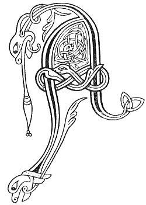

  
[Intangible Textual Heritage](../../../index) 
[Legends/Sagas](../../index)  [Celtic](../index)  [Carmina
Gadelica](../cg)  [Index](index)  [Previous](cg2049)  [Next](cg2051) 

------------------------------------------------------------------------

[Buy this Book at
Amazon.com](https://www.amazon.com/exec/obidos/ASIN/B0027P890O/internetsacredte)

------------------------------------------------------------------------

  
*Carmina Gadelica, Volume 2*, by Alexander Carmicheal, \[1900\], at
Intangible Textual Heritage

------------------------------------------------------------------------

 

<table data-border="0">
<colgroup>
<col style="width: 50%" />
<col style="width: 50%" />
</colgroup>
<tbody>
<tr class="odd">
<td data-valign="top" width="327">
p. 100
</td>
<td data-valign="top" width="327">
p. 101
</td>
</tr>
<tr class="even">
<td data-valign="top" width="327"><h3 id="achlasan-chaluim-chille-167" data-align="center">ACHLASAN CHALUIM-CHILLE [167]</h3></td>
<td data-valign="top" width="327"><h3 id="st-columbas-plant" data-align="center">ST COLUMBA'S PLANT</h3></td>
</tr>
</tbody>
</table>

 

<table data-border="0">
<colgroup>
<col style="width: 25%" />
<col style="width: 25%" />
<col style="width: 25%" />
<col style="width: 25%" />
</colgroup>
<tbody>
<tr class="odd">
<td data-valign="top">
 
</td>
<td data-valign="top">
p. 100
</td>
<td data-valign="top">
 
</td>
<td data-valign="top">
p. 101
</td>
</tr>
<tr class="even">
<td data-valign="top">
 
</td>
<td data-valign="top">
ACHLASAIN Chaluim-chille, 
Gun sireadh, gun iarraidh, 
Achlasain Chaluim-chille, 
Fo m’ righe gu siorruidh!

Air shealbh dhaona, 
Air shealbh mhaona, 
Air shealbh mhianna, 
Air shealbh chaora, 
Air shealbh mhaosa, 
Air shealbh iana, 
Air shealbh raona, 
Air shealbh mhaora, 
Air shealbh iasga, 
Air shealbh bhliochd is bhuar, 
Air shealbh shliochd is shluagh, 
Air shealbh bhlar is bhuadh, 
Air tir, air lir, air cuan, 
Trid an Tri ta shuas, 
Trid an Tri ta nuns, 
Trid an Tri ta buan, 
Achlasain Chaluim-chille, 
Ta mis a nis da d’ bhuain, 
     Ta mis a nis da d’ bhuain.
</td>
<td data-valign="top">
 
</td>
<td data-valign="top">
PLANTLET of Columba, 
Without seeking, without searching, 
Plantlet of Columba, 
Under my arm for ever!

For luck of men, 
For luck of means, 
For luck of wish (?), 
For luck of sheep, 
For luck of goats, 
For luck of birds, 
For luck of fields, 
For luck of shell-fish, 
For luck of fish, 
For luck of produce and kine, 
For luck of progeny and people, 
For luck of battle and victory, 
On land, on sea, on ocean, 
Through the Three on high, 
Through the Three a-nigh, 
Through the Three eternal, 
Plantlet of Columba, 
I cull thee now, 
     I cull thee now.
</td>
</tr>
</tbody>
</table>

 

------------------------------------------------------------------------

[Next: 168. Saint John's Wort. Eala-Bhi, Eala-Bhi](cg2051)
