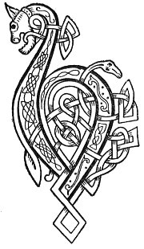

  
[Intangible Textual Heritage](../../../index) 
[Legends/Sagas](../../index)  [Celtic](../index)  [Carmina
Gadelica](../cg)  [Index](index)  [Previous](cg2055)  [Next](cg2057) 

------------------------------------------------------------------------

[Buy this Book at
Amazon.com](https://www.amazon.com/exec/obidos/ASIN/B0027P890O/internetsacredte)

------------------------------------------------------------------------

  
*Carmina Gadelica, Volume 2*, by Alexander Carmicheal, \[1900\], at
Intangible Textual Heritage

------------------------------------------------------------------------

 

<table data-border="0">
<colgroup>
<col style="width: 50%" />
<col style="width: 50%" />
</colgroup>
<tbody>
<tr class="odd">
<td data-valign="top" width="327">
p. 112
</td>
<td data-valign="top" width="327">
p. 113
</td>
</tr>
<tr class="even">
<td data-valign="top" width="327"><h3 id="am-mothan-173" data-align="center">AM MOTHAN [173]</h3></td>
<td data-valign="top" width="327"><h3 id="the-mothan" data-align="center">THE 'MOTHAN'</h3></td>
</tr>
</tbody>
</table>

 

<table data-border="0">
<colgroup>
<col style="width: 25%" />
<col style="width: 25%" />
<col style="width: 25%" />
<col style="width: 25%" />
</colgroup>
<tbody>
<tr class="odd">
<td data-valign="top">
 
</td>
<td data-valign="top">
p. 112
</td>
<td data-valign="top">
 
</td>
<td data-valign="top">
p. 113
</td>
</tr>
<tr class="even">
<td data-valign="top">
 
</td>
<td data-valign="top">
BUAINIDH mi am mothan, 
Luibh nan naodh alt, 
Buainidh agus boinichidh, 
     Do Bhride bhorr ’s dh’ a Dalt.

Buainidh mi am mothan, 
A dh’ orduich Righ nam feart, 
Buainidh agus boinichidh, 
     Do Mhoire mhor ’s dh’ a Mac.

Buainidh mi am mothan, 
A dh’ orduich Righ nan dul, 
Bheir buaidh air gach foirneart, 
     Is ob air obi shul.
</td>
<td data-valign="top">
 
</td>
<td data-valign="top">
PLUCK will I the 'mothan,' 
Plant of the nine joints, 
Pluck will I and vow me, 
     To noble Bride and her Fosterling.

Pluck will I the 'mothan,' 
As ordained of the King of power, 
Pluck will I and vow me, 
     To great Mary and her Son.

Pluck will I the 'mothan,' 
As ordained of the King of life, 
To overcome all oppression, 
     And the spell of evil eye.
</td>
</tr>
</tbody>
</table>

 

------------------------------------------------------------------------

[Next: 174. The 'Mothan'. Am Mothan](cg2057)
