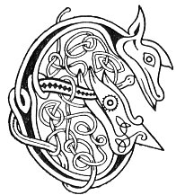

  
[Intangible Textual Heritage](../../../index) 
[Legends/Sagas](../../index)  [Celtic](../index)  [Carmina
Gadelica](../cg)  [Index](index)  [Previous](cg2064)  [Next](cg2066) 

------------------------------------------------------------------------

[Buy this Book at
Amazon.com](https://www.amazon.com/exec/obidos/ASIN/B0027P890O/internetsacredte)

------------------------------------------------------------------------

  
*Carmina Gadelica, Volume 2*, by Alexander Carmicheal, \[1900\], at
Intangible Textual Heritage

------------------------------------------------------------------------

 

<table data-border="0">
<colgroup>
<col style="width: 50%" />
<col style="width: 50%" />
</colgroup>
<tbody>
<tr class="odd">
<td data-valign="top" width="327">
p. 124
</td>
<td data-valign="top" width="327">
p. 125
</td>
</tr>
<tr class="even">
<td data-valign="top" width="327"><h3 id="eolas-a-ghalar-fhuail-182" data-align="center">EOLAS A GHALAR FHUAIL [182]</h3></td>
<td data-valign="top" width="327"><h3 id="the-gravel-charm" data-align="center">THE GRAVEL CHARM</h3></td>
</tr>
</tbody>
</table>

 

<table data-border="0">
<colgroup>
<col style="width: 25%" />
<col style="width: 25%" />
<col style="width: 25%" />
<col style="width: 25%" />
</colgroup>
<tbody>
<tr class="odd">
<td data-valign="top">
 
</td>
<td data-valign="top">
p. 124
</td>
<td data-valign="top">
 
</td>
<td data-valign="top">
p. 125
</td>
</tr>
<tr class="even">
<td data-valign="top">
 
</td>
<td data-valign="top">
EOLAS ta agam air a ghalar fhuail, 
     Air a ghalar a ta buan; 
Eolas ta agam air a ghalar dhearg, 
     Air a ghalar a ta garg.

Mar a ruitheas abhuinn fhuar, 
     Mar a mheileas muileann luath, 
Fhir a dh’orduich tir is muir, 
     Casg air fhuil, ruith air fhual.

An ainm Athar, agus Mic, 
An ainm Spioraid Naoimh.
</td>
<td data-valign="top">
 
</td>
<td data-valign="top">
I HAVE a charm for the gravel disease, 
     For the disease that is perverse 
I have a charm for the red disease, 
     For the disease that is irritating.

As runs a river cold, 
     As grinds a rapid mill, 
Thou who didst ordain land and sea, 
     Cease the blood and let flow the urine.

In name of Father, and of Son, 
     In name of Holy Spirit.
</td>
</tr>
</tbody>
</table>

 

------------------------------------------------------------------------

[Next: 183. The Strangles. An Stringlein](cg2066)
