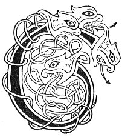

  
[Intangible Textual Heritage](../../../index) 
[Legends/Sagas](../../index)  [Celtic](../index)  [Carmina
Gadelica](../cg)  [Index](index)  [Previous](cg2067)  [Next](cg2069) 

------------------------------------------------------------------------

[Buy this Book at
Amazon.com](https://www.amazon.com/exec/obidos/ASIN/B0027P890O/internetsacredte)

------------------------------------------------------------------------

  
*Carmina Gadelica, Volume 2*, by Alexander Carmicheal, \[1900\], at
Intangible Textual Heritage

------------------------------------------------------------------------

 

<table data-border="0">
<colgroup>
<col style="width: 50%" />
<col style="width: 50%" />
</colgroup>
<tbody>
<tr class="odd">
<td data-valign="top" width="327">
p. 130
</td>
<td data-valign="top" width="327">
p. 131
</td>
</tr>
<tr class="even">
<td data-valign="top" width="327"><h3 id="ora-cuithe-185" data-align="center">ORA CUITHE [185]</h3></td>
<td data-valign="top" width="327"><h3 id="prayer-of-the-cattle-fold" data-align="center">PRAYER OF THE CATTLE-FOLD</h3></td>
</tr>
</tbody>
</table>

 

<table data-border="0">
<colgroup>
<col style="width: 25%" />
<col style="width: 25%" />
<col style="width: 25%" />
<col style="width: 25%" />
</colgroup>
<tbody>
<tr class="odd">
<td data-valign="top">
 
</td>
<td data-valign="top">
p. 130
</td>
<td data-valign="top">
 
</td>
<td data-valign="top">
p. 131
</td>
</tr>
<tr class="even">
<td data-valign="top">
 
</td>
<td data-valign="top">
CUIREAM tan a steach 
Air bhearn nan speach, 
Air ghuth mairbh, 
Air ghuth tairbh, 
Air ghuth dair, 
Air ghuth na ba ceire 
Cionnara, ceannara, cairr, 
Clach mhor bhun sgonnaig 
Gun faothachadh, gun lomadh, 
Na taodaiche tromaidh 
Bhi slaodadh ri dronnaig bhur tairr, 
Gon tig latha geal am mair.

An t-Athair, am Mac, an Spiorad Naomh, 
D’ar caomhnadh, d’ar comhnadh, ’s d’ar tilleadh, 
Gun comhlaich mise no mo dhuine sibh.
</td>
<td data-valign="top">
 
</td>
<td data-valign="top">
I DRIVE the kine within 
The gateway of the herds, 
On voice of the dead, 
On voice of bull, 
On voice of pairing, 
On voice of grayling cow 
White-headed, strong-headed, of udder. 
Be the big stone of the base of the couple 
Without ceasing, without decreasing, 
As a full-weighted tether 
Trailing from the hunch of your rump, 
Till bright daylight comes in to-morrow.

The Father, the Son, the Holy Spirit, 
Save you, and shield you, and tend you, 
Till I or mine shall meet you again.
</td>
</tr>
</tbody>
</table>

 

------------------------------------------------------------------------

[Next: 186. The Ditch of Mary. Feith Mhoire](cg2069)
