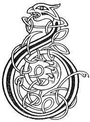

  
[Intangible Textual Heritage](../../../index) 
[Legends/Sagas](../../index)  [Celtic](../index)  [Carmina
Gadelica](../cg)  [Index](index)  [Previous](cg2069)  [Next](cg2071) 

------------------------------------------------------------------------

[Buy this Book at
Amazon.com](https://www.amazon.com/exec/obidos/ASIN/B0027P890O/internetsacredte)

------------------------------------------------------------------------

  
*Carmina Gadelica, Volume 2*, by Alexander Carmicheal, \[1900\], at
Intangible Textual Heritage

------------------------------------------------------------------------

 

<table data-border="0">
<colgroup>
<col style="width: 50%" />
<col style="width: 50%" />
</colgroup>
<tbody>
<tr class="odd">
<td data-valign="top" width="327">
p. 136
</td>
<td data-valign="top" width="327">
p. 137
</td>
</tr>
<tr class="even">
<td data-valign="top" width="327"><h3 id="an-eilid-187" data-align="center">AN EILID [187]</h3></td>
<td data-valign="top" width="327"><h3 id="the-hind" data-align="center">THE HIND</h3></td>
</tr>
</tbody>
</table>

 

<table data-border="0">
<colgroup>
<col style="width: 25%" />
<col style="width: 25%" />
<col style="width: 25%" />
<col style="width: 25%" />
</colgroup>
<tbody>
<tr class="odd">
<td data-valign="top">
 
</td>
<td data-valign="top">
p. 136
</td>
<td data-valign="top">
 
</td>
<td data-valign="top">
p. 137
</td>
</tr>
<tr class="even">
<td data-valign="top">
 
</td>
<td data-valign="top">
BHA Peadail is Pol a dol seachad, 
Is eilid ’s an ro a cur laoigh; 
'Tha eilid a breith,' osa Peadail; 
'Chi mi gu bheil,' osa Pol.

'Mar a thuiteas a duille bho ’n chraoibh, 
Gun ann a thuiteadh a seile gu lar, 
An ainm Athar an aigh agus Mhic an aoibh, 
Agus Spiorad a ghliocais ghraidh; 
     Athar an aigh agus Mhic an aoibh, 
     Agus Spioraid a ghliocais ghraidh.'
</td>
<td data-valign="top">
 
</td>
<td data-valign="top">
PETER and Paul were passing by, 
While a hind in the path was bearing a fawn; 
'A hind is bearing there,' said Peter; 
'I see it is so,' said Paul.

'As her foliage falls from the tree, 
So may her placenta fall to the ground, 
In name of the Father of love and of the Son of grace, 
And of the Spirit of loving wisdom; 
     Father of love and Son of grace, 
     And Spirit of loving wisdom.'
</td>
</tr>
</tbody>
</table>

 

------------------------------------------------------------------------

[Next: 188. Columba, Peter, and Paul. Calum-cille, Peadail, Agus
Pol](cg2071)
