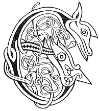

  
[Intangible Textual Heritage](../../../index) 
[Legends/Sagas](../../index)  [Celtic](../index)  [Carmina
Gadelica](../cg)  [Index](index)  [Previous](cg2075)  [Next](cg2077) 

------------------------------------------------------------------------

[Buy this Book at
Amazon.com](https://www.amazon.com/exec/obidos/ASIN/B0027P890O/internetsacredte)

------------------------------------------------------------------------

  
*Carmina Gadelica, Volume 2*, by Alexander Carmicheal, \[1900\], at
Intangible Textual Heritage

------------------------------------------------------------------------

 

<table data-border="0">
<colgroup>
<col style="width: 50%" />
<col style="width: 50%" />
</colgroup>
<tbody>
<tr class="odd">
<td data-valign="top" width="327">
p. 152
</td>
<td data-valign="top" width="327">
p. 153
</td>
</tr>
<tr class="even">
<td data-valign="top" width="327"><h3 id="an-eoir-a-chuir-moire-192" data-align="center">AN EOIR A CHUIR MOIRE [192]</h3></td>
<td data-valign="top" width="327"><h3 id="the-charm-sent-of-mary" data-align="center">THE CHARM SENT OF MARY</h3></td>
</tr>
</tbody>
</table>

 

<table data-border="0">
<colgroup>
<col style="width: 25%" />
<col style="width: 25%" />
<col style="width: 25%" />
<col style="width: 25%" />
</colgroup>
<tbody>
<tr class="odd">
<td data-valign="top">
 
</td>
<td data-valign="top">
p. 152
</td>
<td data-valign="top">
 
</td>
<td data-valign="top">
p. 153
</td>
</tr>
<tr class="even">
<td data-valign="top">
 
</td>
<td data-valign="top">
EOIR a chuir Moir Oighe, 
Dh’ an chaillich bha chomhnuidh 
Air orrlain a ghlinne, 
Air fireacha fuara-- 
      Air orrlain a ghlinne, 
      Air fireacha fuara.

Chuir i eoir ri stile, 
Chon meudach a h-ime, 
Chon lughdach a bainne, 
Chon tachradh a tuara-- 
      Chon meudach a h-ime, 
      Chon lughdach a bainne, 
      Chon tachradh a tuara.
</td>
<td data-valign="top">
 
</td>
<td data-valign="top">
THE charm sent of Mary Virgin, 
To the nun who was dwelling 
On the floor of the glen, 
On the cold high moors-- 
      On the floor of the glen, 
      On the cold high moors.

She put spell to saliva, 
To increase her butter, 
To decrease her milk, 
To make plentiful her food-- 
      To increase her butter, 
      To decrease her milk, 
      To make plentiful her food.
</td>
</tr>
</tbody>
</table>

 

\[The nun referred to is Brigit, of whom *Broccan's Hymn* says, 'She was
not a milkmaid of a mountain-side; she wrought in the midst of a plain.'
The second stanza is an echo of one of the miracles attributed to her in
the same hymn; 'when the first dairying was sent with the first butter
in a hamper, it kept not from bounty to her guests, their attachment was
not diminished,' explained further as follows: 'Brigit serving a certain
wizard was wont to give away much butter in charity. This displeased the
wizard and his wife, who came on her without notice. Brigit had only a
small churning ready and she repeated this stave--"My store-room, a
store-room of fair God, a store-room which my King has blessed, a
store-room with somewhat therein.

'"May Mary's Son, my friend, come to bless my store-room which my King
has blessed, a store-room with somewhat therein.

'"May Mary's Son, my friend, come to bless my store-room. The Prince of
the world to the border may there be plenty with Him.

'"O my Prince, who hast power over all these things! Bless, O God--a cry
unforbidden--with thy right hand this store-room."

p. 153

'She brought a half churning to the wizard's wife. "That is good to fill
a big hamper!" said the wizard's wife. "Fill ye your hamper," said
Brigit, "and God will put somewhat therein." She still kept going into
her kitchen and bringing half a making thereout and singing a stave of
these staves as she went back. If the hampers which the men of Munster
possessed had been given to her she would have filled them all. The
wizard and his wife marvelled at the miracle which they beheld. Then
said the wizard to Brigit: "This butter and the kine which thou hast
milked, I offer to thee; and thou shalt not be serving me but serve the
Lord." Said Brigit: "Take thou the kine, but give me my mother's
freedom. Said the wizard: "Behold thy mother and the kine; and
whatsoever thou shalt say, that will I do." Then Brigit dealt out the
kine to the poor and the needy; and the wizard was baptized and "he was
full of faith.'"

See *Broccan's Hymn*, told at greater length in the note. *Thesaurus
Palæohibernicus*, vol. ii., p. 331, etc. Also *Lismore Lives*, p. 186-7;
compare also pp. [18](cg2011.htm#page_18)-19,
[34](cg2018.htm#page_34)-35, [150](cg2075.htm#page_150)-151,
[158](cg2078.htm#page_158)-159 of this volume with incidents in the Life
of St Brigit as recorded in the above books.

------------------------------------------------------------------------

[Next: 193. The Wicked Who Would Me Harm. Ulc A Dhean Mo Lochd](cg2077)
