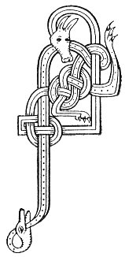

  
[Intangible Textual Heritage](../../../index) 
[Legends/Sagas](../../index)  [Celtic](../index)  [Carmina
Gadelica](../cg)  [Index](index)  [Previous](cg2084)  [Next](cg2086) 

------------------------------------------------------------------------

[Buy this Book at
Amazon.com](https://www.amazon.com/exec/obidos/ASIN/B0027P890O/internetsacredte)

------------------------------------------------------------------------

  
*Carmina Gadelica, Volume 2*, by Alexander Carmicheal, \[1900\], at
Intangible Textual Heritage

------------------------------------------------------------------------

 

<table data-border="0">
<colgroup>
<col style="width: 50%" />
<col style="width: 50%" />
</colgroup>
<tbody>
<tr class="odd">
<td data-valign="top" width="327">
p. 170
</td>
<td data-valign="top" width="327">
p. 171
</td>
</tr>
<tr class="even">
<td data-valign="top" width="327"><h3 id="coistrig-mathar-200" data-align="center">COISTRIG MATHAR [200]</h3></td>
<td data-valign="top" width="327"><h3 id="mothers-consecration" data-align="center">MOTHER'S CONSECRATION</h3></td>
</tr>
</tbody>
</table>

 

THE following lines are whispered by mothers into
the ears of sons and daughters when leaving their homes in the Outer
Isles for the towns of the south and for foreign lands. p. 171 Probably they are the last accents of the
mother's voice--heard in the far-away home among the hills clothed with
mist or on the machair washed by the sea--that linger on the Gaelic ear
as it sinks in the sleep that knows no waking.

 

<table data-border="0">
<colgroup>
<col style="width: 25%" />
<col style="width: 25%" />
<col style="width: 25%" />
<col style="width: 25%" />
</colgroup>
<tbody>
<tr class="odd">
<td data-valign="top">
 
</td>
<td data-valign="top">
p. 170
</td>
<td data-valign="top">
 
</td>
<td data-valign="top">
p. 171
</td>
</tr>
<tr class="even">
<td data-valign="top">
 
</td>
<td data-valign="top">
AN Dia mor bhi eadar do dha shlinnein, 
Ga do chomhnadh a falbh ’s a tilleadh, 
Mac Moire Oighe bhi an coir do chridhe, 
’S an Spiorad foirfe bhi ort a sileadh-- 
O, an Spiorad foirfe bhi ort a sileadh! 
          [<em>Aoidh</em>        [<em>Una</em>  
          [<em>Thorcuil</em>     [<em>Shorcha</em>  
          [<em>Thascail</em>      [<em>Shlainte</em>.
</td>
<td data-valign="top">
 
</td>
<td data-valign="top">
BE the great God between thy two shoulders, 
To protect thee in thy going and in thy coming, 
Be the Son of Mary Virgin near thine heart, 
And be the perfect Spirit upon thee pouring-- 
Oh, the perfect Spirit upon thee pouring! 
                 [<em>Aodh</em>       [<em>Una</em>  
                 [<em>Torquil</em>     [<em>Light</em>  
                 [<em>Tascal</em>       [<em>Health</em>.
</td>
</tr>
</tbody>
</table>

 

------------------------------------------------------------------------

[Next: 201. He Who Was Crucified. Am Fear A Cheusadh](cg2086)
