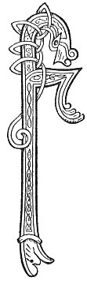

  
[Intangible Textual Heritage](../../../index) 
[Legends/Sagas](../../index)  [Celtic](../index)  [Carmina
Gadelica](../cg)  [Index](index)  [Previous](cg2085)  [Next](cg2087) 

------------------------------------------------------------------------

[Buy this Book at
Amazon.com](https://www.amazon.com/exec/obidos/ASIN/B0027P890O/internetsacredte)

------------------------------------------------------------------------

  
*Carmina Gadelica, Volume 2*, by Alexander Carmicheal, \[1900\], at
Intangible Textual Heritage

------------------------------------------------------------------------

 

<table data-border="0">
<colgroup>
<col style="width: 50%" />
<col style="width: 50%" />
</colgroup>
<tbody>
<tr class="odd">
<td data-valign="top" width="327">
p. 172
</td>
<td data-valign="top" width="327">
p. 173
</td>
</tr>
<tr class="even">
<td data-valign="top" width="327"><h3 id="am-fear-a-cheusadh-201" data-align="center">AM FEAR A CHEUSADH [201]</h3></td>
<td data-valign="top" width="327"><h3 id="he-who-was-crucified" data-align="center">HE WHO WAS CRUCIFIED</h3></td>
</tr>
</tbody>
</table>

 

THE two following poems were got in Kintail. They
are obscure in themselves, and the dialect of Kintail in which they were
recited p. 173 increases their obscurity. The
reciters repeated them as one poem, but were uncertain whether they were
one or two poems.

 

<table data-border="0">
<colgroup>
<col style="width: 25%" />
<col style="width: 25%" />
<col style="width: 25%" />
<col style="width: 25%" />
</colgroup>
<tbody>
<tr class="odd">
<td data-valign="top">
 
</td>
<td data-valign="top">
p. 172
</td>
<td data-valign="top">
 
</td>
<td data-valign="top">
p. 173
</td>
</tr>
<tr class="even">
<td data-valign="top">
 
</td>
<td data-valign="top">
FHIR a chruchadh air a chribh, 
     Fhir a chiosadh le minn an t-sluaigh,     [binn 
Nis bho dh’ f has mi aosda, liath, 
     Gabh ri m’ fhaosaid, a Dhia! truais.

Chan ioghnadh domh is mor mo lochd, 
     Is mi an clab-goileam bochd bua’all, 
Ri m’ oige gun robh mi baoth, 
     Ri m’ aois gu bheil mi truagh.

Seal mu’n taine Mac De, 
     Bha ’n ce na lodruich dhuibh, 
Gun ri, gun ro, gun re, 
     Gun chro, gun chre, gun chruth.

Shoillsich fearann, shoillsich fonn, 
     Shoillsich an trom fhairge ghlas, 
Shoillsich an cruinne ce gu leir, 
     Ri linn Mhic De tigh’nn gu teach.

Sin ’d uair labhair Moire nan gras, 
     An Oigh bhaigheil a bha ghnath glic, 
’D uair thug Eosai dhi-se ghradh, 
     Bu mhiann leis bhi ’n a lathair tric.
</td>
<td data-valign="top">
 
</td>
<td data-valign="top">
THOU who wert hanged upon the tree, 
     And wert crucified by the condemnation of the people, 
Now that I am grown old and grey, 
     Take to my confession-prayer, O God! pity.

No wonder to me great is my wickedness, 
     I am a poor clattering cymbal, 
In my youth I was profane, 
     In my age I am forlorn.

A time ere came the Son of God, 
     The earth was a black morass, 
Without star, without sun, without moon, 
     Without body, without heart, without form.

Illumined plains, illumined hills, 
     Illumined the great green sea, 
Illumined the whole globe together, 
     When the Son of God came to earth.

Then it was that spoke the Mary of grace, 
     The Virgin always most kindly and wise, 
When Joseph gave to her his love, 
     He desired to be often in her presence.
</td>
</tr>
<tr class="odd">
<td data-valign="top">
 
</td>
<td data-valign="top">
p. 174
</td>
<td data-valign="top">
 
</td>
<td data-valign="top">
p. 175
</td>
</tr>
<tr class="even">
<td data-valign="top">
 
</td>
<td data-valign="top">
Bha cumhnant eadar Eos agus Oigh, 
     Ann an ordugh dligheach ceart, 
Gum biodh cuis ga cur air doigh 
     Le seula Righ Mor nam feart.

Chair iad leis gu Teampull De, 
     Far an robh a chleir a steach; 
Mar a dh’ orduich an t-Ard High Mor, 
     Phos iad mu’n taine mach.

Thainig aingeal na dheigh:-- 
     'Eosai, ciod e ’n gleus a th’ ort?' 
'Fhuair mi boirionnach bho ’n chleir, 
     Cha dual domh fein a bhi ceart.'

'Eosai, fuirich ri do cheil, 
     Chan nodaidh dhuit beud a radh, 
Gur h-e th’ agad an Oigh ghlan, 
     Air nach deachaidh le fear lamh.'

'Ciamar a chreideas mi sin uat? 
     Agam fein, mo nuar! tha fios-- 
’D uair a laigh mi sios ri gual’ 
     Bha leanabh beo a briosg fo crios.'
</td>
<td data-valign="top">
 
</td>
<td data-valign="top">
A compact there was between Joseph and Virgin, 
     In order well-becoming and just, 
That the compact might be confirmed 
     By the seal of the Great King of virtues.

They went with him to the Temple of God, 
     Where the clerics sat within; 
As ordained of the Great High King, 
     They married ere they came out.

An angel came afterwards: 
     'Joseph, why excited thou?' 
'I got a woman from the clerics, 
     It is not natural for me to be calm.'

'Joseph, abide thou by thy reason, 
     Not enlightened of thee to find fault, 
What thou hast gotten is a virgin pure, 
     On whom man never put hand.'

'How can I believe that from thee? 
     I myself, my grief! have knowledge-- 
When I laid me down by her shoulder 
     A living child beneath her girdle throbbed.'
</td>
</tr>
</tbody>
</table>

 

------------------------------------------------------------------------

[Next: 202. That Cock. An Coileach Sin](cg2087)
