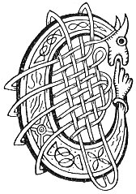

  
[Intangible Textual Heritage](../../../index) 
[Legends/Sagas](../../index)  [Celtic](../index)  [Carmina
Gadelica](../cg)  [Index](index)  [Previous](cg2090)  [Next](cg2092) 

------------------------------------------------------------------------

[Buy this Book at
Amazon.com](https://www.amazon.com/exec/obidos/ASIN/B0027P890O/internetsacredte)

------------------------------------------------------------------------

  
*Carmina Gadelica, Volume 2*, by Alexander Carmicheal, \[1900\], at
Intangible Textual Heritage

------------------------------------------------------------------------

 

<table data-border="0">
<colgroup>
<col style="width: 50%" />
<col style="width: 50%" />
</colgroup>
<tbody>
<tr class="odd">
<td data-valign="top" width="327">
p. 184
</td>
<td data-valign="top" width="327">
p. 185
</td>
</tr>
<tr class="even">
<td data-valign="top" width="327"><h3 id="manaidh-206" data-align="center">MANAIDH [206]</h3></td>
<td data-valign="top" width="327"><h3 id="omens" data-align="center">OMENS</h3></td>
</tr>
</tbody>
</table>

 

<table data-border="0">
<colgroup>
<col style="width: 25%" />
<col style="width: 25%" />
<col style="width: 25%" />
<col style="width: 25%" />
</colgroup>
<tbody>
<tr class="odd">
<td data-valign="top">
 
</td>
<td data-valign="top">
p. 184
</td>
<td data-valign="top">
 
</td>
<td data-valign="top">
p. 185
</td>
</tr>
<tr class="even">
<td data-valign="top">
 
</td>
<td data-valign="top">
CHUALA mi chuthag ’s gun bhiadh am bhroinn, 
Chuala mi am fearan am barr a chroinn, 
Chuala mi ’n suaircean shuas anns a choill, 
’S chuala mi nualla cumhachag na h-oidhche.

Chunna mi ’n t-uan ’s a chula rium, 
Chunna mi ’n t-seiliche air lic luim, 
Chunna mi ’n searrach le thulachain rium, 
Chunna mi an clachran air gharadh tuill, 
An eunarag ’s mi ’m shuidhe cruinn, 
’S dh’ aithnich mi fhe’ nach teidheadh 
     A bhliadhna lion.
</td>
<td data-valign="top">
 
</td>
<td data-valign="top">
I HEARD the cuckoo with no food in my stomach, 
I heard the stock-dove on the top of the tree, 
I heard the sweet singer in the copse beyond, 
And I heard the screech of the owl of the night.

I saw the lamb with his back to me, 
I saw the snail on the bare flag-stone, 
I saw the foal with his rump to me, 
I saw the wheatear on a dyke of holes, 
I saw the snipe while sitting bent, 
And I foresaw that the year would not 
     Go well with me.
</td>
</tr>
</tbody>
</table>

 

------------------------------------------------------------------------

[Next: 207. The Incense. An Tuis](cg2092)
