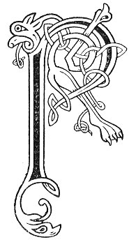

  
[Intangible Textual Heritage](../../../index) 
[Legends/Sagas](../../index)  [Celtic](../index)  [Carmina
Gadelica](../cg)  [Index](index)  [Previous](cg2091)  [Next](cg2093) 

------------------------------------------------------------------------

[Buy this Book at
Amazon.com](https://www.amazon.com/exec/obidos/ASIN/B0027P890O/internetsacredte)

------------------------------------------------------------------------

  
*Carmina Gadelica, Volume 2*, by Alexander Carmicheal, \[1900\], at
Intangible Textual Heritage

------------------------------------------------------------------------

 

<table data-border="0">
<colgroup>
<col style="width: 50%" />
<col style="width: 50%" />
</colgroup>
<tbody>
<tr class="odd">
<td data-valign="top" width="327">
p. 186
</td>
<td data-valign="top" width="327">
p. 187
</td>
</tr>
<tr class="even">
<td data-valign="top" width="327"><h3 id="an-tuis-207" data-align="center">AN TUIS [207]</h3></td>
<td data-valign="top" width="327"><h3 id="the-incense" data-align="center">THE INCENSE</h3></td>
</tr>
</tbody>
</table>

 

<table data-border="0">
<colgroup>
<col style="width: 25%" />
<col style="width: 25%" />
<col style="width: 25%" />
<col style="width: 25%" />
</colgroup>
<tbody>
<tr class="odd">
<td data-valign="top">
 
</td>
<td data-valign="top">
p. 186
</td>
<td data-valign="top">
 
</td>
<td data-valign="top">
p. 187
</td>
</tr>
<tr class="even">
<td data-valign="top">
 
</td>
<td data-valign="top">
RI la do shlainte, 
Cha dean thu crabhadh, 
Cha tabhair thu taine, 
     ’S cha tar thu tuis;

Ceann an ardain, 
Cridhe na gabhachd, 
Beul gun fhaigheam, 
     ’S cha nar leat cuis.

Ach thig do gheamhradh, 
Is cruas do theanndachd, 
Is bidh do cheann mar 
     Am meall ’s an uir;

Do luth air failing, 
Do chruth air fhagail, 
Is tu na do thraill, 
     Air do dha ghlun.
</td>
<td data-valign="top">
 
</td>
<td data-valign="top">
IN the day of thy health, 
Thou wilt not give devotion, 
Thou wilt not give kine, 
     Nor wilt thou offer incense;

Head of haughtiness, 
Heart of greediness, 
Mouth unhemmed, 
     Nor ashamed art thou.

But thy winter will come, 
And the hardness of thy distress, 
And thy head shall be as 
     The clod in the earth

Thy strength having failed, 
Thine aspect having gone, 
And thou a thrall, 
     On thy two knees.
</td>
</tr>
</tbody>
</table>

 

------------------------------------------------------------------------

[Next: 208 (notes). Poem of the Beetles. Duan Nan Daol](cg2093)
