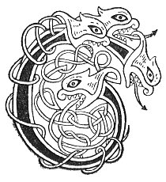

  
[Intangible Textual Heritage](../../../index) 
[Legends/Sagas](../../index)  [Celtic](../index)  [Carmina
Gadelica](../cg)  [Index](index)  [Previous](cg2097)  [Next](cg2099) 

------------------------------------------------------------------------

[Buy this Book at
Amazon.com](https://www.amazon.com/exec/obidos/ASIN/B0027P890O/internetsacredte)

------------------------------------------------------------------------

  
*Carmina Gadelica, Volume 2*, by Alexander Carmicheal, \[1900\], at
Intangible Textual Heritage

------------------------------------------------------------------------

 

<table data-border="0">
<colgroup>
<col style="width: 50%" />
<col style="width: 50%" />
</colgroup>
<tbody>
<tr class="odd">
<td data-valign="top" width="327">
p. 202
</td>
<td data-valign="top" width="327">
p. 203
</td>
</tr>
<tr class="even">
<td data-valign="top" width="327"><h3 id="ban-tighearna-bhinn-212" data-align="center">BAN-TIGHEARNA BHINN [212]</h3></td>
<td data-valign="top" width="327"><h3 id="the-melodious-lady-lord" data-align="center">THE MELODIOUS LADY-LORD</h3></td>
</tr>
</tbody>
</table>

 

THERE were many religious houses throughout the Isles. Two of these were
in Benbecula--one at 'Baile-mhanaich,' Monk's-town, and one at
'Baile-nan-cailleach,' Nuns'-town. These houses were attached to Iona,
and were ruled and occupied by members of the first families of the
Western Isles. Probably their insularity secured them from dissolution
at the time of the Reformation, for these communities lingered long
after the Reformation, and ceased to exist simply through natural decay.

It is said that two nuns had been visiting a sick woman. When returning
home from the moorland to the townland, they heard the shrill voice of a
child and the soft voice of a woman. The nuns groped their way down the
rugged rocks, and there found a woman soothing a child in her arms. They
were the only two saved from a wreck--the two frailest in the ship. The
nuns took them home to Nunton. The woman was an Irish princess and a
nun, and the child an Irish prince, against whose life a usurper to the
throne had conceived a plot. The holy princess fled with the
child-prince, intending to take him for safety to Scandinavia. The two
nuns are said to have composed the two following poems.

One version of the story says that the child grew up and succeeded to
the throne in Ireland; another that he died in the North Sea, and that
he was buried in North Ronaldsay, Orkney.

During the three centuries of the Norse occupation there was much
cordial communication between Scotland and Ireland, and much, but not
cordial communication between Ireland and Scandinavia. Norsemen infested
the east of Ireland and west of Scotland. There were plots and
counterplots and wars innumerable between invaders and invaded, the ends
of the beam ascending p. 202 and descending
in sore quick succession. Ultimately the Irish succeeded in inflicting a
crushing defeat on the Scandinavians at the battle of Clontarf.

Clontarf is situated on Dublin Bay, a few miles below the city. It is a
low-lying plain of much extent and great fertility. In the adjoining sea
is a spit or bar emitting curious sounds during certain conditions of
tide and wind. The sounds resemble the bellowing of a bull, and hence
the name 'Cluain tarbh,' Clontarf, the plain of bulls.

The famous battle of Clontarf was fought on Good Friday, 23rd April,
1014. The Irish were led by their celebrated warrior-king, Brian
Boroimhe, monarch of all Ireland, and the Danes by their Celto-Danish
Prince, Earl Sigurd. There was indescribable havoc on both sides. The
slaughter, as seen from the walls of Dublin, is described as resembling
the work of mad reapers in a field of corn. Earl Sigurd fell. This was
foretold him by his mother, Audna, daughter of Carroll, King of Ireland,
when she gave him the 'Raven Banner of Battle' at Skidda-myre, now
Skidden, in Caithness. Audna told Sigurd that the Raven Banner would
always bring victory to the owner, but death to the bearer. At the
battle of Clontarf every man who took up the Raven Banner fell. At last
no one would take it up. Seeing this, Sigurd himself seized the banner,
saying, '’Tis meetest that the beggar himself should bear his bag.'
Immediately thereafter Sigurd fell, and with him the Norse power in
Ireland. The victorious Irish slaughtered the defeated Danes with all
the concentrated hate of three centuries of cruel wrong. The fall of
Earl Sigurd was made known to his friends in the North through the
fore-knowledge of the Valkymar, the twelve weird sisters of Northern
Mythology, of whom Gray sings in his 'Fatal Sisters.'

 

<table data-border="0">
<colgroup>
<col style="width: 25%" />
<col style="width: 25%" />
<col style="width: 25%" />
<col style="width: 25%" />
</colgroup>
<tbody>
<tr class="odd">
<td data-valign="top">
 
</td>
<td data-valign="top">
p. 202
</td>
<td data-valign="top">
 
</td>
<td data-valign="top">
p. 203
</td>
</tr>
<tr class="even">
<td data-valign="top">
 
</td>
<td data-valign="top">
CO i bhain-tighearna bhinn, 
An bun an tuim, 
Am beul an tuim?

Chan alca,    [fhalc 
Cha lacha, 
Chan eala, 
’S chan aonar i.
</td>
<td data-valign="top">
 
</td>
<td data-valign="top">
WHO is she the melodious lady-lord, 
At the base of the knoll, 
At the mouth of the wave?

Not the ale, 
Not the duck, 
Not the swan, 
And not alone is she.
</td>
</tr>
<tr class="odd">
<td data-valign="top">
 
</td>
<td data-valign="top">
p. 204
</td>
<td data-valign="top">
 
</td>
<td data-valign="top">
p. 205
</td>
</tr>
<tr class="even">
<td data-valign="top">
 
</td>
<td data-valign="top">
Co i bhain-tighearna bhinn, 
Am bun an tuim, 
Am beul an tuim?

Chan fhosga, 
Cha lona, 
Cha smeorach, 
     Air gheuig i.

Co i bhain-tighearna bhinn, 
Am bun an tuim, 
Am beul an tuim?

  *       *       *       * 
  *       *       *       * 
Cha tarman tuirim 
     An t-sleibh i.

Co i bhain-tighearna bhinn, 
Am bun an tuim, 
Am beul an tuim?

Cha bhreac air a bhuinne, 
Cha mhoineis na tuinne, 
Cha mhuirghin-mhuire 
     Na Ceit i.

Co i bhain-tighearna bhinn, 
Am bun an tuim, 
Am beul an tuim?

Cha bhainisg na cuigeil, 
Chan ainnir na fuiril, 
Cha bhainnireach bhuidhe 
     Na spreidh i.
</td>
<td data-valign="top">
 
</td>
<td data-valign="top">
Who is she the melodious lady-lord, 
At the base of the knoll, 
At the mouth of the wave?

Not the lark, 
Not the merle, 
Not the mavis, 
     On the bough is she.

Who is she the melodious lady-lord, 
At the base of the knoll, 
At the mouth of the wave?

  *       *       *       * 
  *       *       *       * 
Not the murmuring ptarmigan 
     Of the hill is she.

Who is she the melodious lady-lord, 
At the base of the knoll, 
At the mouth of the wave?

Not the grilse of the stream, 
Not the seal of the wave, 
Not the sea maiden 
     Of May is she.

Who is she the melodious lady-lord, 
At the base of the knoll, 
At the mouth of the wave?

Not the dame of the distaff, 
Not the damsel of the lyre, 
Not the golden-haired maid 
     Of the flocks is she.
</td>
</tr>
<tr class="odd">
<td data-valign="top">
 
</td>
<td data-valign="top">
p. 206
</td>
<td data-valign="top">
 
</td>
<td data-valign="top">
p. 207
</td>
</tr>
<tr class="even">
<td data-valign="top">
 
</td>
<td data-valign="top">
Co i bhain-tighearna bhinn, 
Am bun an tuim, 
Am beul an tuim?

Bain-tighearna bhinn, 
Bhaindidh mhin,

Ighinn righ, 
Ogha righ, 
Iar-ogh righ, 
Ion-ogh righ, 
Dubh-ogh righ, 
Bean righ, 
Mathair righ, 
Muime righ, 
I taladh righ, 
     Is e fo breid aic.

A Eirinn a shiubhail i, 
Gu Lochlann tha fiughair aic, 
An Trianaid bhi siubhal leath 
H-uile taobh a theid i-- 
     H-uile taobh a theid i.
</td>
<td data-valign="top">
 
</td>
<td data-valign="top">
Who is she the melodious lady-lord, 
At the base of the knoll, 
At the mouth of the wave?

Melodious lady-lord, 
God-like in loveliness,

Daughter of a king, 
Granddaughter of a king, 
Great-granddaughter of a king, 
Great-great-granddaughter of a king, 
Great-great-great-granddaughter of a king, 
Wife of a king, 
Mother of a king, 
Foster-mother of a king, 
She lullabying a king, 
     And he under her plaid.

From Erin she travelled, 
For Lochlann is bound, 
May the Trinity travel with her 
Whithersoever she goes-- 
     Whithersoever she goes.
</td>
</tr>
</tbody>
</table>

 

------------------------------------------------------------------------

[Next: 213. Queen of Grace. Righinn Nam Buadh](cg2099)
