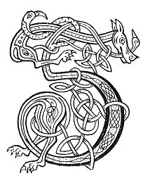

  
[Intangible Textual Heritage](../../../index) 
[Legends/Sagas](../../index)  [Celtic](../index)  [Carmina
Gadelica](../cg) 

------------------------------------------------------------------------

[Buy this Book at
Amazon.com](https://www.amazon.com/exec/obidos/ASIN/B0027P890O/internetsacredte)

------------------------------------------------------------------------

<table width="75%">
<colgroup>
<col style="width: 50%" />
<col style="width: 50%" />
</colgroup>
<tbody>
<tr class="odd">
<td width="50%" data-valign="TOP"></td>
<td width="50%" data-valign="CENTER"><h1 id="carmina-gadelica" data-align="CENTER">Carmina Gadelica</h1>
<h6 id="hymns-and-incantations" data-align="CENTER">Hymns and Incantations</h6>
<h2 id="ortha-nan-gaidheal" data-align="CENTER">Ortha Nan Gaidheal</h2>
<h4 id="volume-ii" data-align="CENTER">Volume II</h4>
<h4 id="by-alexander-carmichael" data-align="CENTER">by Alexander Carmichael</h4>
<h4 id="section" data-align="CENTER">[1900]</h4></td>
</tr>
</tbody>
</table>

------------------------------------------------------------------------

[Contents](#contents)    [Start Reading](cg2000)    [Page
Index](pageidx)    [Text \[Zipped\]](cg2.txt.gz)

------------------------------------------------------------------------

[Volume I](../cg1/index)    \|    **Volume II**

------------------------------------------------------------------------

|                                                                                                                           |
|---------------------------------------------------------------------------------------------------------------------------|
|  |

This is volume II of Alexander Carmichael's collection of folk poetry
from the Western Isles of Scotland. Volume II includes many incantations
for luck, love and good health. This volume also has numerous poems
about plants and animals, and extensive notes on the lore associated
with them.

Besides the complete English and Gaelic text of the poems, and the
beautiful initials, this etext includes the [extensive
glossary](cg2105), which occupies the last third of the book. This
appendix has not been reprinted in any of the contemporary anthologies
of the Carmina Gadelica, and appears for the first time on the Internet
at this site. It is a treasure trove of Scottish and Celtic lore, and
makes fascinating reading. The glossary includes crucial background
information about the main text of the book, many shorter poems, and
Carmichael's personal insights into the life and beliefs of the people
he studied for many years.

------------------------------------------------------------------------

 [Title Page](cg2000)  
[Contents](cg2001)  

### IV. Uibe. Incantations

[Header](cg2002)  
[122. Charm For Rose. Eolas Na Ruaidh](cg2003)  
[123. Charm For Rose. Eolas Na Ruaidh](cg2004)  
[124. Charm For Rose. Eolas Na Ru](cg2005)  
[125. Charm For Swollen Breast. Eolas At Cioch](cg2006)  
[126. Toothache Charm. Eolas An Deididh](cg2007)  
[127. Charm For Jaundice. Eolas Na Budha](cg2008)  
[128. Charm For A Bursting Vein. Eolas Sgiucha Feithe](cg2009)  
[129. Charm For Bursting Vein. Eolas Sgocha Feith](cg2010)  
[130. Charm of the Sprain. Eolas An T-Sniamh](cg2011)  
[131. Charm For Sprain. Eolas An T-Sniamh](cg2012)  
[132. Charm For Sprain. Eolas An T-Sniamh](cg2013)  
[133. Fāth-Fīth](cg2014)  
[134 (notes). Charm Of The Lasting Life. Sian A Bheatha Bhuan](cg2015)  
[134. Charm Of The Lasting Life. Sian A Bheatha Bhuan](cg2016)  
[135. The Charm of the Lasting Life. Sian A Bheatha Bhuan](cg2017)  
[136. St Bride's Charm. Sian Bride](cg2018)  
[137. Sain. Sian](cg2019)  
[138. Love Charm. Eolas Gradhaich](cg2020)  
[139. Love Charm. Eolas Gradhaidh](cg2021)  
[140. Thwarting the Evil Eye. Cronachduinn Suil](cg2022)  
[141. Exorcism of the Eye. Eolas A Bheum Shula.](cg2023)  
[142. Counteracting The Evil Eye. Cronachdain Suil](cg2024)  
[143. Spell For Evil Eye. Uibe Ri Shul](cg2025)  
[144. Charm For The Eye. Obi Ri Shuil](cg2026)  
[145. Charm For The Evil Eye. Eoir Beum Sula](cg2027)  
[146. Charm. Eolas](cg2028)  
[147. A Malediction. Mallachd](cg2029)  
[148. Spell Of The Evil Eye Eolas A Bheim Shuil](cg2030)  
[149. Incantation for the Eye. Obi Nan Sul](cg2031)  
[150. Spell of the Eye. Oba Ri Shul](cg2032)  
[151. Spell of the Eye. Oba Ri Sul](cg2033)  
[152. Spell of the Eye. Ob Ri Shul](cg2034)  
[153. Spell of the Counteracting. Eolas A Chronachaidh](cg2035)  
[154. The Counting of the Stye. Cunntas An T-Sleamhnain](cg2036)  
[155. The 'Fionn-Faoilidh'. Am Fionn-Faoilidh](cg2037)  
[156. Envy Spell. Eolas Tnu](cg2038)  
[157. The Red-Stalk. An Dearg Chasachan](cg2039)  
[158. The Tree-Entwining Ivy. An Eidheann-Mu-Chrann](cg2040)  
[159 (notes). The Charm of the Figwort. Eolas An Torranain](cg2041)  
[159. The Charm of the Figwort. Eolas An Torranain](cg2042)  
[160. The Figwort. An Torranan](cg2043)  
[161. The Charm of the Figwort. Eolas An Torranain](cg2044)  
[162. The Fairy Wort. An Earnaid Shith](cg2045)  
[163. The Yarrow. Earr Thalmhainn](cg2046)  
[164. The Yarrow. An Earr-Thalmhainn](cg2047)  
[165. Saint John's Wort. Achlasan Chaluim-Chille](cg2048)  
[166. St Columba's Plant. Achlasan Chaluim-Chille](cg2049)  
[167. St Columba's Plant. Achlasan Chaluim-Chille](cg2050)  
[168. Saint John's Wort. Eala-Bhi, Eala-Bhi](cg2051)  
[169. The Aspen. An Crithionn](cg2052)  
[170. Shamrock Of Luck. Seamarag Nam Buadh](cg2053)  
[171. The Shamrock of Power. Seamarag Nam Buadh](cg2054)  
[172. The 'Mothan'. Am Mothan](cg2055)  
[173. The 'Mothan'. Am Mothan](cg2056)  
[174. The 'Mothan'. Am Mothan](cg2057)  
[175. The Passion-Flower of Virtues. Ceus-Chrann Nam Buadh](cg2058)  
[176. The Club-Moss. Garbhag An T-Sleibh](cg2059)  
[177. The Red-Palmed. An Dearg-Bhasach](cg2060)  
[178. The Catkin Wool. A Chloimh Chat](cg2061)  
[179. The Catkin Wool. A Chloimh Chat](cg2062)  
[180. Incantation of the Red Water. Eolas A Bhun Deirg](cg2063)  
[181. Red Water Charm. Eolas Bun Deirg](cg2064)  
[182. The Gravel Charm. Eolas A Ghalar Fhuail](cg2065)  
[183. The Strangles. An Stringlein](cg2066)  
[184. The Spell of the Fox. Sian Sionnaich](cg2067)  
[185. Prayer of the Cattle-Fold. Ora Cuithe](cg2068)  
[186. The Ditch of Mary. Feith Mhoire](cg2069)  
[187. The Hind. An Eilid](cg2070)  
[188. Columba, Peter, and Paul. Calum-cille, Peadail, Agus
Pol](cg2071)  
[189. The Indigestion Spell. Eolas A Mheirbhein](cg2072)  
[190. Cud Chewing Charm. Eolas Chnamh Chir](cg2073)  
[191 (notes). Charm of the Churn. Eolas A Chrannachain](cg2074)  
[191. Charm of the Churn. Eolas A Chrannachain](cg2075)  
[192. The Charm Sent of Mary. An Eoir A Chuir Moire.](cg2076)  
[193. The Wicked Who Would Me Harm. Ulc A Dhean Mo Lochd](cg2077)  
[194. Augury of Mary. Frith Mhoire](cg2078)  

### V. Measgain. Miscellaneous

[Header](cg2079)  
[195. The First Miracle of Christ. Ciad Miarail Chriosd](cg2080)  
[196. The Virgin and Child. An Oigh Agus An Leanabh](cg2081)  
[197. God of the Moon. Dia Na Gile](cg2082)  
[198. God of the Moon, God of the Sun. Dia Na Gile, Dia Na
Greine](cg2083)  
[199. Safety of the Generous. Tearuinteachd Nam Fial](cg2084)  
[200. Mother's Consecration. Coistrig Mathar](cg2085)  
[201. He Who Was Crucified. Am Fear A Cheusadh](cg2086)  
[202. That Cock. An Coileach Sin](cg2087)  
[203. Omens. Manaidh](cg2088)  
[204. Early Easter Monday. Moch La Luan Casg](cg2089)  
[205. Omen of the Swans. Manadh Nan Eala](cg2090)  
[206. Omens. Manaidh](cg2091)  
[207. The Incense. An Tuis](cg2092)  
[208 (notes). Poem of the Beetles. Duan Nan Daol](cg2093)  
[208. Poem of the Beetles. Duan Nan Daol](cg2094)  
[209. Poem of the Beetles. Duan Nan Daol](cg2095)  
[210. Poem of the Beetle. Duan An Daoil](cg2096)  
[211. Lullaby. Taladh](cg2097)  
[212. The Melodious Lady-Lord. Ban-Tighearna Bhinn](cg2098)  
[213. Queen of Grace. Righinn Nam Buadh](cg2099)  
[214. Killmoluag. Cill-Moluag](cg2100)  
[215 (notes). The Kertch. Am Breid](cg2101)  
[215. The Kertch. Am Breid](cg2102)  
[216. Fragment. Fuigheal](cg2103)  

### Notes

[Header](cg2104)  
[A](cg2105)  
[B](cg2106)  
[C](cg2107)  
[D](cg2108)  
[E](cg2109)  
[F](cg2110)  
[G](cg2111)  
[I](cg2112)  
[L](cg2113)  
[M](cg2114)  
[N](cg2115)  
[O](cg2116)  
[P](cg2117)  
[R](cg2118)  
[S](cg2119)  
[T](cg2120)  
[U](cg2121)  
[Names of Those From Whose Recitation the Poems Have Been
Recorded](cg2122)  

 

[Farewell. Soiridh](cg2123)  
