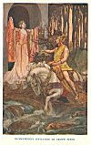

  
[Intangible Textual Heritage](../../../index) 
[Legends/Sagas](../../index)  [Celtic](../index)  [Index](index) 
[Previous](cml19)  [Next](cml21) 

------------------------------------------------------------------------

[Buy this Book at
Amazon.com](https://www.amazon.com/exec/obidos/ASIN/0809531534/internetsacredte)

------------------------------------------------------------------------

p. 249 

# THE BRITISH GODS AND THEIR STORIES

p. 251

### CHAPTER XVI

### THE GODS OF THE BRITONS

The descriptions and the stories of the British gods have hardly come
down to us in so ample or so compact a form as those of the deities of
the Gaels, as they are preserved in the Irish and Scottish manuscripts.
They have also suffered far more from the sophistications of the
euhemerist. Only in the "Four Branches of the Mabinogi" do the gods of
the Britons appear in anything like their real character of supernatural
beings, masters of magic, and untrammelled by the limitations which
hedge in mortals. Apart from those four fragments of mythology, and from
a very few scattered references in the early Welsh poems, one must
search for them under strange disguises. Some masquerade as kings in
Geoffrey of Monmouth's more than apocryphal *Historia Britonum*. Others
have received an undeserved canonization, which must be stripped from
them before they can be seen in their true colours. Others, again, were
adopted by the Norman-French romancers, and turned into the champions of
chivalry now known as Arthur's Knights of the Round Table. But, however
disguised, their real nature can still be discerned. The Gaels and the
Britons were but two branches of one

p. 252

race--the Celtic. In many of the gods of the Britons we shall recognize,
with names alike and attributes the same, the familiar features of the
Gaelic Tuatha Dé Danann.

The British gods are sometimes described as divided into three
families--the "Children of Dôn", the "Children of Nudd", and the
"Children of Llyr". But these three families are really only two; for
Nudd, or Lludd, as he is variously called, is himself described as a son
of Beli, who was the husband of the goddess Dôn. There can be no doubt
that Dôn herself is the same divine personage as Danu, the mother of the
Tuatha Dé Danann, and that Beli is the British equivalent of the Gaelic
Bilé, the universal Dis Pater who sent out the first Gaels from Hades to
take possession of Ireland. With the other family, the "Children of
Llyr", we are equally on familiar ground; for the British Llyr can be
none other than the Gaelic sea-god Lêr. These two families or tribes are
usually regarded as in opposition, and their struggles seem to symbolize
in British myth that same conflict between the powers of heaven, light,
and life and of the sea, darkness, and death which are shadowed in
Gaelic mythology in the battles between the Tuatha Dé Danann and the
Fomors.

For the children of Dôn were certainly gods of the sky. Their names are
writ large in heaven. The glittering W which we call "Cassiopeia's
Chair" was to our British ancestors *Llys Dôn*, or "Dôn's Court"; our
"Northern Crown" was *Caer Arianrod*, the "Castle of Arianrod", Dôn's
daughter;

p. 253

while the "Milky Way" was the "Castle of Gwydion", Dôn's son. [1](#fn_281) More than this, the greatest of her
children, the Nudd or Lludd whom some make the head of a dynasty of his
own, was the Zeus alike of the Britons and of the Gaels. His epithet of
*Llaw Ereint*, that is, "of the Hand of Silver", proves him the same
personage as Nuada the "Silver-Handed". The legend which must have
existed to explain this peculiarity has been lost on British ground, but
it was doubtless the same as that told of the Irish god. With it, and,
no doubt, much else, has disappeared any direct account of battles
fought by him as sky-god against Fomor-like enemies. But, under the
faint disguise of a king of Britain, an ancient Welsh tale [2](#fn_282) records how he put an end to three
supernatural "plagues" which oppressed his country. In addition to this,
we find him under his name of Nudd described in a Welsh Triad as one of
"the three generous heroes of the Isle of Britain", while another makes
him the owner of twenty-one thousand milch cows--an expression which
must, to the primitive mind, have implied inexhaustible wealth. Both
help us to the conception of a god of heaven and battle, triumphant, and
therefore rich and liberal. [3](#fn_283)

More tangible evidence is, however, not lacking to prove the wide-spread
nature of his worship. A temple dedicated to him in Roman times under
the name of Nodens, or Nudens, has been discovered at

p. 254

\[paragraph continues\] Lydney, on the
banks of the Severn. The god is pictured on a plaque of bronze as a
youthful deity, haloed like the sun, and driving a four-horsed chariot.
Flying spirits, typifying the winds, accompany him; while his power over
the sea is symbolized by attendant Tritons. [1](#fn_284) This was in the west of Britain, while,
in the east, there is good reason to believe that he had a shrine
overlooking the Thames. Tradition declares that St. Paul's Cathedral
occupies the site of an ancient pagan temple; while the spot on which it
stands was called, we know from Geoffrey of Monmouth, "Parth Lludd" by
the Britons, and "Ludes Geat" by the Saxons. [2](#fn_285)

Great, however, as he probably was, Lludd, or Nudd occupies less space
in Welsh story, as we have it now, than his son. Gwyn ap Nudd has
outlived in tradition almost all his supernatural kin. Professor Rhys is
tempted to see in him the British equivalent of the Gaelic Finn mac
Cumhail. [3](#fn_286) The name of both alike
means "white"; both are sons of the heaven-god; both are famed as
hunters. Gwyn, however, is more than that; for his game is man. In the
early Welsh poems, he is a god of battle and of the dead, and, as such,
fills the part of a *psychopompos*, conducting the slain into Hades, and
there ruling over them. In later, semi-Christianized story he is
described as "Gwyn, son of Nudd, whom God has placed over the brood of
devils in Annwn, lest they should destroy the present

p. 255

race [1](#fn_287)". Later again, as paganism
still further degenerated, he came to be considered as king of the
*Tylwyth Teg*, the Welsh fairies, [2](#fn_288)
and his name as such has hardly yet died out of his last haunt, the
romantic vale of Neath. He is the wild huntsman of Wales and the West of
England, and it is his pack which is sometimes heard at chase in waste
places by night.

In his earliest guise, as a god of war and death, he is the subject of a
poem in dialogue contained in the Black Book of Caermarthen. [3](#fn_289) Obscure, like most of the ancient Welsh
poems, [4](#fn_290) it is yet a spirited
production, and may be quoted here as a favourable specimen of the
poetry of the early Cymri. In it we shall see mirrored perhaps the
clearest figure of the British Pantheon, the "mighty hunter", not of
deer, but of men's souls, riding his demon horse, and cheering on his
demon hound to the fearful chase. He knows when and where all the great
warriors fell, for he gathered their souls upon the field of battle, and
now rules over them in Hades, or upon some "misty mountain-top". [5](#fn_291) It describes a mythical prince, named
Gwyddneu Garanhir, known to Welsh legend as the ruler of a lost country
now covered by the waters of Cardigan Bay, asking protection of the god,
who

p. 256

accords it, and then relates the story of his exploits:

*Gwyddneu*.

A bull of conflict was he, active in dispersing an arrayed army,  
The ruler of hosts, indisposed to anger,  
Blameless and pure his conduct in protecting life.

*Gwyn*.

Against a hero stout was his advance,  
The ruler of hosts, disposer of wrath,  
There will be protection for thee since thou askest it.

*Gwyddneu*.

For thou hast given me protection  
How warmly wert thou welcomed!  
The hero of hosts, from what region thou comest?

*Gwyn*.

I come from battle and conflict  
With a shield in my hand;  
Broken is the helmet by the pushing of spears.

*Gwyddneu*.

I will address thee, exalted man,  
With his shield in distress.  
Brave man, what is thy descent?

*Gwyn*.

Round-hoofed is my horse, the torment of battle,  
Fairy am I called, Gwyn the son of Nudd, [1](#fn_292)  
The lover of Creurdilad, the daughter of Lludd.

p. 257

*Gwyddneu*.

Since it is thou, Gwyn, an upright man,  
From thee there is no concealing:  
I am Gwyddneu Garanhir.

*Gwyn*.

Hasten to my ridge, the Tawë abode;  
Not the nearest Tawë name I to thee,  
But that Tawë which is the farthest. [1](#fn_293)

Polished is my ring, golden my saddle and bright:  
To my sadness  
I saw a conflict before Caer Vandwy. [2](#fn_294)

Before Caer Vandwy a host I saw,  
Shields were shattered and ribs broken;  
Renowned and splendid was he who made the assault.

*Gwyddneu*.

Gwyn, son of Nudd, the hope of armies,  
Quicker would legions fall before the hoofs  
Of thy horse than broken rushes to the ground.

*Gwyn*.

Handsome my dog, and round-bodied,  
And truly the best of dogs;  
Dormarth [3](#fn_295) was he, which belonged to
Maelgwyn.

*Gwyddneu*.

Dormarth with the ruddy nose! what a gazer  
Thou art upon me because I notice  
Thy wanderings on Gwibir Vynyd. [4](#fn_296)

p. 258

*Gwyn*

I have been in the place where was killed Gwendoleu,  
The son of Ceidaw, the pillar of songs,  
When the ravens screamed over blood.

I have been in the place where Brân was killed,  
The son of Iweridd, of far extending fame,  
When the ravens of the battle-field screamed.

I have been where Llacheu was slain,  
The son of Arthur, extolled in songs,  
When the ravens screamed over blood.

I have been where Meurig was killed,  
The son of Carreian, of honourable fame,  
When the ravens screamed over flesh.

I have been where Gwallawg was killed,  
The son of Goholeth, the accomplished,  
The resister of Lloegyr, the son of Lleynawg.

I have been where the soldiers of Britain were slain,  
From the east to the north:  
I am the escort of the grave. [1](#fn_297)

I have been where the soldiers of Britain were slain,  
From the east to the south:  
I am alive, they in death!

 

A line in this poem allows us to see Gwyn in another and less sinister
rôle. "The lover of Creurdilad, the daughter of Lludd," he calls
himself; and an episode in the mythical romance of "Kulhwch and Olwen",
preserved in the Red Book of Hergest, gives the details of his
courtship. Gwyn had as rival a deity called Gwyrthur ap Greidawl,

p. 259

that is "Victor, son of Scorcher". [1](#fn_298)
These two waged perpetual war for Creurdilad, or Creudylad, each in turn
stealing her from the other, until the matter was referred to Arthur,
who decided that Creudylad should be sent back to her father, and that
Gwyn and Gwyrthur "should fight for her every first of May, from
henceforth until the day of doom, and that whichever of them should then
be conqueror should have the maiden". What satisfaction this would be to
the survivor of what might be somewhat flippantly described as, in two
senses, the longest engagement on record, is not very clear; but its
mythological interpretation appears fairly obvious. In Gwyn, god of
death and the underworld, and in the solar deity, Gwyrthur, we may see
the powers of darkness and sunshine, of winter and summer, in
contest, [2](#fn_299) each alternately winning
and losing a bride who would seem to represent the spring with its grain
and flowers. Creudylad, whom the story of "Kulhwch and Olwen" calls "the
most splendid maiden in the three islands of the mighty and in the three
islands adjacent", is, in fact, the British Persephoné. As the daughter
of Lludd, she is child of the shining sky. But a different tradition
must have made her a daughter of Llyr, the sea-god; for her name as such
passed, through Geoffrey of Monmouth, to Shakespeare, in whose hands she
became that pathetic figure, Cordelia in "King Lear". It may not be
altogether unworthy of notice, though perhaps it is only a coincidence,
that in some myths

p. 260

the Greek Persephoné is made a daughter of Zeus and in others of
Poseidon. [1](#fn_300)

Turning from the sky-god and his son, we find others of Dôn's children
to have been the exponents of those arts of life which early races held
to have been taught directly by the gods to men. Dôn herself had a
brother, Mâth, son of a mysterious Mathonwy, and recognizable as a
benevolent ruler of the underworld akin to Beli, or perhaps that god
himself under another title, for the name Mâth, which means "coin,
money, treasure ", [2](#fn_301) recalls that of
Plouton, the Greek god of Hades, in his guise of possessor and giver of
metals. It was a belief common to the Aryan races that wisdom, as well
as wealth, came originally from the underworld; and we find Mâth
represented, in the Mabinogi bearing his name, as handing on his magical
lore to his nephew and pupil Gwydion, who, there is good reason to
believe, was the same divine personage whom the Teutonic tribes
worshipped as "Woden" and "Odin". Thus equipped, Gwydion son of Dôn
became the druid of the gods, the "master of illusion and phantasy",
and, not only that, but

p. 261

the teacher of all that is useful and good, the friend and helper of
mankind, and the perpetual fighter against niggardly underworld powers
for the good gifts which they refused to allow out of their keeping.
Shoulder to shoulder with him in this "holy war" of culture against
ignorance, and light against darkness, stood his brothers Amaethon, god
of agriculture, and Govannan, a god of smithcraft identical with the
Gaelic Giobniu. He had also a sister called Arianrod, or "Silver
Circle", who, as is common in mythologies, was not only his sister, but
also his wife. So Zeus wedded Heré; and, indeed, it is difficult to say
where otherwise the partners of gods are to come from. Of this
connection two sons were born at one birth--Dylan and Lieu, who are
considered as representing the twin powers of darkness and light. With
darkness the sea was inseparably connected by the Celts, and, as soon as
the dark twin was born and named, he plunged headlong into his native
element. "And immediately when he was in the sea," says the Mabinogi of
Mâth, son of Mâthonwy, "he took its nature, and swam as well as the best
fish that was therein. And for that reason was he called Dylan, the Son
of the Wave. Beneath him no wave ever broke." He was killed with a spear
at last by his uncle, Govannan, and, according to the bard Taliesin, the
waves of Britain, Ireland, Scotland, and the Isle of Man wept for
him. [1](#fn_302) Beautiful legends grew up
around his death. The clamour of the waves dashing

p. 262

upon the beach is the expression of their longing to avenge their son.
The sound of the sea rushing up the mouth of the River Conway is still
known as "Dylan's death-groan " [1](#fn_303). A
small promontory on the Carnarvonshire side of the Menai Straits, called
*Pwynt Maen Tylen*, or *Pwynt Maen Dulan*, preserves his name. [2](#fn_304)

The other child of Gwydion and Arianrod grew up to become the British
sun-god, Lleu Llaw Gyffes, the exact counterpart of the Gaelic Lugh
Lamh-fada, "Light the Long-handed". Like all solar deities, his growth
was rapid. When he was a year old, he seemed to be two years; at the age
of two, he travelled by himself; and when he was four years old, he was
as tall as a boy of eight, and was his father's constant companion.

One day, Gwydion took him to the castle of Arianrod--not her castle in
the sky, but her abode on earth, the still-remembered site of which is
marked by a patch of rocks in the Menai Straits, accessible without a
boat only during the lowest spring and autumn tides. Arianrod had
disowned her son, and did not recognize him when she saw him with
Gwydion. She asked who he was, and was much displeased when told. She
demanded to know his name, and, when Gwydion replied that he had as yet
received none, she "laid a destiny upon" him, after the fashion of the
Celts, that he should be without a name until she chose to bestow one on
him herself.

p. 263

To be without a name was a very serious thing to the ancient Britons,
who seem to have held the primitive theory that the name and the soul
are the same. So Gwydion cast about to think by what craft he might
extort from Arianrod some remark from which he could name their son. The
next day, he went down to the sea-shore with the boy, both of them
disguised as cordwainers. He made a boat out of sea-weed by magic, and
some beautifully-coloured leather out of some dry sticks and sedges.
Then they sailed the boat to the port of Arianrod's castle, and,
anchoring it where it could be seen, began ostentatiously to stitch away
at the leather. Naturally, they were soon noticed, and Arianrod sent
someone out to see who they were and what they were doing. When she
found that they were shoemakers, she remembered that she wanted some
shoes. Gwydion, though he had her measure, purposely made them, first
too large, and then too small. This brought Arianrod herself down to the
boat to be fitted.

While Gwydion was measuring Arianrod's foot for the shoes, a wren came
and stood upon the deck. The boy took his bow and arrow, and hit the
wren in the leg--a favourite shot of Celtic "crack" archers, at any rate
in romance. The goddess was pleased to be amiable and complimentary.
"Truly," said she, "the lion aimed at it with a steady hand." It is from
such incidents that primitive people take their names, all the world
over. The boy had got his. "It is no thanks to you," said Gwydion to
Arianrod, "but now he has a name. And a good

p. 264

name it is. He shall be called Llew Llaw Gyffes [1](#fn_305)."

This name of the sun-god is a good example of how obsolete the ancient
pagan tradition had become before it was put into writing. The old word
*Lleu*, meaning "light", had passed out of use, and the scribe
substituted for a name that was unintelligible to him one like it which
he knew, namely *Llew*, meaning "lion". The word *Gyffes* seems also to
have suffered change, and to have meant originally not "steady", but
"long" [2](#fn_306).

At any rate, Arianrod was defeated in her design to keep her son
nameless. Neither did she even get her shoes; for, as soon as he had
gained his object, Gwydion allowed the boat to change back into
sea-weed, and the leather to return to sedge and sticks. So, in her
anger, she put a fresh destiny on the boy, that he should not take arms
till she herself gave them him.

Gwydion, however, took Lleu to Dinas Dinllev his castle, which still
stands at the edge of the Menai Straits, and brought him up as a
warrior. As soon as he thought him old enough to have arms, he took him
with him again to Caer Arianrod. This time, they were disguised as
bards. Arianrod received them gladly, heard Gwydion's songs and tales,
feasted them, and prepared a room for them to sleep in.

The next morning, Gwydion got up very early, and prepared his most
powerful incantations. By his druidical arts he made it seem as if the
whole

p. 265

country rang with the shouts and trumpets of an army, and he put a
glamour over everyone, so that they saw the bay filled with ships.
Arianrod came to him in terror, asking what could be done to protect the
castle. "Give us arms," he replied, "and we will do the best we can." So
Arianrod's maidens armed Gwydion, while Arianrod herself put arms on
Lleu. By the time she had finished, all the noises had ceased, and the
ships had vanished. "Let us take our arms off again," said Gwydion; "we
shall not need them now." "But the army is all round the castle!" cried
Arianrod. "There was no army," answered Gwydion; "it was only an
illusion of mine to cause you to break your prophecy and give our son
arms. And now he has got them, without thanks to you." "Then I will lay
a worse destiny on him," cried the infuriated goddess. "He shall never
have a wife of the people of this earth." "He shall have a wife in spite
of you," said Gwydion.

So Gwydion went to Mâth, his uncle and tutor in magic, and between them
they made a woman out of flowers by charms and illusion. "They took the
blossoms of the oak, and the blossoms of the broom, and the blossoms of
the meadow-sweet, and produced from them a maiden, the fairest and most
graceful that man ever saw." They called her Blodeuwedd (Flower-face),
and gave her to Lleu as his wife. And they gave Lleu a palace called Mur
y Castell, near Bala Lake.

All went well until, one day, Gronw Pebyr, one of the gods of darkness,
came by, hunting, and

p. 266

killed the stag at nightfall near Lieu's castle. The sun-god was away
upon a visit to Mâth, but Blodeuwedd asked the stranger to take shelter
with her. That night they fell in love with one another, and conspired
together how Lleu might be put away. When Lleu came back from Mâth's
court, Blodeuwedd, like a Celtic Dalilah, wormed out of him the secret
of how his life was preserved. He told her that he could only die in one
way; he could not be killed either inside or outside a house, either on
horseback or on foot, but that if a spear that had been a year in the
making, and which was never worked upon except during the sacrifice on
Sunday, were to be cast at him as he stood beneath a roof of thatch,
after having just bathed, with one foot upon the edge of the bath and
the other upon a buck goat's back, it would cause his death. Blodeuwedd
piously thanked Heaven that he was so well protected, and sent a
messenger to her paramour, telling him what she had learned. Gronw set
to work on the spear; and in a year it was ready. When she knew this,
Blodeuwedd asked Lleu to show her exactly how it was he could be killed.

Lleu agreed; and Blodeuwedd prepared the bath under the thatched roof,
and tethered the goat by it. Lieu bathed, and then stood with one foot
upon the edge of the bath, and the other upon the goat's back. At this
moment, Gronw, from an ambush, flung the spear, and hit Lleu, who, with
a terrible cry, changed into an eagle, and flew away. He never came
back; and Gronw took possession of both his wife and his palace.

 

[  
Click to enlarge](img/26600.jpg)  
BLODEUWEDD'S INVITATION TO GRONW PEBYR  

 

p. 267

But Gwydion set out to search everywhere for his son. At last, one day,
he came to a house in North Wales where the man was in great anxiety
about his sow; for as soon as the sty was opened, every morning, she
rushed out, and did not return again till late in the evening. Gwydion
offered to follow her, and, at dawn, the man took him to the sty, and
opened the door. The sow leaped forth, and ran, and Gwydion ran after
her. He tracked her to a brook between Snowdon and the sea, still called
Nant y Llew, and saw her feeding underneath an oak. Upon the top of the
tree there was an eagle, and, every time it shook itself, there fell off
it lumps of putrid meat, which the sow ate greedily. Gwydion suspected
that the eagle must be Lleu. So he sang this verse:

"Oak that grows between the two banks;  
Darkened is the sky and hill!  
Shall I not tell him by his wounds,  
That this is Lleu?"

\[paragraph continues\] The eagle, on
hearing this, came half-way down the tree. So Gwydion sang:

"Oak that grows in upland ground,  
Is it not wetted by the rain?  
Has it not been drenched  
By nine score tempests?  
It bears in its branches Lleu Llaw Gyffes."

\[paragraph continues\] The eagle came
slowly down until it was on the lowest branch. Gwydion sang:

"Oak that grows beneath the steep;  
Stately and majestic is its aspect!  
Shall I not speak it?  
That Lleu will come to my lap?"

p. 268

\[paragraph continues\] Then the eagle
came down, and sat on Gwydion's knee. Gwydion struck it with his magic
wand, and it became Lleu again, wasted to skin and bone by the poison on
the spear.

Gwydion took him to Mâth to be healed, and left him there, while he went
to Mur y Castell, where Blodeuwedd was. When she heard that he was
coming, she fled. But Gwydion overtook her, and changed her into an owl,
the bird that hates the day. A still older form of this probably
extremely ancient myth of the sun-god--the savage and repulsive details
of which speak of a hoary antiquity--makes the chase of Blodeuwedd by
Gwydion to have taken place in the sky, the stars scattered over the
Milky Way being the traces of it. [1](#fn_307)
As for her accomplice, Lleu would accept no satisfaction short of
Gronw's submitting to stand exactly where Lleu had stood, to be shot at
in his turn. To this he was obliged to agree; and Lleu killed him. [2](#fn_308)

There are two other sons of Beli and Dôn of whom so little is recorded
that it would hardly be worth while mentioning them, were it not for the
wild poetry of the legend connected with them. The tale, put into
writing at a time when all the gods were being transfigured into simple
mortals, tells us that they were two kings of Britain, brothers. One
starlight night they were walking together. "See," said Nynniaw to
Peibaw, "what a fine, wide-spreading field I have." "Where is it?" asked

p. 269

\[paragraph continues\] Peibaw. "There,"
replied Nynniaw; "the whole stretch of the sky, as far as the eye
reaches." "Look then," returned Peibaw, "what a number of cattle I have
grazing on your field." "Where are they?" asked Nynniaw. "All the stars
that you can see," replied Peibaw, "every one of them of fiery-coloured
gold, with the moon for a shepherd over them." "They shall not feed on
my field," cried Nynniaw. "They shall," exclaimed Peibaw. "They shall
not," cried Nynniaw, "They shall," said Peibaw. "They shall not,"
Nynniaw answered; and so they went on, from contradiction to quarrel,
and from private quarrel to civil war, until the armies of both of them
were destroyed, and the two authors of the evil were turned by God into
oxen for their sins. [1](#fn_309)

Last of the children of Dôn, we find a goddess called Penardun, of whom
little is known except that she was married to the sea-god Llyr. This
incident is curious, as forming a parallel to the Gaelic story which
tells of intermarriage between the Tuatha Dé Danann and the
Fomors. [2](#fn_310) Brigit, the Dagda's
daughter, was married to Bress, son of Elathan, while Cian, the son of
Diancecht, wedded Ethniu, the daughter of Balor. So, in this kindred
mythology, a slender tie of relationship binds the gods of the sky to
the gods of the sea.

The name *Llyr* is supposed, like its Irish equivalent Lêr, to have
meant "the Sea". [3](#fn_311) The British
sea-god is undoubtedly the same as the Gaelic; indeed,

p. 270

the two facts that he is described in Welsh literature as Llyr Llediath,
that is, "Llyr of the Foreign Dialect", and is given a wife called
Iweridd (Ireland) [1](#fn_312), suggest that he
may have been borrowed by the Britons from the Gaels later than any
mythology common to both. As a British god, he was the far-off original
of Shakespeare's "King Lear". The chief city of his worship is still
called after him, Leicester, that is, Llyr-cestre, in still earlier
days, Caer Llyr.

Llyr, we have noticed, married two wives, Penardun and Iweridd. By the
daughter of Dôn he had a son called Manawyddan, who is identical with
the Gaelic Manannán mac Lir. [2](#fn_313) We
know less of his character and attributes than we do of the Irish god;
but we find him equally a ruler in that Hades or Elysium which the
Celtic mind ever connected with the sea. Like all the inhabitants. of
that other world, he is at once a master of magic and of the useful
arts, which he taught willingly to his friends. To his enemies, however,
he could show a different side of his character. A triad tells us that

"The achievement of Manawyddan the Wise,  
After lamentation and fiery wrath,  
Was the constructing of the bone-fortress of Oeth and Anoeth", [3](#fn_314)

which is described as a prison made, in the shape of

p. 271

a bee-hive, entirely of human bones mortared together, and divided into
innumerable cells, forming a kind of labyrinth. In this ghastly place he
immured those whom he found trespassing in Hades; and among his captives
was no less a person than the famous Arthur. [1](#fn_315)

"Ireland" bore two children to Llyr: a daughter called Branwen and a son
called Brân. The little we know of Branwen of the "Fair Bosom" shows her
as a goddess of love--child, like the Greek Aphrodité, of the sea. Brân,
on the other hand, is, even more clearly than Manawyddan, a dark deity
of Hades. He is represented as of colossal size, so huge, in fact, that
no house or ship was big enough to hold him. [2](#fn_316) He delighted in battle and carnage, like
the hoodie-crow or raven from which he probably took his name, [3](#fn_317) but he was also the especial patron of
bards, minstrels, and musicians, and we find him in one of the poems
ascribed to Taliesin claiming to be himself a bard, a harper, a player
on the crowth, and seven-score other musicians all at once. [4](#fn_318) His son was called Caradawc the
Strong-armed, who, as the British mythology crumbled, became confounded
with the historical Caratacus, known popularly as "Caractacus".

Both Brân and Manawyddan were especially connected with the Swansea
peninsula. The bone-fortress of Oeth and Anoeth was placed by tradition
in

p. 272

\[paragraph continues\] Gower. [1](#fn_319) That Brân was equally at home there may
be proved from the Morte Darthur, in which store-house of forgotten and
misunderstood mythology Brân of Gower survives as "King
Brandegore". [2](#fn_320)

Such identification of a mere mortal country with the other world seems
strange enough to us, but to our Celtic ancestors it was a quite natural
thought. All islands--and peninsulas, which, viewed from an opposite
coast, probably seemed to them islands--were deemed to be pre-eminently
homes of the dark Powers of Hades. Difficult of access, protected by the
turbulent and dangerous sea, sometimes rendered quite invisible by fogs
and mists and, at other times, looming up ghostlily on the horizon,
often held by the remnant of a hostile lower race, they gained a mystery
and a sanctity from the law of the human mind which has always held the
unknown to be the terrible. The Cornish Britons, gazing from the shore,
saw Gower and Lundy, and deemed them outposts of the over-sea Other
World. To the Britons of Wales, Ireland was. no human realm, a view
reciprocated by the Gaels, who saw Hades in Britain, while the Isle of
Man was a little Hades common to them both. Nor even was the sea always
necessary to sunder the world of ghosts from that of "shadow-casting
men". Glastonbury Tor, surrounded by almost impassable swamps, was one
of the especial haunts of Gwyn ap Nudd. The Britons of the north held
that beyond the Roman

p. 273

wall and the vast Caledonian wood lived ghosts and not men. Even the
Roman province of Demetia--called by the Welsh Dyfed, and corresponding,
roughly, to the modern County of Pembrokeshire--was, as a last
stronghold of the aborigines, identified with the mythic underworld.

As such, Dyfed was ruled by a local tribe of gods, whose greatest
figures were Pwyll, "Head of Annwn" (the Welsh name for Hades), with his
wife Rhiannon, and their son Pryderi. These beings are described as
hostile to the children of Dôn, but friendly to the race of Llyr. After
Pwyll's death or disappearance, his widow Rhiannon becomes the wife of
Manawyddan. [1](#fn_321) In a poem of
Taliesin's we find Manawyddan and Pryderi joint-rulers of Hades, and
warders of that magic cauldron of inspiration [2](#fn_322) which the gods of light attempted to
steal or capture, and which became famous afterwards as the "Holy
Grail". Another of their treasures were the "Three Birds of Rhiannon",
which, we are told in an ancient book, could sing the dead to life and
the living into the sleep of death. Fortunately they sang seldom. "There
are three things," says a Welsh triad, "which are not often heard: the
song of the birds of Rhiannon, a song of wisdom from the mouth of a
Saxon, and an invitation to a feast from a miser."

Nor is the list of British gods complete without mention of Arthur,
though most readers will be surprised to find him in such company. The

p. 274

genius of Tennyson, who drew his materials mostly from the Norman-French
romances, has stereotyped the popular conception of Arthur as a king of
early Britain who fought for his fatherland and the Christian faith
against invading Saxons. Possibly there may, indeed, have been a
powerful British chieftain bearing that typically Celtic name, which is
found in Irish legend as Artur, one of the sons of Nemed who fought
against the Fomors, and on the Continent as Artaius, a Gaulish deity
whom the Romans identified with Mercury, and who seems to have been a
patron of agriculture. [1](#fn_323) But the
original Arthur stands upon the same ground as Cuchulainn and Finn. His
deeds are mythical, because superhuman. His companions can be shown to
have been divine. Some we know were worshipped in Gaul. Others are
children of Dôn, of Llyr, and of Pwyll, dynasties of older gods to whose
head Arthur seems to have risen, as his cult waxed and theirs waned.
Stripped of their godhead, and strangely transformed, they fill the
pages of romance as Knights of the Table Round.

These deities were the native gods of Britain. Many others are, however,
mentioned upon inscriptions found in our island, but these were almost
all exotic and imported. Imperial Rome brought men of diverse races
among her legions, and these men brought their gods. Scattered over
Britain, but especially in the north, near the Wall, we find evidence
that deities of many nations--from Germany to Africa, and from Gaul to
Persia--were

p. 275

sporadically worshipped. [1](#fn_324) Most of
these foreign gods were Roman, but a temple at Eboracum (now York) was
dedicated to Serapis, and Mithras, the Persian sun-god, was also adored
there; while at Corbridge, in Northumberland (the ancient Corspitium),
there have been found altars to the Tyrian Hercules and to Astarte. The
war-god was also invoked under many strange names--as "Cocidius" by a
colony of Dacians in Cumberland; as Toutates, Camulus, Coritiacus,
Belatucador, Alator, Loucetius, Condates, and Rigisamos by men of
different countries. A goddess of war was worshipped at Bath under the
name of Nemetona. The hot springs of the same town were under the
patronage of a divinity called Sul, identified by the Romans with
Minerva, and she was helped by a god of medicine described on a
dedicatory tablet as "Sol Apollo Anicetus". Few of these "strange gods",
however, seem to have taken hold of the imagination of the native
Britons. Their worshippers did not proselytize, and their general
influence was probably about equal to that of an Evangelical Church in a
Turkish town. The sole exceptions to this rule are where the foreign
gods are Gaulish; but in several instances it can be proved that they
were not so much of Roman, as of original Celtic importation. The
warlike heaven-god Camulus appears in Gaelic heroic myth as Cumhal, the
father of Finn, and in British mythical history as Coel, a duke of Caer
Coelvin (known earlier as

p. 276

\[paragraph continues\] Camulodunum, and
now as Colchester), who seized the crown of Britain, and spent his short
reign in a series of battles. [1](#fn_325) The
name of the sun-god Maponos is found alike upon altars in Gaul and
Britain, and in Welsh literature as Mabon, a follower of Arthur; while
another Gaulish sun-god, Belinus, who had a splendid temple at
Bajocassos (the modern Bayeux), though not mentioned in the earliest
British mythology, as its scattered records have come down to us, must
have been connected with Brân; for we find in Geoffrey of Monmouth's
History "King Belinus" as brother of "King Brennius", [2](#fn_326) and in the Morte Darthur "Balin" as
brother of "Balan". [3](#fn_327) A
second-century Greek writer gives an account of a god of eloquence
worshipped in Gaul under the name of Ogmios, and represented as equipped
like Heracles, a description which exactly corresponds to the conception
of the Gaelic Ogma, at once patron of literature and writing and
professional strong man of the Tuatha Dé Danann. Nemetona, the
war-goddess worshipped at Bath, was probably the same as Nemon, one of
Nuada's Valkyr-wives, while a broken inscription to *athubodva*, which
probably stood, when intact, for *Cathubodva*, may well have been
addressed to the Gaulish equivalent of Badb Catha, the "War-fury". Lugh,
or Lleu, was also widely known on the Continent as Lugus. Three
important towns--

p. 277

\[paragraph continues\] Laon, Leyden, and
Lyons--were all anciently called after him *Lugu-dunum* (Lugus' town),
and at the last and greatest of these a festival was still held in Roman
times upon the sun-god's day--the first of August--which corresponded to
the *Lugnassad* (Lugh's commemoration) held in ancient Ireland. Brigit,
the Gaelic Minerva, is also found in Britain as Brigantia, tutelary
goddess of the Brigantes, a Northern tribe, and in Eastern France as
Brigindo, to whom Iccavos, son of Oppianos, made a dedicatory offering
of which there is still record. [1](#fn_328)

Other, less striking agreements between the mythical divine names of the
Insular and Continental Celts might be cited. These recorded should,
however, prove sufficiently that Gaul, Gael, and Briton shared in a
common heritage of mythological names and ideas, which they separately
developed into three superficially different, but essentially similar
cults.

------------------------------------------------------------------------

### Footnotes

[253:1](cml20.htm#fr_281) Lady Guest's
*Mabinogion*, a note to *Math, the Son of Mathonwy*.

[253:2](cml20.htm#fr_282) *The Story of Lludd
and Llevelys*. See [chap. XXIV](cml28.htm#ch-24)--"The Decline and Fall
of the Gods".

[253:3](cml20.htm#fr_283) Rhys: *Hibbert
Lectures*, p. 128.

[254:1](cml20.htm#fr_284) See a monograph by
the Right Hon. Charles Bathurst: *Roman Antiquities in Lydney Park,
Gloucestershire*.

[254:2](cml20.htm#fr_285) See [chap.
XXIV](cml28.htm#ch-24)--"The Decline and Fall of the Gods".

[254:3](cml20.htm#fr_286) *Hibbert Lectures*,
pp. 178, 199.

[255:1](cml20.htm#fr_287) So translated by Lady
Guest. Professor Rhys, however, renders it, "in whom God has put the
instinct of the demons of Annwn". *Arthurian Legend*, p. 341.

[255:2](cml20.htm#fr_288) Lady Guest's
*Mabinogion*. Note to "Kulhwch and Olwen".

[255:3](cml20.htm#fr_289) Black Book of
Caermarthen, poem XXXIII. Vol. I, p. 293, of Skene's *Four Ancient
Books*.

[255:4](cml20.htm#fr_290) I have taken the
liberty of omitting a few lines whose connection with their context is
not very apparent.

[255:5](cml20.htm#fr_291) Gwyn was said to
specially frequent the summits of hills.

[256:1](cml20.htm#fr_292) This line is
Professor Rhys's. Skene translates it: "Whilst I am called Gwyn the son
of Nudd".

[257:1](cml20.htm#fr_293) I have here preferred
Rhys's rendering: *Arthurian Legend*, p. 364.

[257:2](cml20.htm#fr_294) A name for Hades, of
unknown meaning.

[257:3](cml20.htm#fr_295) Dormarth means
"Death's Door". Rhys: *Arthurian Legend*, pp. 156-158.

[257:4](cml20.htm#fr_296) Rhys has it:

"Dormarth, red-nosed, ground-grazing  
On him we perceived the speed  
Of thy wandering on Cloud Mount."  
                          --*Arthurian Legend*, p. 156.

[258:1](cml20.htm#fr_297) Rhys: *Arthurian
Legend*, p. 383. Skene translates: "I am alive, they in their graves!"

[259:1](cml20.htm#fr_298) Rhys: *Hibbert
Lectures*, p. 561.

[259:2](cml20.htm#fr_299) Rhys: *Hibbert
Lectures*, pp. 561-563.

[260:1](cml20.htm#fr_300) Dyer: *Studies of the
Gods in Greece*, p. 48.

Gwyn, son of Nudd, had a brother, Edeyrn, of whom so little has come
down to us that he finds his most suitable place in a foot-note.
Unmentioned in the earliest Welsh legends, he first appears as a knight
of Arthur's court in the Red Book stories of "Kulhwch and Olwen", the
"Dream of Rhonabwy", and "Geraint, the Son of Erbin". He accompanied
Arthur on his expedition to Rome, and is said also to have slain "three
most atrocious giants" at Brentenol (Brent Knoll), near Glastonbury. His
name occurs in a catalogue of Welsh saints, where he is described as a
bard, and the chapel of Bodedyrn, near Holyhead, still stands to his
honour. Modern readers will know him from Tennyson's Idyll of "Geraint
and Enid", which follows very closely the Welsh romance of "Geraint, the
Son of Erbin".

[260:2](cml20.htm#fr_301) Rhys--who calls him
"a Cambrian Pluto": *Lectures on Welsh Philology*, P. 414.

[261:1](cml20.htm#fr_302) Book of Taliesin,
man. *The Death-song of Dylan, Son of the Wave*, Vol. I, p. 288 of
Skene.

[262:1](cml20.htm#fr_303) Rhys: Hibbert
Lecturer, p. 387.

[262:2](cml20.htm#fr_304) Rhys: Celtic
Folklore, p. 210.

[264:1](cml20.htm#fr_305) *i.e.* The Lion with
the Steady Hand.

[264:2](cml20.htm#fr_306) See Rhys: *Hibbert
Lectures*, note to p. 237.

[268:1](cml20.htm#fr_307) Rhys: *Hibbert
Lectures*, p. 240.

[268:2](cml20.htm#fr_308) Retold from the
Mabinogi of *Math, Son of Mathonwy*, In *Lady Guest's Mabinogion*.

[269:1](cml20.htm#fr_309) The Iolo Manuscripts:
collected by Edward Williams, the bard, at about the beginning of the
nineteenth century--*The Tale of Rhitta Gawr*.

[269:2](cml20.htm#fr_310) See Chapter VII--"The
Rise of the Sun-God".

[269:3](cml20.htm#fr_311) Rhys: *Studies in the
Arthurian Legend*, p. 130.

[270:1](cml20.htm#fr_312) Rhys: *Arthurian
Legend*, p. 130.

[270:2](cml20.htm#fr_313) The old Irish tract
called *Coir Anmann* (the *Choice of Names*) says: "Manannán mac Lir . .
. the Britons and the men of Erin deemed that he was the god of the
sea".

[270:3](cml20.htm#fr_314) *Iolo MSS*., stanza
18 of *The Stanzas of the Achievements*, composed by the Azure Bard of
the Chair.

[271:1](cml20.htm#fr_315) See note to [chap.
XXII](cml26.htm#ch-22)--"The Treasures of Britain".

[271:2](cml20.htm#fr_316) Mabinogi of *Branwen,
Daughter of Llyr*.

[271:3](cml20.htm#fr_317) Rhys: *Hibbert
Lectures*, p. 245.

[271:4](cml20.htm#fr_318) *Book of Taliesin*,
poem XLVIII, in Skene's *Four Ancient Books of Wales*. Vol. I. p. 297.

[272:1](cml20.htm#fr_319) The *Verses of the
Graves of the Warriors*, in the Black Book of Caermarthen. See also
Rhys: *Arthurian Legend*, p. 347.

[272:2](cml20.htm#fr_320) Rhys: *Studies in the
Arthurian Legend*, p. 160.

[273:1](cml20.htm#fr_321) Mabinogi of
*Manawyddan, Son of Llyr*.

[273:2](cml20.htm#fr_322) *Book of Taliesin*,
poem xiv, Vol. I, p. 276, of Skene.

[274:1](cml20.htm#fr_323) Rhys: *Studies in the
Arthurian Legend*, p. 48 and note.

[275:1](cml20.htm#fr_324) See a paper in the
*Edinburgh Review* for July, 1851--"The Romans in Britain".

[276:1](cml20.htm#fr_325) It is said that the
"Old King Cole" of the popular ballad, who "was a merry old soul",
represents the last faint tradition of the Celtic god.

[276:2](cml20.htm#fr_326) *Geoffrey of
Monmouth*, Book III, chap. 1.

[276:3](cml20.htm#fr_327) *Morte Darthur*, Book
I, chap. xvi.

[277:1](cml20.htm#fr_328) For full account of
Gaulish gods, and their Gaelic and British affinities, see Rhys:
*Hibbert Lectures*, I and II--"The Gaulish Pantheon".

------------------------------------------------------------------------

[Next: Chapter XVII. The Adventures of the Gods of Hades](cml21)
